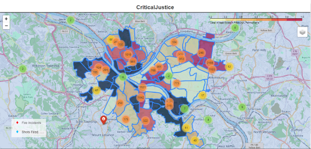

# Introduction

There are several reasons crime occurs in a certain community. These could range from the economic determinants, which as acquired greater relevance in the past couple years, such as educational attainment, wage income, income inequality, and public expenditure on police. The theory that police presence or public funding in protection actually causes more crime may seem contradictory, but there has been data that show that communities who have a higher percentage of police dispatches tend to have a higher crime rate.

## Black Population Currently in Pittsburgh, PA

In order for individuals to understand the impact of factors in the determinants of crime and the relationship with infrastructure that affect neighborhood development, one has to understand the conditions of the Black population in Pittsburgh, PA.

According to the U.S. Census, 7,000 persons of color left Pittsburgh between 2014 and 2018-as recently as May 2021. According to a news report on WPXI-TV, Pittsgburgh's news source, by Michele Newell, the wholesale eviction of Black inhabitants from Pittsburgh is the primary cause of the outmigration. Newell reports that Black and Brown people in the city of Pittsburgh believe that they aren't given tools to create and preserve affordable housing. Black and Brown people in the city of Pittsburgh were able to voice their concerns about mass displacement of Black residents in Pittsburgh during the City Council's public hearing. A woman exclaims during the hearing that, "Pittsburgh fails Black women and their families terribly! Unemployment and housing!" [@newell2021]

It is clear from the above testimony and the facts provided by the news reporter that Black and Brown individuals are dissatisfied with quality of life in Pittsburgh.

According to an article titled, "Pitt report: Quality of life for black residents worse in Pittsburgh than in other cities", Emily Wolfe reports that the former Mayor Bill Peduto's Gender Equity Commission released a report that investigates racial and gender disparity in the City. According to the report conducted by a team of Pitt researchers, "while Pittsburgh ranks in the middle 50% of American cities when it comes to health, employment, income and education for its white residents, those same factors rank much lower for black residents." [@wolfe2019]

The above factors, health, employment, income, and education, are essential for neighborhood development, and predominantly Black communities suffer because they do not have access to these elements compared to their white counterparts.

## "Hot Spot" Policing

On top of the lack of resources that could be a catalyst for  neighborhood development, the aspect of "Hot Spot" policing could potentially damage the community it targets because of the overly aggressive and indiscriminating police. There are certain unfavorable outcomes, including increasing hostility against and fear of the police and, more significantly, a failure to adequately address the roots of crime.

A method of lowering crime is called "Hot Spot" policing. In this method, resources and activities in hot spots are targeted. "Hot spots" are defined as places where crime and chaos are persistently high. Usually, these hot spots tend to have a high population of Black residents. The plan with "hot spot" policing is predicted on the nation that in communities, crime and disorder are often concentrated in a few small areas rather than being distributed uniformly and crime issues can be resolved more effectively by focusing resources on areas with a persistently high crime rate. [@collegeofpolicing]

A mechanism that has been used for "Hot Spot" policing has been the gunshot detection system ShotSpotter. ShotSpotter consistently detects and precisely locates gunshots using a set of acoustic sensors that are wirelessly linked to a centralized, cloud-based application. According to the ShotSpotter data collected, the equipment had a 97% accuracy rate and a 0.5 false positive rate.

Even with the reported positive results, several individuals still question the gunshot detection company and its technology. For instance, the city of Chicago's Inspector General issued a critical report on the ShotSpotter gunshot detection company which indicated there are deep problems with ShotSpotter and its technology and how it impacts communities of color and their relationship with law enforcement. Inside the critical report, it questions the technology's "operational value" and discovered that it makes police officers use stop and frisk procedures more frequently in specific neighborhoods. The Northwestern School of Law's MacArthur Justice Center also made a similar critical report and legal filing that addresses how Shot Spotter is "deployed overwhelmingly in communities of color, which already disproportionately bear the brunt of a heavy police presence". There are various issues with the police's claim that they choose neighborhoods for deployment depending on where shootings occur. For example, the MacArthur Justice Center highlights that because sensors are placed in some neighborhoods but not others, the police will be able to identify more incidents—real or fake—in those areas. This could skew data on gunfire and produce a statistical basis for excessive policing in neighborhoods of color. [@stanley2021]

## Fire Instances in Pittsburgh, PA

Pittsburgh has unfortunately seen several infrastructure fails in the past couple years. In September of 2016, a building fire came dangerously close to destroying the Liberty Bridge. It took firefighters nearly 30 minutes to put out the fire, which had a temperature of more than 1,200 degrees. [@folts2022] With an incident like this occurring, there was a need for an investigative report on fire inspections in Pittsburgh, PA.

Fortunately, Carnegie Mellon University conducted a Metro21 research project that assesses fire risk prediction models to decide which property fire inspections to prioritize. Their motivation for this research project address the issue with the approach towards fire inspections and how they could be significantly advanced in the city of Pittsburgh. The argument made here is that the use of risk-based data-driven systems for the identification, selection, and prioritization of new properties to check could greatly improve current approaches to fire inspection. This data 

## Relationship between Citizens and Police

Pittsburgh's recent city operating budget has created an uproar among their citizens due to the large amount of money allocated to the Pittsburgh Police Department. Andrew Bankson and Brian Gonnella in their article titled, "Pittsburgh's city budget works for the police but not for the people", discuss the specifics of the budget and display which  organizations suffered when it pertains to funding. Pittsburgh's city operating budget for 2021 increased spending more than $30 million from the previous year. That totals a staggering $608 million, including a 5.45 percent rise in the budget for police personnel, which rose to over $68 million. [@banksongonnella]

Because of this diversion of money, public-sector workers must bear the burden and government positions must "stay unfilled". This creates even more fracture to communities because for EMS personnel, firefighters, laborers, truck drivers, and several other city employees who have put their lives in danger to keep the city operating during the crises our community has experienced, the budget asks for a general cut in pay. These cuts to city employees severely affects almost all city employees, with the exception of the pay and benefits of the uninformed police officers who intimidate the Black population of the city. The city budget is still managing to slash salaries for the Office of Public Works staff by am astounding 23.64 percent, while also reducing the number of truck drivers from 44 to 38 and laborers from 118 to 106. This is in a city known for its deteriorating infrastructure, potholes, and lead-tainted pipes.

Unfortunately, these are the not the only programs who have seen cuts when it pertains to staffing and funding. Environmental Services is seeing a 23.64 percent reduction in funding as well as personnel layoffs. With a 27.17 percent reduction in staff, the Bureau of Facilities will have to lay off electricians, plumbers, bricklayers, and ironworkers. The Department of Mobility and Infrastructure, which manages one of Pittsburgh's biggest issue, is down 20.42 percent, and the Department of Parks and Recreation is down 18.58 percent. Even the Citizen Police Review Board, whose power was recently approved by 78 percent of voters through referenda, suffered a 2.25 percent decrease in personnel wages and compensation.

## Community Violence in Pittsburgh

There are many factors that has been speculated that lead to violence. Research that has been conducted identifies numerous root causes and danger signs for societal violence. It can range from individual risk factor, relationship risk factors, and community risk factors. More prevalently, community risk factors such as social disorganization  or limited community participation; poverty; crime; and community blight. Despite significant intervention and prevention efforts made by public officials, researchers, law enforcement personnel, and community-based individuals are organizations, community violence has persisted as a public health issue throughout the United States, and particularly within urban underprivileged communities of color.

For an individual to understand why community violence occurs so frequently, one must recognize the many elements that contribute to community violence. The Allegheny County Department of Human Services is especially interested in community violence because of how it disproportionately impacts families in communities and vulnerable population groups. In a report prepared by Erin Dalton, Michael Yonas, Latoya Warren, and Emily Sturman titled, "Violence in Allegheny County and Pittsburgh", the authors attempt to produce a profile of community violence in Allegheny County to more fully comprehend how DHS clients and consumers feel about violence.  

In addition to intergroup violence, Pittsburgh has had a number of incidents of gun violence in its urban neighborhoods. Even though they frequently make the news, killings and drive-by shootings are much less common than aggravated assaults with weapons. In Pittsburgh, shootings (defined as aggravated assaults with a firearm that cause injury) are six times as prevalent as killings, while aggravated assaults with firearms are ten times more frequent than homicides. According to the report, "Pittsburgh's murder rate (4.8 per 100,000 in 2005) is lower than the national average and that of many benchmark cities like Detroit, St. Louis, Baltimore, and Richmond. However, examination of violence trends among different demographic groups shows that, in particular, Pittsburgh's young black men are at acute risk of homicide victimization; the homicide rate for this group was 284.2 per 100,00-60 times the city-wide average and more than 50 times the national average". This information exposes the demographic that actively is affected by gun violence in Pittsburgh which is the Black male community. This violence was strongly concentrated in particular Pittsburgh areas as well as in nearby but outlying communities including Penn Hills, Wilkinsburgh, West Mifflin, and Mckeesport. The report indicated that African Americans and those living in poverty are more prevalent than usual in almost all communities with high homicide rates.

Though there is evidence that gun violence has become assimilated into predominantly Black communities, there still exists a lack of action towards addressing the gun violence issue and lessening the homicide rate.


The map above visualizes six years of homicides that have taken place in Allegheny County, additionally non-fatal shootings in Pittsburgh. The figure focuses on the city of Pittsburgh neighborhoods and also Allegheny County municipalities outside Pittsburgh. According to the legend located at the bottom of the figure, the coloring represents if the instances of homicides are either more sparse or more dense in a certain community. Evidently, homicide seems to occur more frequently around the Eastern region of Pittsburgh, where the residents are primarily Black.

## The Death and Life of Great American Cities

In her book, "The Death and Life of Great American Cities", Jane Jacobs directly criticizes the current results of city planning and rebuilding, and its effects it has on, as she describes it, the "slums" of America cities. She emphasizes in the introduction of her book that she will be discussing how cities in America work in real life, "because this is the only way to learn what principles of planning and what practices in rebuilding can promote social and economic vitality in cities, and what practices and principles will deaden these attributes". [@jacobs1993] If one wants to rebuild a community they feel is faltering, one must understand the conditions of that certain city and how cities in general operate.

Though several individuals in America believe investing more money in the communities she refers to as "slums" would be a clear solution, Jane Jacobs debunks that claim by explaining how city planning strategies such as, low-income projects, middle-income housing projects, expressways, etc., have made more of a negative impact on these communities rather than a positive impact. She proclaims that, "Under the surface, these accomplishments prove even poorer than their poor pretenses". [@jacobs1993] Jacobs believes that the actions that have been taken towards city planning cannot stand as achievements because they rarely assists the urban areas around them, despite the fact that in theory they should. Moreover, many believe the biggest accomplishments when it comes to city planning is when areas that may be labeled as "dangerous" are combined with modern city architecture. Nonetheless, the crisis within the communities continue to worsen while the removal of commerce and culture from the intimate and informal life of cities is concealed by massive cultural centers beneath the publicity blitz.

Jacobs heavily criticizes those who are in charge of city planning by stating how they, "...are guided instead by principles derived from the behavior and appearance of towns, suburbs, tuberculosis sanatoria, fairs, and imaginary dream cities-from anything but cities themselves". [@jacobs1993] This statement by Jacobs references back to the idea that there is becoming a removal of culture from cities nowadays. Instead of focusing on the revival of the so-called "slums", both practitioners and educators in this field continue to attempt to replicate their view of a "balanced community", where aspects of commercialization and struggle are both present.

In her book, Jacobs discusses how planning for a city or a community may not always result in improvements to the inhabitants' standard of living. The first consideration for city planners when deciding whether to develop a community is if the proposed project will improve the lives of the residents or do more harm to their neighborhood. 


## Motivation

The current metro area population in 2022 stands as 1,699,000. Statistically, the racial composition of Pittsburgh in the year of 2022 is 66.37% White, 24% Black or African American, 5.83% Asian, and 0.3% Latino. [@macrotrends]


The graph illustrates the different races in Pittsburgh per the percentage in total population. The figure shows that the majority of the population in Pittsburgh identify as white compared to the other races present.


Within the semi-diverse community of Pittsburgh, there was a clear displacement between the neighborhoods, whether one
was speaking about the suburban communities or the urban communities. In both the suburban and urban communities in Pittsburgh, PA, the percentage of white people is more than 82%. Inside these primarily white communities, the Black population percentage stands as 9.8%.


The figure above illustrates a line plot of the city of Pittsburgh's historical population from the 1950s to the 2000s, while depicting a second plot of the annual change in Pittsburgh's population. This figure also shows the United Nation's projections of what the metro population of Pittsburgh will be in 2030. One can see how there is gradual increase around the 1950s, and then a clear decrease occurs around the 1990s. After these evident changes, the population of Pittsburgh around the 2000s stays stagnant.


As someone who grew up in a predominantly Black and brown community in the suburbs of Pittsburgh, I have witnessed how individuals in my neighborhood suffered compared to the individuals who lived in the predominantly white neighborhoods near me who did not face the same issues. In actuality, issues within displacement represent the negative aspect of enduring poverty and segregation/exclusion. According to the Pittsburgh Neighborhood Project, due to deliberate actions taken at the federal, state, and municipal levels that deprived poor Black and Brown neighborhoods of investment, along with the consequences of white flight, out-migration, and de-industrialization, our poorest communities are as destitute as they are.


The figure here shows the percentage of poor white and black residents living in high or extreme poverty neighborhoods in Pittsburgh according to the 2017 American Community survey estimates. Evidently, there is a higher percentage of Black resident living in high or extreme poverty.


## Current State of the Art

In the city of Pittsburgh, within the Office of Management and Budget, there is a Community Development Division that manages and keeps track of the City of Pittsburgh's federal grants. These federal grant programs include the Community Development Block Grant, Emergency Solution Grant, HOME Investment Partnerships Program, and Housing Opportunities for Persons with AIDS (HOPWA).

The City of Pittsburgh government page concerning the Community Development of the city recounts each of these federal grant programs and its purpose.

For example, The Urban Redevelopment is in charge of overseeing HOME, a program that encourages the creation of affordable homes. The Jewish Healthcare FOundation oversees HOPWA, which focuses on providing accommodation for people with HIV/AIDS. Any information must be reported to the Community Development Division by the groups in charge of both of these programs. In addition to this, The City of Pittsburgh utilizes the Community Development Block Grant for a variety of improvement initiatives, such as road maintenance. Nonprofit organizations may also apply to the City for Community Development Block Grant and Emergency Solution Grant funds, which they will utilize to support those with low to moderate incomes, those who are homeless, or areas in need of economic development.

Similar to this, New York City established its Community Investment in 2002, and it continues to this day to be dedicated to meeting the critical community needs of the boroughs of Staten Island, Manhattan, The Bronx, Queens, and Brooklyn.

## Goals of the Project

Within this project, data has been collected that relate to the determinants of crime, ranging from economic to social determinants. The main goal of the project CriticalJustice is to visualize research that is already available for the public to view. The method of visualization primarily will be mapping instances of determinants of crime such as Shots Fired data, Fire Incident data, and the Average Dispatches per Shots Fired.

Though there is a main goal of the project, there is also an argument that this project is trying to prove. The argument is from the evidence of the data collected, there is implicit bias when police are being dispatched. There has been  This argument requires a large amount of evidence that specifically shows the effect of implicit police dispatch bias existing in a community and how that affect the resident's lives.

For instance, CriticalJustice utilizes the research conducted on the gunshot detection system ShotSpotter to add more to the argument that it is trying to prove. ShotSpotter is a type of technology that has caused residents in areas where it is widely used feel as though their privacy has been violated, despite claims of how accurate it has been at forecasting where the likely fire is located. Benjamin Goodman in his article, "ShotSpotter - The New Tool to Degrade What Is Left of the Fourth Amendment", explains how he feels the new technology infringes on the Fourth Amendment in the United States Constitution that, "protects people from unreasonable searches and seizures by the government".

The CriticalJustice project is also attempting to demonstrate that, when it comes to elements like the proportion of families living below the poverty lines and the frequency of 911 dispatches for gunshots, neighborhood with the highest police presence are also the ones with the greatest need. A neighborhood's level of need can also be determined by the frequency of fire incidents there. The statistics on fire incidences can show how infrastructure development varies from community to community.

## Ethical Implications

Regarding data science, there are pre-cautions individuals should take when completing projects take require data collection. The ability to access enormous amounts of data has profound effects on society. The human population has the potential to solve more problems and do more than ever before due to technology breakthroughs. However, it is crucial to keep in mind that law, ethics, and the concepts of privacy, trust, and security are all intertwined.

Data collection, in general, mandates several ethical considerations to be taken. For example, acquiring permission to use or share data, receiving clear and informed consent, and securely keeping data. Since this project relies heavily on data, there is a concern about information accuracy. To mitigate this harm, I have been carefully processing through the data sets I have acquired to ensure the data collected was not tampered with / has incorrect data.

It is crucial to have defined procedures for data sharing in addition to having clear processes in place for data collection. However, also it is also essential to check the researcher's bias when collecting data from research, for example, scholarly articles.

# Related work

When it comes to neighborhood development, more funding for struggling areas is the presumptive answer. However, there needs to be clear initiative set on what would be the best way to utilize the funding. The analysis of instances where a community received, but still experienced hardship is frequently disregarded, and many articles examine this.  

Also, there are several examples of some sort of police surveillance that impacted the infrastructure of a certain community that exists in not just the Pittsburgh region, but other cities that are more populated than Pittsburgh. However, these cities share similar demographics to the city of Pittsburgh and face the same issues when it pertains to community investment.

In this section, I will offer critiques of the articles that discuss the value of community investment and the effects of excessive police presence in various neighborhoods. In order to illustrate the many functionalities used and how they are similar to CriticalJustice, I will also be looking at critical cartography initiatives which address inequality.

## Critical Cartography

Critical cartography can be defined as a set of mapping techniques and analytical approaches based on critical theory, particularly the concept that maps reflect and uphold power relations, often favoring the dominant groups in society. With the help of critical cartography, people have been able to demonstrate a variety of ideologies using data and different mapping techniques. Counter-mapping which can be defined as map-making as a method of protest against established power structures also relates to the ideology of critical cartography.

Critical cartography may involve the creation and transformation of knowledge. The process of mapping involves sharing knowledge and building new knowledge by combining various points of view, connecting various personal maps, or developing group maps through rotation, negotiation, or consensus. [@theoccupiedtimes]

## Mapping Inequality: Redlining in New Deal America

At the University of Richmond, Virginia Tech, University of Maryland, and Johns Hopkins University, three teams were able to collaborate to create ***Mapping Inequality***. In order to help the public better understand the effects of federal housing policy and local implementation in their own communities, ***Mapping Inequality*** brings a study of Home Owners' Loan Corporation into the digital sphere. This big data approach can simultaneously give a national view of the program to a neighborhood level-assessment of the 1930s real estate rescue. In this project, HOLC staff members assigned to residential neighborhood that reflected their "mortgage security", which would then be visualized on color-coded maps. The grades were based on data and evaluation compiled by local real estate professional-lenders, developers, and real estate appraisers-in each city. [@digitalscholarshiplab]

When banks and other mortgage lenders were assessing who should receive loans and which locations in the city were safe investments, they considered neighborhoods obtaining the highest rating of "A"-colored green on the maps-to be minimum risks. Red-colored communities with the lowest grade of "D" were labeled as "dangerous".

This project utilizes shapefiles and GeoJSON to develop complex visualizations of large geographically related data, similar to CriticalJustice. Geospatial visualization emphasize the actual linkage of the data elements. In order to provide insight, these visualizations concentrate on the connection between the physical location of the data. Geospatial visualization can depict the history of humanity. [@tableau]


This figure depicts the visualization of the ***Mapping Inequality*** project. There is a legend located at the bottom corner that informs users how the color-coded markers represent the how a particular portion of a city is graded and colored.

## Native Land

The ***Native Land*** project represents a critical cartography project that aids in mapping Indigenous lands, agreements, and languages all around the world. By utilizing mapping, the goal of this project is to map Indigenous lands in a way that alters, tests, and enhances how people perceive the past of the present. Within this interactive map, all Indigenous territories, languages, and treaties are featured to show the wide influence Indigenous culture at a global scale.

This project utilizes a mix of technologies that make it reasonably simple to maintain, access, and distribute the site. These technologies include: Mapbox and WordPress and its plugins. This differs from the technologies utilized in CriticalJustice to create an interactive map. The technical procedure of updating the map requires creating entries in WordPress for each distinct country, language, or treaty. This is then sent to Mapbox, where there is a daily update for our public geoJSONs and API. [@nativeland2021]


This graphic displays ***Native Land Digital***'s interactive map. Compared to CriticalJustice, this map provides a greater variety of data because it depicts the many Indigenous lands of every nation on the planet. Also, within this graphic, there are options for the user to not only see the different Indigenous territories, but also the different languages and treaties made in each country.

## Pittsburgh Neighborhood Project

The 90 communities in the city of Pittsburgh are examined street by street in the Pittsburgh Neighborhood Project. The truth of enduring racial and economic segregation is reveled by this project as each neighborhood's beauty and individuality are also investigated. The mission of this project is to inform Pittsburgh residents about the origins, effects, and ongoing racial and economic segregation in Pittsburgh's neighborhood. The project also hopes to draw attention to the areas and the people who live there who desperately need long-term, equitable, all-encompassing investment.  

Similar to the project CriticalJustice, the Pittsburgh Neighborhood Project focus on indicators of why a specific community requires a higher level of need than other communities. In contrast, the Pittsburgh Neighborhood Project focuses on how poverty affects the citizens of the community, compared to how CriticalJustice will focus on how lack of infrastructure and policing procedures affect a community. Similarly, both of the projects focus on the idea that everyone, regardless of their color or social standing, deserves to live in areas that are secure and free from violence.


The figure here shows the map visualization of the Pittsburgh neighborhood Project. The map here shows the different communities of Pittsburgh while also depicting the relevant Pittsburgh Parks and Allegheny County Major Rivers. The legend below also highlights one of the key factors of the Pittsburgh Neighborhood Project that they have been trying to emphasize-poverty. The coloring of the map represents the percentage of the rate that falls below federal poverty line by census tract.

## Infrastructure and Policing Research  

In the project CriticalJustice, the aim is to visualize how factors such as lack of infrastructure and over-policing disproportionately affect the neighborhood development. Within several aspects of infrastructure, Black communities continually face some type of disadvantage. For instance, in Jesus M. Barajas' article, "Biking where Black: Connecting transportation planning and infrastructure to disproportionate policing", he examines whether excessive policing is related to transit limitations while using the example of cycling in Chicago. He would then report his findings, "Tickets were issued 8 times more often per capita in majority Black tracts and 3 times more often in majority Latino tracts compared to majority white tracts. More tickets were issued on major streets, but up to 85% fewer were issued when those streets had bike facilities, which was less prevalent in Black and Latino neighborhoods." [@BARAJAS2021103027]. From these statistics, one can conclude that the impacts of racially biased policing are exacerbated in the context of transportation safety tactics by infrastructure imbalances.

Barajas' brings a different aspect when it pertains to infrastructure that individuals usually do not think about. Inside this article, a connecting thread exists between the harm caused by racially biased police and the compounding injustices of poor bike infrastructure and disproportionately high levels of policing in Chicago's Black neighborhoods.

According to the article's findings, Black, Latino, and low-income neighborhoods in Chicago are more likely to be labeled as "dangerous" places for cyclists, but this exists due to historical underinvestment and failure to build sufficient infrastructure. Because of the element of danger in these communities, Barajas states how, "...safety advocates have called for an overhaul of the traditional 3 E's approach to safety focused on engineering, education, and enforcement to one that mitigates the impacts of crashes through a safe systems approach." [@BARAJAS2021103027] This would soon become labeled as Vision Zero, an approach that puts a lot greater focus on using data to target and create the best roadside countermeasures possible in order to completely eradicate traffic fatalities.

Vision Zero has similar technology to ShotSpotter when it relates to predictive policing, which is the practice of using computational models to predict where crime will occur before it happens.

Since there is a present racial bias in policing, validated through documentation, infrastructure alone cannot eliminate racial prejudice in law enforcement, and discrepancies are likely to persist even after taking infrastructure into consideration. There is evidence of discrepancies at the neighborhood level in addition to racially biased enforcement at the person level. The patterns of traffic stops frequently reveal a policing approach that aims to impose order on "disorganized" communities. According to the article, researchers discovered that in an unnamed city in the Southwest of the United States, more traffic citations were issued in areas with lower residential stability, higher poverty rates, and higher proportions of Black and Latino residents, regardless of the race, gender, or resident status of the drivers. This re-occurring discrimination start to effect Black and brown communities more mentally and emotionally, rather than physically.

Throughout history, several scholars have suggested that a zero-tolerance policing policy degraded quality of life and constrained the mobility of people of color while being linked to a decrease in violent crime. Though you can see the advantage of a strict policing strategy, the mental and emotional health of people of color consequently decreases because of the prevalent racial bias police will always have. It raises the question of the effectiveness of
strict policing when it pertains to the happiness of the community's population of people of color.

## Neighborhood Investment and Crime

With the aim of enhancing community conditions, service access, and ultimately the wellbeing of people, there is growing interest in rejuvenating urban neighborhoods that have historically experienced disinvestment. However, place-based affordable housing is frequently opposed by locals who claim that it will increase crime and drive down poverty values. In the article, "Do investments in low-income neighborhoods produce objective change in health-related neighborhood conditions", the authors have noticed that there is a necessity to evaluate to what extent may the revival of troubled, low-income urban-districts be triggered by strategic allocation or processes associated to development implementation. In other words, there is not enough evidence to declare that community investment really affect characteristics that may have a direct impact on inhabitants' capacity to live comfortably, such as crime incidence reports and walkability that has been objectively analyzed. [@BROOKSHOLLIDAY2020102361]

In addition to this article's findings, the article, "Residential crimes and neighbourhood build environment: Assessng the effectiveness of crime prevention through environmental design (CPTED)", evaluates the relationship between residential crime and the built environment that adheres to the crime prevention through environmental design principles at the neighborhood level. In this article, the author, Dong-Wook Sohn, highlights the claim that criminologists make about how demographic and socioeconomic conditions are highly linked to crime in urban neighborhoods. However, when it comes to the perspective of environmental psychology, crime is thought to be a behavior that is influenced by the physical aspects of the environment. [@SOHN201686]

## Crime and Private Investment in Urban Neighborhoods

Though the task of how to best enhance neighborhoods burden policy-makers, practitioners, and academia, there still remains to be little to no change made towards the issue. Correspondingly, the most effective ways to achieve community development are still the subject of a heated dispute. In the article, "Crime and private investment in urban neighborhoods", Johanna Lacoe analyzes a study that was conducted to examine how, throughout the 2000s, while crime was dropping in both Chicago and Los Angeles cities on a city-wide level, private investment in areas varied as the incidence of neighborhood crime changed. The questions of whether criminal policy may influence the development of neighborhoods and the residents who live there is the focus of this essay.


For background, this figure above showcases the homicide rate diverged from three major cities, New York, Los Angeles, and Chicago from the years 1889 to 2021. All three cities starting to see an increase in their own homicide rates in the early 1990s, but both New York and Chicago began to see a rise as early as 1890. The homicide rate starting to be become noticeable in the city of Los Angeles in the year 1920. However, the city of Chicago had a much higher increase than the other two cities. That soon to become a trend all three cities had a noticeable increase in the homicide rate, Chicago's homicide rate would surpass the more populated cities. In fact, when there was massive decrease in the homicide rate from the years 2010 to 2020, the city of Chicago's homicide rated increased 10 times its counterparts.

There has been research conducted already that evidently shows that a neighborhood's and its residents' quality of life is negatively impacted by high and rising crime rates. However, this does not immediately mean that the relationship between crime and neighborhoods is proportionate. More specifically, the research on crime and neighborhoods raises the questions of whether or not crime and communities have a symmetrical dynamic connection. In other words, if more crime has bad consequences, does less crime have good consequences that produce observable change? If so, it would imply that measures aimed at lowering crime might be useful and even significant instruments for economic development. After conducting research on how private investment in the cities of Chicago and Los Angeles has changed as the incidence (and rate) of crime in those neighborhoods changed, Johanna Lacoe was able to come to the conclusion that private investment, as shown by procurement of construction permits, increase on the same blocks where crime decreased the year before.


# Method of approach

## Reasoning Behind Method

After reviewing all the topics I could research for the senior thesis project, I decided that I would primarily focus on the topic of data analysis. Originally, I wanted to center my thesis on the idea of crime in the United States and the different categories of crime. I had downloaded a dataset that contained every county in the United States's crime rate while also depicting the amount of instances of different kinds of crime. Though this was a very informative dataset,I felt I was going towards a more broad approach rather than concretely identifying an idea. After consulting with advisors, I realized I need to be more specific in my research idea. Then, after much deliberation, I decided to concentrate my thesis on the concept of the under-investment of communities particularly neighborhoods in Pittsburgh, PA. Another aspect of my previous thesis idea that I felt was not sufficient was that the best way to visualize this data was just a simple bar and plot graphs. Because of the research I conducted, I felt that type of visualization was redundant and I wished for my project to have uniqueness. Therefore, I explored several types of data visualization until I was able to discover critical cartography.

Since critical cartography focuses on reflecting and maintaining power relations, frequently serving the needs of dominant groups, I pursued mapping as the form of visualization for my project. After determining that, I examined what kind of data would be most helpful in portraying my argument that predominately Black communities in Pittsburgh, PA suffer from underinvestment in their communities due to the focus of over-policing.

## Data Collection and Analysis

Once the idea for my thesis was definite, the next step was to collect data that related to the argument that I am attempting to portray. After much research, I was able to download several datasets whose information correlated with my research idea. I was able to download all of the datasets as CSV files. For instance, I was able to download a dataset that I named `Neighborhood.csv`. This dataset was downloaded  from the Allegheny County Analytics webpage. In this dataset, there is details about every neighborhood in Pittsburgh, Pennsylvania.  These details range from the total population and also different demographics population, but I am mostly  concerned with the Black population of each community, to the average dispatches for shots fired per five hundred which
connects with the idea of over-policing in communities.

I also was able to download a dataset from the Western Pennsylvania Regional Data Center. This data was called the Allegheny County 911 Dispatches - EMS and Fire. According to the website, this dataset contains dispatched EMS and Fire events from a computer aided dispatch system and also includes information about the nature of the emergency. [@catalog2023] I chose this dataset because I wanted to research if there was bias concerning how police were dispatched in different Pittsburgh neighborhoods. Also, this dataset also contains information about fire instances in different neighborhoods. These range from simple cooking fires to building fires. By highlighting the disproportionate number of building fires that occur in predominately Black neighborhoods, I think these statistics will demonstrate how important infrastructure investment is for some communities. 

In relation to the subject of gun violence, I was able to download a dataset that contains information from ShotSpotter data in Pittsburgh, Pennsylvania. Each instance in this dataset contains the longitude and latitude coordinates, allowing users to determine the precise place where the shot was fired. Additionally, it specifies the incident type of the specific shot fired; these incident types include single gunshot, multiple gunshots, and probable fire, which denotes a very high probability that a shot was fired.

## Level of Need Indicator

The Allegheny County Community Need Index was created by the Allegheny County Department of Human Services (DHS) to the identify the locations that require more help and have more socioeconomic obstacles to overcome than other areas. According to the Allegheny County Analytics, the Community Need Index will be ranking neighborhoods by looking at the percentage of families who live below the poverty line, the percentage of unemployed males, the resident education levels, the percentage of single mothers, and the number of 911 dispatches for gun shots fired. From this site, I was able to download the specific neighborhood dataset that showcased attributes about each Pittsburgh neighborhood. According to the Community Need Index report, the takeaways are that levels of need amount Allegheny County census tracts have stayed mostly consistent with the previous analysis 5 years ago. Also, 89% of tracts that were high or extreme need within 2009 to 2013 (5-year estimate) were still high or extreme need in the latest report. [@acanalyticswebdev2]

The community index report has been utilized to inform a variety of DHS strategic planning and resource allocation choices, including those on the placement of new after-school programs or Family Centers. For the sake of my study, this index will be used to rank Pittsburgh neighborhoods according to which ones require greater infrastructure investment based on the previously listed characteristics.


The figure illustrates the spectrum of community need in Pittsburgh, Pennsylvania. The levels range from a very modest demand to an enormous need, as one can observe. The figure also displays the ranking criteria, such as the percentage of men without a job and the number of shooting per 500 residents.

According to the neighborhood dataset and the community need index, Pittsburgh's high-need areas include parts of the West End, the Upper Northside as whole, the Hill District, and East End communities including Garfield, Homewood, Larimer, East Hills, and Lincoln-Lemington. High and extreme need clusters can be found outisde of Pittsbugh in the Monongahela River valley, parts of Wilkinsburg and Penn Hills, stretches of the Ohio River Valley like McKees Rocks and Stowe Township, and parts of Harrison Township in the county's far northeast. [@person2021]

## Technical Diagram


This UML diagram shows how each of the datasets interact with each other and the certain columns that were essential in creating the Python script `vector.py`.  In the top upmost table, I stated the columns I would be utilizing in the `Neighborhood.csv` dataset. I utilized the `Pittsburgh_Neighborhood` column to display each of the Pittsburgh neighborhoods' names, so individuals would know where each community was located. The `Level_of_Need` and `Level_of_Need_Scale` columns coincide together to visualize the metric of the level of need in neighborhood by transforming the scale to a decimal format.

Concerning the `shots.csv` file, by using both the `Longitude` and `Latitude` columns, data points that had neighborhood's exact location were able to be plotted on the interactive map. Additionally, the `IncidentType` column was put to use to display the kind of incident was occurring at the exact location.

Similar to the `shots.csv` file, the columns `latitude` and `longitude` were employed to create data points that show different kinds of fire incidents that have occurred in the certain community. The `incident_type` column gives a description of the certain fire incident that occurred in that particular neighborhood. This can range from a simple cooking fire to a building fire.

## Code Segment

I have now finished gathering the information necessary to create the interactive map of Pittsburgh, Pennsylvania. I had access to satellite maps to overlay the data on, but each Pittsburgh neighborhood needed to be displayed precisely. I came to the conclusion that using a shape file is the most effective technique to accurately depict the boundaries of the neighborhoods.


This figure shows how each Pittsburgh neighborhood is delineated, allowing one to pinpoint exactly where a certain aspect of community need is located and how frequently each incidence occurs.

After being to able to find a shapefile that properly defined the Pittsburgh neighborhood, I then began constructing the Python script that would create the interactive map.

```python
import pandas as pd
from datatest import validate
import numpy as np 
import geopandas as gpd
import folium
from folium import Choropleth, Marker
from folium.features import GeoJsonTooltip
from folium.plugins import MarkerCluster
```

With each individual `import` statement, I will be utilizing a Python package, which is a directory with Python files that also contains an `__init__ .py` file, which sets a package apart from a directory that is meant to hold several Python scripts. Each package served a different purpose in the development of the interactive map:

- ***pandas**: When working with "relational or "labeled data, the pandas Python library offers quick, adaptable, and expressive data structures that are simple to use. I utilized the Python package `pandas` to read into CSV files, which are the datasets I was able to download. Also, with `pandas`, I was able handle any missing data, these can be represented as Nan, NA, or NaT, that was present throughout any of the downloaded datasets. [@pypi]

- ***dataset/validate**: The python package `dataset` makes database data reading and writing as easy as reading and writing JSON files. The dataset module is compatible with the major database SQLite, that I utilized to create tables for the multiple CSV files. Also, from the dataset module, I imported the `validate` library to validate the specific dataset I wanted to read into did not contain any NaN values. 

- ***geopandas**: The Python package `geopandas` enables a user to work with geospatial data with Python. It is an extension of the package `pandas` to enable geometric types to do spatial operations.  `Geopandas` combines the power of `pandas` with another Python package `shapely` by giving `shapely` a high-level interface to several geometries and `pandas` geographic operations. I was able to utilize `geopandas` to read a shapefile and convert it to a GeoJson, so I couple properly create a `choropleth` map visualizations.

- ***folium**: The Python package `folium` allows user to view Python-manipulated data on an interactive leaflet map. With the `folium` package, I created a Leaflet map by combine the data manipulation capabilities of the Python ecosystem and the mapping capabilities of the leaflet.js library. I was also able to utilize `folium` plugins and features that helped to enhance the interactive map even more.

    - ***Choropleth**: In connection to a numerical variable, a `choropleth` map shows split geographic areas or regions that are colored. I added this feature to the interactive map to visualize the Black population rate in Pittsburgh, PA.

    - ***Marker**: With the `Marker` feature in `folium`, I was able to plot points from the download CSV files. For instance, the `shots.csv` data file included the longitude and latitude coordinates of each shots fired in Pittsburgh, PA. With these two columns, I was able plot the points of th shots fired. I was also able to do this feature with the `Fireincident.csv` dataset as well.

    - ***GeoJsonToolTip**: The `GeoJsonTooltip` class of the `folium.features` package enables a user to create tooltip that utilizes data from a `GeoJSON` file. I was able to utilize this specific feature to create tooltips on the GeoJson file I downloaded, so individuals have a better understanding on the markers I made.

    - ***MarkerCluster**: The`MarkerCluster` plugin in `folium` is utilized to condense data that slows down the performance of the interactive map. I utilized this feature for the `shots.csv` and `FireIncident.csv` datasets, so that the large points were contained in clusters.


This code syntax represents the creation of the Folium map and assigning it as `pitt_map`. This also creates a default Folium with no features added until the user prompts it with additional code.

```python
folium.GeoJson('https://raw.githubusercontent.com/datasets/geo-admin1-us/master/data/admin1-us.geojson').add_to(pitt_map)

counties_gdf = gpd.read_file(r"C:\Users\favou\Documents\COMP\CriticalJustice\src\Neighborhood_SNAP.shp")

base_df = pd.read_csv(r'C:\Users\favou\Documents\COMP\CriticalJustice\data\shots.csv')

neighbor = pd.read_csv(r"C:\Users\favou\Documents\COMP\CriticalJustice\data\Neighborhood.csv")
neighbor = neighbor[["Pittsburgh_Neighborhood", "Level_of_Need_Scale"]]

fire_data = pd.read_csv(r'C:\Users\favou\Documents\COMP\CriticalJustice\data\FireIncident.csv')

fire_data = fire_data.dropna(subset=['latitude', 'longitude'])

```

For this code segment, I use the  `folium.GeoJson` plugin to change the downloaded shapefile into a `GeoJson` file . I made this choice to make the in-lines stand out sufficiently to demonstrate how Pittsburgh's communities are divided.

Each of the downloaded datasets may be read into by using the `pandas` and `geopandas` tools. The shapefile that is now in `GeoJSON` format may be used for the initial shape of teh interactive map of Pittsburgh, Pennsylvania, thanks to the `geopandas` package and `read_file` function. The `shots.csv`, `FireIncident.csv` and `Neighborhood.csv` files were similarly given alternative values using the `pandas` package and `read_csv` function so that the data within could be used for modification.

The `FireIncident.csv` dataset, however, contained `NaN` values, which Python cannot recognize as data. In order to remove any `NaN` values from the `latitude` and `longitude` columns, I utilized the `datatest` package and import the `validate` library to validate the dataset. 

```python
folium.Choropleth(
    geo_data='pittsburgh.geojson',
    data=neighbor,
    columns=['Pittsburgh_Neighborhood', 'Level_of_Need_Scale'],
    key_on='feature.properties.name',
    fill_color='OrRd',
    fill_opacity=0.7,
    line_opacity=0.2,
    legend_name="Level of Need Scale in Pittsburgh, Pennsylvania" 
).add_to(pitt_map)
```

The `Level_of_Need_Scale` is being represented as a choropleth map within this code section, which visualizes it as a color-coded map. I set the variable `geo_data` to include the converted `GeoJSON` file. The dataset being used is called `Neighborhood.csv`. `Pittsburgh_Neighborhood` and `Level_of_Need_Scale` are the columns that will be displayed through the map, with the degree of need metric being measured by the `fill_color` scale.

```python
for i, r in base_df.iterrows():
    location =[r['Latitude'], r['Longitude']]
    folium.Marker(location, 
                tooltip=tooltip, 
                popup=r["IncidentType"], 
                icon=folium.Icon(color="blue", icon="person-rifle", prefix='fa')).add_to(marker_cluster)

for i, r in fire_data.iterrows():
    location1 = [r['latitude'], r['longitude']]
    folium.Marker(location1, 
                tooltip1=tooltip1, 
                popup=r["type_description"], 
                icon=folium.Icon(color="red", icon="fire", prefix='fa')).add_to(marker_cluster_1), 
```

These two `for` loops demonstrate how data points from the `shots.csv` file and `FireIncident.csv` are plotted. Both employ `Latitude` and `Longitude` coordinates to depict the locations of the two distinct occurrences. I was able to add creative icons to the data points and incorporate a `tooltip` that identifies the incident type thanks to several `folium` capabilities. To prevent the performance of the interactive map from being slowed down and to maintain the aesthetic appeal, these points will likewise be enclosed in a `MarkerCluster`.

# Experiments

I will cover both the basics of mapping and the problems that emerge when using mapping and data sets in this chapter. Creating arguments and producing analyses to support  arguments both benefit greatly from data collecting. Yet, there is a chance for problems to occur in the data gathering process if the proper procedure is not followed, especially if it involves community data collection.

Normally, for the argument to be more persuasive, visualization may be employed to help people grasp the reasoning and see connections and patterns within the facts. The data has more significance when it is visualized. Data has been visualized with the help of mapping, particularly data pertaining to social concerns. However, there is criteria needed to be followed for a map ot be considered 

## Purpose of Project  

With the project **CriticalJustice**, I hope to shed light on how the lack of infrastructure investment in a effects a neighborhood and its citizens' quality of life. Because it continues to be a problem in the majority of areas today, I believe this matter deserves attention. Furthermore, I believe that a lot of these under-invested communities-both financially and in terms of services-also see an excessive amount of police in their local areas. This belief also comes from the personal experience I have from growing up in a low-income neighborhood. I've done a lot of study on this subject, and when I apply it to myself, I realize how crucial a tool like this is since it represents actual experience. When addressing how causes of crime like excessive police or a lack of infrastructure investment influence a community, this project helps those who live in low-income areas or "dangerous" places feel more represented and understood.

## Issues with Community Data Collection

Although community data collecting may be used to a community's advantage, there are difficulties and irregularities in the procedure. It is crucial to first identify obstacles to consistent data collecting before developing strategies to enhance data gathering process.

### Census Under-Count

More specifically, there has been a social problem with Census data under-counting that is both historical and current. In the project **CriticalJustice**, I utilize Census data about Pittsburgh, Pennsylvania that was contained in a dataset. The dataset included information about the total population of each community in Pittsburgh while also showing the demographics of each of the neighborhoods. This dataset will be utilized to further my argument about how Black communities are disproportionally affected by lack of infrastructure investment. With the use of aggregate information on births, deaths, immigration, emigration, and previous censuses, demographic analysis gives estimates of the overall U.S. population and its constituent parts by race, age, and sex. A measure of census coverage is produced by comparing the estimated value to the corresponding census numbers. [@westfein1990]

However, when it pertains to census community data collection, there are certain population who suffers from the census under-count. There are some populations, nevertheless, that are under-counted in the census when it comes to gathering community statistics. Because of the large number of homeless people living in urban neighborhoods, these communities are typically the ones to experience these instances. In a study sent to the Secretary of the Department of Housing and Urban Development in 1984, the first shot was fired in the "numbers debate" surrounding homelessness. [@wright1992counting]. The Housing and Urban Development assessment estimated that there were between 250,000 to 350,000 homeless people in the country, an order of magnitude fewer than the 2-3 million figure htat was  then popular in advocacy circles. This estimate was based on educated judgment and shelter capacity in many significant cities. Many people instantly discounted the HUD estimate as a flismy attempt by a conservative government to downplay the severity of the homelessness issue.

### Bias with Data Collection

The effectiveness of our conclusions is impacted by the data gathering techniques we use. This is especially true for human rights and violence researchers on the ground. These researchers have a higher risk of methodological errors and the resulting weaknesses in their results and policy recommendations since they operate in high-risk, low information environments. Selection bias is defined in greater detail below and happens when a researcher purposefully excludes a certain class of subjects from their data collection. 

## Design Principles of Mapping

There are many design principles that are taken in to consideration when compiling maps. Legibility, visual contrast, figure-ground, hierarchical order, and balance are five of the major design concepts. These factors work together to provide a framework for identifying and comprehending the relative relevance of the information on the page and in the map. Together, they aid cartographers in producing maps that effectively convey geographic information. [@buckley2011]

### Visual Contrast

Visual contrast refers to how page items and map features contrast with one another and with their backgrounds. A well-designed map with strong visual contrast may have a crisp, tidy, sharp appearance. Something will stick out more, generally the darker or brighter feature, the higher the contrast between features. On the other hand, a map with little visual contrast might be utilized to convey a more subdued message.

### Legibility

The capacity to be read nad comprehended is known as legibility. For the outcomes to be effortlessly seen and easily understood, legibility depends on effective decision making for selecting symbols that are recognizable and choosing the proper sizes. For instance, if you are depicting two kinds of data points on your map, both symbols representing the data points must be clearly visible and In order for your mind to interpret what your eyes are sensing, features must be distinct from one another and the backdrop as well as large enough to be seen and comprehended.

### Figure-ground

The spontaneous separation of a foreground figure from a shapeless background is known as figure-ground organization. This design idea is used by cartographers to make it easier for readers to focus on a particular section of the map or page. There are several ways to support figure-ground organization, including giving the map more depth and applying effects.

### Hierarchical Organization

Making meaningful distinctions between traits and depicting similarities, contrasts, and linkages is one of the main goals of mapping. To make the map easier to read, the interior visual organization is crucial. A hierarchy may be thought of as the visual division of the map into levels of data. Readers can concentrate on what is essential and see trends thanks to the map's and the page's visual stacking of information.

### Balance

The layout of the map and other website components contributes to balance. An impression of stability and harmony is created by a well-balanced map page. The two main components of balance are visual weight and visual direction. With the help of the element of balance, the elements of the map will be positioned in a certain way, taking into account their respective size, form, and subject matter.


These five design tenets work well together to significantly influence your map. Map readers will be attracted ot deterred depending on how you employ them. You can ensure that your maps are ones that people will want to look at by carefully considering how to build them utilizing these concepts. 


## Experimental Design

## Evaluation

I will be undertaking evaluations of many mapping examples, including my own project's interactive map, in this chapter's portion. This assessment system is going to be built using map criteria that have been gathered from many sources. 

### Map Criteria

Alongside design principles, there are a number of questions needed to be asked pertaining to map criteria before crafting an interactive map. The data visualization must fulfill certain requirements in order to be understood. Who uses the map would be an example of a question. The person drawing up the map is prompted with this question to specify their goal. This will demonstrate how consistent and audience-specific the mapping is. 

### Evaluation of **CriticalJustice** Map



### Evaluation of **Mapping Inequality** Map


### Evaluation of **Native Land ** Map


## Threats to Validity

# Conclusion

Traditionally, this chapter addresses the areas proposed below as sections, although
not necessarily in this order or organized as offered. However, the last section --
"Ethical Implcations" is required for this chapter. See the heading below for more
details.

## Summary of Results

## Future Work

## Future Ethical Implications and Recommendations

Especially as pertains to the public release or use of your software or methods, what
unresolved or special issues remain? What recommendations might you make?

## Conclusions


# References

::: {#refs}
:::
