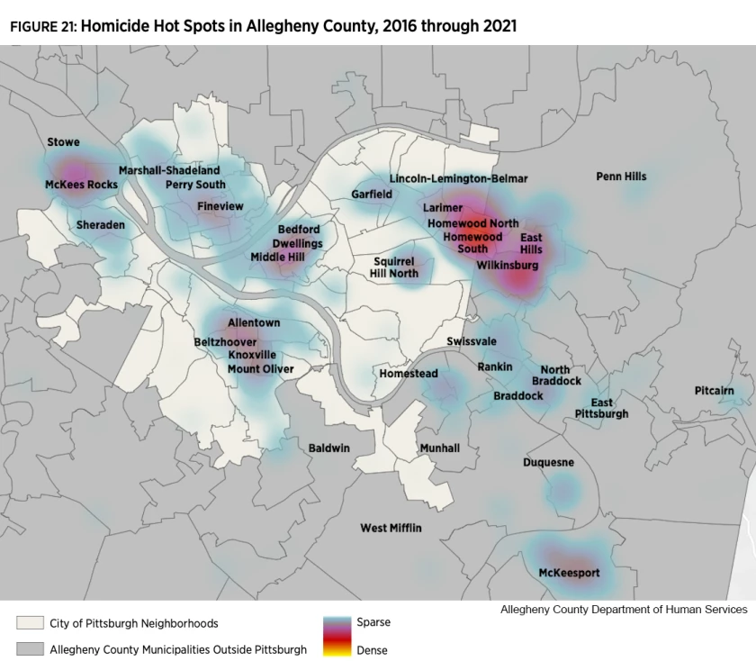
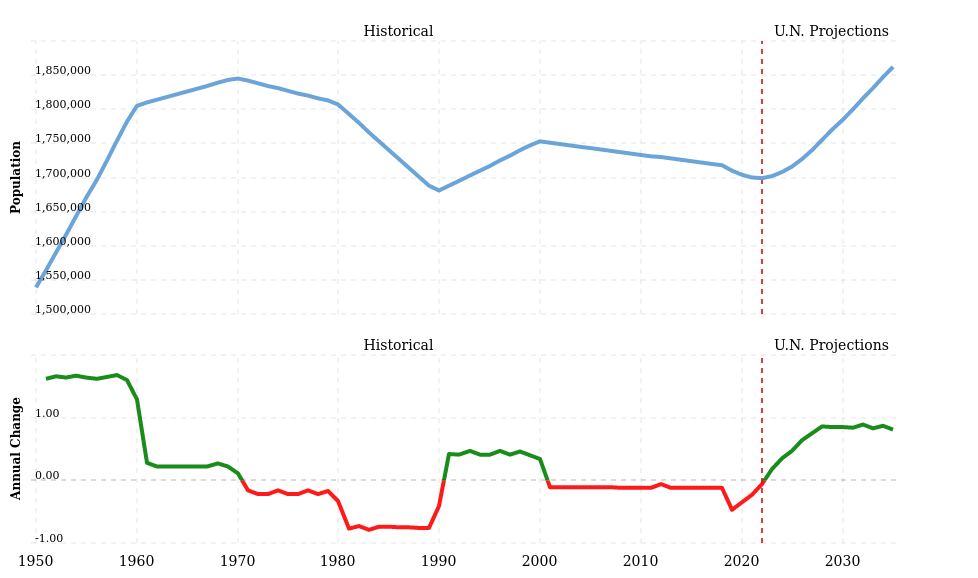

# Template description

This repository contains the starter materials for your thesis in Computer
Science 600 and 610 in Fall 2022  and Spring 2023 academic term. The main
directory of this repository contains the Markdown template for a project that
is designed for use with GitHub Classroom. To learn more about the course
in which these assignments were completed, please refer to the `README.md` file.

The template specifies various settings in the `config.yaml` file included in the
repository. Change the appropriate values under the `Project-specific values`
heading. Changing other values outside of that section may cause the project to
fail to build. **Modify these values at your own risk.**

Author your thesis in the `thesis.md` document using appropriate Markdown
hierarchy and syntax; GitHub Actions will automatically create a PDF from the
`abstract.md` and `proposal.md` files. Consult the `README` of the proposal
repository to learn how to properly build and release this PDFs.

## Citations and references

Including references throughout requires a specific pseudo-Markdown tag, demonstrated
in the following blockquote. (Inspect the `thesis.md` file to see the format.)

> A citation, when included correctly, will appear as it does at the end of this
> sentence. [@plaat1996research]

## Labeling figures

To label a figure (i.e. an image), referencing the image using correct Markdown
will automatically caption the figure:

```markdown

```

## Labeling tables

To provide a label for a table, write a short caption for the table and prefix the caption
with `Table:` as in the example below:

```
Table: A two-row table demonstrating tables

|Row number | Description |
|:----------|:------------|
|1          |Row 1        |
|2          |Row 2        |
```

## Other template information

Two things specific to this template to also keep in mind:

1. It is your responsibility to remove this description section before building
the PDF version you plan to defend.
2. References _will only appear if cited correctly_ in the text

## Note on `LaTeX` commands

Documents may include specific `LaTeX` commands _in Markdown_. To render these, surround the commands
with markup denoting `LaTeX`. For example:

```
Checkmark character:   $\checkmark$
Superscript character: $^{\dag}$
```

If using a special package not included in the template, add the desired `LaTeX`
package or command/macro to the `header-includes` property in [config.yaml](config.yaml).

Should this package not be included in the environment shipped with this template,
you may also need to add the package to the [GitHub Actions Workflow](.github/workflows/main.yml).

Direct any questions about issues to your first reader.

# Introduction

## History of Pittsburgh Black Population
Few places held as much promise for the huge numbers of African Americans fleeing the South in the years following the Civil War as the thriving city of Pittsburgh, Pennsylvania. Black people flocked to Pittsburgh, particularly to the Hill District, hoping to find work in the steel and railroad industries and escape the Jim Crow segregationist laws of the Reconstruction-era South. The Hill District was a neighborhood close to downtown but up against steep hills, making it an unattractive place for the city's upper classes to live. In the Hill District, a city-within-a-city that was acknowledged by the 1930s as the center of black culture and commerce, African Americans established close-knit communities. The Negro League Pittsburgh Crawfords, one of the best baseball teams in the country, played there at Greenlee Field, the first black-owned and black-build baseball stadium in America. It was also home to one of the most active jazz scenes in the nation. However, as the century went on, the neighborhood's decaying infrastructure cast a shadow over it. Regardless of whether the Lower Hill District's structures need restoration, the city decided to demolish them in 1956 to make room for the construction of the new Civic Arena. Over the subsequent five years, this resulted in the eviction of 8,000 inhabitants, further causing overcrowding in the Middle and Upper Hill areas. This led to the loss of much of the city's cultural vitality and significantly changed how the Hill is today. After these event, the city of Pittsburgh, as a whole, suffered through a period of economic decline as the city would start to lose their number of jobs and residents to the suburbs and to overseas. Though they faced hardship, the African-American population in Pittsburgh would continue to grow, reaching to about 12% in 1950. However, that would not stop the rampant unfair employment practices and barriers they would have to overcome to live where they wanted to live. Black unemployment was more than twice as high as white unemployment from the early 1950s to the early 1960s, and wealth disparities were pervasive. Even though the city passed a fair employment practices legislation in 1953, approximately 25% of all discrimination complaint cases across the states were filled with the Pittsburgh area office. 

## Policing in Pittsburgh
The Pittsburgh Police Department's budget has risen from a budget of $74 million to $115 million from the years 2014 to 2021, an almost 60% in 7 years. One-fifth of the city's annual budget is represented by this figure. Because of this, many individuals in the Pittsburgh region conveyed the wish to cut the police budget by at least $40 million in order to invest the money elsewhere in the community. Inside the Pittsburgh City Paper, Lauryn Nania writes an article discussing the call for the decrease in police  funding and an increase in community investment in Pittsburgh, Pennsylvania. In this article, she discusses comments made at a news conference conducted by the Coalition to Reimagine Public Safety. Nanaia recounts a statement Jasiti X, founder of 1Hood Media, made when examining the structural and institutionalized violence that minority groups experience and the fact that these problems frequently lead to violent crimes. The problem cannot be handled if these communities lack the necessary resources. Jarisi X exemplifies his point by saying, "Violence is far more than just crime. Violence is an experience that limits or diminishes people's capacity to survive. Unemployment, inadequate housing, lack of access to medical care, subpar public education systems, food insecurity, and racism are all violence." [Pittsburgh City Paper: Policing] With this, individuals are concerned with the increase in police funding when problems within community investment continue to be neglected. According to a 2020 research by the Abolitionist Law Center, there were significant disparities in how Black and white were treated by police in Pittsburgh in 2019. This information was highlighted by the Coalition to Reimagine Public Safety in Lauryn Nania's article. The Abolitionist Law Center report states, "Black people made up only 23.2% of the Pittsburgh population, and yet they made up 43.6% of individuals involved in traffic stops, 71.4% of all frisks, 69% of individuals subject to warrantless search and seizures, and 63% of all arrests conducted by the Pittsburgh Police. When it comes to children, teh disparities were even more vast: Black children accounted for 83% of all warrantless search and seizures of individuals ages 11-18 and 100% of all warrantless search and seizures of children ages 10 and under." These statistics illustrates the effect of the increasing crime prevention rather than analyzing the aspects of what could displace a community. Even with these statistics, Mayor Bill Peduto has resisted calls to dramatically reduce the police budget, arguing that while it has grown, general crime has fallen. Individuals within the community believe with an uprising in interactions with police that end in death such as Antown Ross II and Bruce Kelly Jr., policing can be replaced with required and immediate alternatives. 

## Gun Violence in Pittsburgh 
According to recent study by county researchers, homicides in Allegheny County are disproportionately concentrated in a small number of high-need regions and disproportionately affect young Black men. Since 
the beginning of the Coronavirus virus pandemic in 2020, Pittsburgh and Allegheny County's homicide rate has spiked since the initial decline. 




## Motivation
The current metro area population in 2022 is 1,699,000, a 0.06% decline from 2021. Statistically, the racial composition of Pittsburgh in the year of 2022 is 66.37% White, 22.98% Black or African American, 5.83% Asian, 0.19% Native American, and 0.95% of other races not listed. Within the semi- diverse community of Pittsburgh, there was a clear displacement between the neighborhoods, whether one 
was speaking about the suburban communities or the urban communities. In both the suburban and urban communities in Pittsburgh, PA, the percentage of white people is more than 82%. Inside these primarily white communities, the Black population percentage stands as 9.8%. 




The figure above illustrates a line plot of the city of Pittsburgh's historical population from the 1950s to the 2000s, while depicting a second plot of the annual change in Pittsburgh's population. This figure also shows the United Nation's projections of what the metro population of Pittsburgh will be in 2030. One can see how there is gradual increase around the 1950s, and then a clear decrease occurs around the 1990s. After these evident changes, the population of Pittsburgh around the 2000s stays stagnant.

If one would compare these differing communities, the statistics would show how the Black and Brown communities are economically disadvantaged and more vulnerable to displacement. In actuality, issues within displacement represent the negative aspect of enduring poverty and segregation/exclusion. According to the Pittsburgh Neighborhood Project, due to deliberate actions taken at the federal, state, and municipal levels that deprived poor Black and Brown neighborhoods of investment, along with the consequences of white flight, outmigration, and de-industrialization, our poorest communities are as destitute as they are.


## Current State of the Art


## Goals of the Project
There are marginalized communities almost everywhere. They are persons who are excluded from participating in popular economic, political, cultural, and social activities for a variety of reasons. The goal of this project is to shed light on the effect marginalization has had on these Black and Brown communities. Though there is not a clear solution for marginalization at the moment, there can be steps made to acknowledge the affected individuals, and thus aid in their need for community investment. In fact, there are several benefits to tackling marginalization for the United States of America's economy. The economic prosperity of communities and the entire nation might be significantly increased bu marginalized groups, such as ex-offenders and low-income communities, but they require support from the commercial, public, and social sectors. Concerning those who were previously incarcerated, more opportunities for newly released prisoners to enter the workforce are required. Thus, it opens up avenues for these individuals to re-build their lives and start providing for themselves and also the economy. While also providing opportunities for ex-convicts, individuals should also focus their attention on delivering services to those who most need them. People who are having a hard time financially need assistance, but they are frequently too overburdened by work, family, and other commitments to ask for it. 


## Ethical Implications

* Information Privacy
* Information Accuracy (e.g. can contain reliability)
* Potential Misuse (e.g. computer crime, unintended consequences)
* Second- or Third-Party Risk (e.g. safety)
* Data Collection Issues (e.g. issues inherent in collecting data)
  - The basis of this project primarily concerns data collection.

* Algorithmic or Data Bias
* Potential Power Difference / Social Imbalance / Issues in Equity

In addition, reflect on ways that the above harms can be or are mitigated by your work

# Related work

This chapter includes a broad and detailed review of relevant existing work.
The literature review should provide background and context for the thesis work.
The subsections may be organized in whatever manner seems best suited to the material--
chronological, or by topic, or according to some other criteria
(e.g., primary versus secondary resources).

If ethical issues are central to this work, you should also address historical and
contemporary issues or efforts made to address them.

# Method of approach

This chapter answers the "how" question - how did you complete your project,
including the overall design of your study, details of the algorithms and tools you
have used, etc.  Use technical diagrams, equations, algorithms, and paragraphs of text
to describe the research that you have completed. Be sure to number all figures and
tables and to explicitly refer to them in your text.

This should contain:

* lists
* with points
* and more points
  * possibly subpoints

For those projects whose implications address social or moral issues (i.e. ethical
standards, causes, effects), you will want to use this section to describe how you
actively mitigated or considered these issues.

# Experiments

This chapter describes your experimental set up and evaluation. It should also
produce and describe the results of your study. The section titles below offer
a typical structure used for this chapter.

## Experimental Design

Especially as it pertains to responisble computing, if conducting experiments or
evaluations that involve particular ethical considerations, detail those issues here.

## Evaluation

## Threats to Validity

# Conclusion

Traditionally, this chapter addresses the areas proposed below as sections, although
not necessarily in this order or organized as offered. However, the last section --
"Ethical Implcations" is required for this chapter. See the heading below for more
details.

## Summary of Results

## Future Work

## Future Ethical Implications and Recommendations

Especially as pertains to the public release or use of your software or methods, what
unresolved or special issues remain? What recommendations might you make?

## Conclusions


# References

::: {#refs}
[1] Wolfson, Charlie, and Ladimir Garcia. “Turnout Data Show Marginalized Communities Often Have Quietest Voice in Allegheny County Elections.” Pittsburgh City Paper, Pittsburgh City Paper, 28 Nov. 2022, https://www.pghcitypaper.com/pittsburgh/turnout-data-show-marginalized-communities-often-have-quietest-voice-in-allegheny-county-elections/Content?oid=22722946. 

[Gun Violence](https://www.wesa.fm/politics-government/2022-07-26/allegheny-county-homicide-report)

[2] 

[Pittsburgh Neighborhood Project](https://pittsburghneighborhoodproject.blog/2021/03/01/gentrification-and-displacement-in-pittsburgh/)

[Figure 1](https://www.researchgate.net/publication/270051294_How_Migration_Flows_Shape_Elderly_Pop_in_Pittsburgh_10112004/figures?lo=1&utm_source=google&utm_medium=organic)

[Figure 2](https://www.macrotrends.net/cities/23100/pittsburgh/population)

[Pittsburgh History](https://www.marintheatre.org/productions/fences/fences-pittsburgh-1957)

[Marginalization Solution](https://www.urban.org/urban-wire/keys-americas-economic-growth-are-low-income-and-marginalized-communities)

[Pittsburgh City Paper: Policing](https://www.pghcitypaper.com/pittsburgh/police-reform-activists-call-for-decrease-in-pittsburgh-police-funding-and-increase-in-community-investment/Content?oid=19705923)

[Citizen Review Board Analysis](https://www.publicsource.org/who-polices-the-police-in-pittsburgh-and-allegheny-county-a-critical-crossroads-for-civilian-review/)
:::
