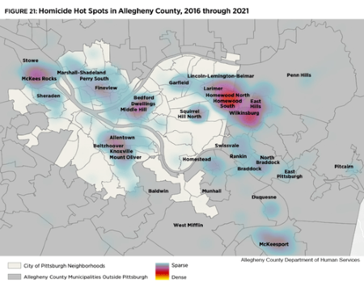
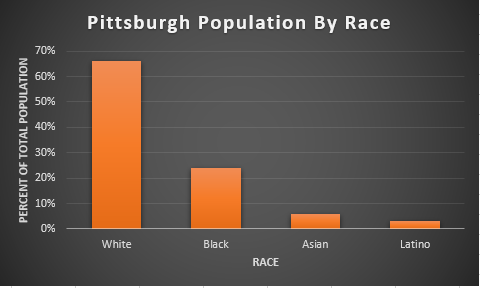
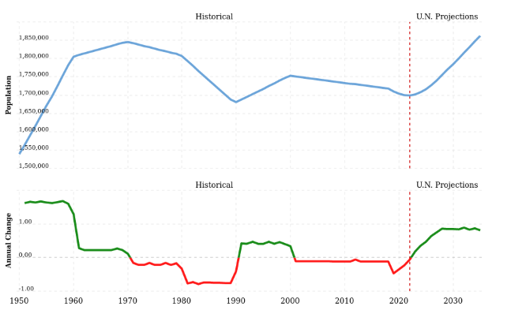
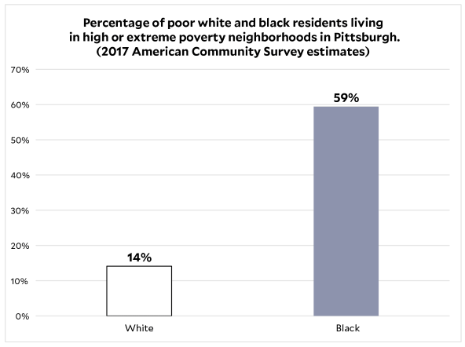
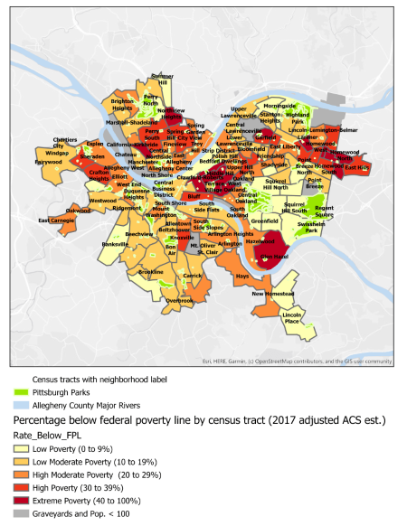

# Introduction

There are several reasons crime occurs in a certain community. These could range from the economic determinants, which as acquired greater relevance in the past couple years, such as educational attainment, wage income, income inequality, and public expenditure on police. The theory that police presence or public funding in protection actually causes more crime may seem contradictory, but there has been data that show that communities who have a higher percentage of police dispatches tend to have a higher crime rate

## Black Population Currently in Pittsburgh, PA

In order for individuals to understand the impact of factors in the determinants of crime and the relationship with infrastructure that affect neighborhood development, one has to understand the status of the Black population in Pittsburgh, PA.

According to the U.S. Census, 7,000 persons of color left Pittsburgh between 2014 and 2018-as recently as May 2021. According to a news report on WPXI-TV, Pittsgburgh's news source, by Michele Newell, the wholesale eviction of Black inhabitants from Pittsburgh is the primary cause of the outmigration. Michele reports that Black and Brown people in the city of Pittsburgh believe that they aren't given tools to create and preserve affordable housing. Black and Brown people in the city of Pittsburgh were able to voice their concerns about mass displacement of Black residents in Pittsburgh during the City Council's public hearing. A woman exclaims during the hearing that, "Pittsburgh fails Black women and their families terribly! Unemployment and housing!"

## "Hot Spot" Policing

A method of lowering crime is called "Hot Spot" policing. In this method, resources and activities in hot spots are targeted. "Hot spots" are defined as places where crime and chaos are persistently high. Usually, these hot spots tend to have a high population of Black residents. The plan with "hot spot" policing is predicted on the nation that in communities, crime and disorder are often concentrated in a few small areas rather than being distributed uniformly and crime issues can be resolved more effectively by focusing resources on areas with a persistently high crime rate.

A mechanism that has been used for "Hot Spot" policing has been the gunshot detection system ShotSpotter. ShotSpotter consistently detects and precisely locates gunshots using a set of acoustic sensors that are wirelessly linked to a centralized, cloud-based application. According to the ShotSpotter data collected, the equipment had a 97% accuracy rate and a 0.5 false positive rate.

Even with the reported positive results, several individuals still question the gunshot detection company and its technology. For instance, the city of Chicago's Inspector General issued a critical report on the ShotSpotter gunshot detection company which indicated there are deep problems with ShotSpotter and its technology and how it impacts communities of color and their relationship with law enforcement. Inside the critical report, it questions the technology's "operational value" and discovered that it makes police officers use stop and frisk procedures more frequently in specific neighborhoods. The Northwestern School of Law's MacArthur Justice Center also made a similar critical report and legal filing that addresses how Shot Spotter is "deployed overwhelmingly in communities of color, which already disproportionately bear the brunt of a heavy police presence"
There are various issues with the police's claim that they choose neighborhoods for deployment depending on where shootings occur. For example, the MacArthur Justice Center highlights that because sensors are placed in some neighborhoods but not others, the police will be able to identify more incidents—real or fake—in those areas. This could skew data on gunfire and produce a statistical basis for excessive policing in neighborhoods of color.

## Relationship between Citizens and Police

Pittsburgh's recent city operating budget has created an uproar among their citizen due to the large amount of money allocated to the Pittsburgh Police Department. Andrew Bankson and Brian Gonnella in their article titled, "Pittsburgh's city budget works for the police but not for the people", discuss the specifics of the budget and display which  organizations suffered when it pertains to funding. Pittsburgh's city operating budget for 2021 increased spending more than $30 million from the previous year. That totals a staggering $608 million, including a 5.45 percent rise in the budget for police personnel, which rose to over $68 million.

Because of this diversion of money, public-sector workers must bear the burden and government positions must "stay unfilled". This creates even more fracture to communities because for EMS personnel, firefighters, laborers, truck drivers, and several other city employees who have put their lives in danger to keep the city operating during the crises our community has experienced, the budget asks for a general cut in pay. These cuts to city employees severely affects almost all city employees, with the exception of the pay and benefits of the uninformed police officers who intimidate the Black population of the city. The city budget is still managing to slash salaries for the Office of Public Works staff by am astounding 23.64 percent, while also reducing the number of truck drivers from 44 to 38 and laborers from 118 to 106. This is in a city known for its deteriorating infrastructure, potholes, and lead-tainted pipes.

Unfortunately, these are the not the only programs who have seen cuts when it pertains to staffing and funding. Environmental Services is seeing a 23.64 percent reduction in funding as well as personnel layoffs. With a 27.17 percent reduction in staff, the Bureau of Facilities will have to lay off electricians, plumbers, bricklayers, and ironworkers. The Department of Mobility and Infrastructure, which manages one of Pittsburgh's biggest issue, is down 20.42 percent, and the Department of Parks and Recreation is down 18.58 percent. Even the Citizen Police Review Board, whose power was recently approved by 78 percent of voters through referenda, suffered a 2.25 percent decrease in personnel wages and compensation.

## Community Violence in Pittsburgh

There are many factors that has been speculated that lead to violence. Research that has been conducted identifies numerous root causes and danger signs for societal violence. It can range from individual risk factor, relationship risk factors, and community risk factors. More prevalently, community risk factors such as social disorganization  or limited community participation; poverty; crime; and community blight. Despite significant intervention and prevention efforts made by public officials, researchers, law enforcement personnel, and community-based individuals are organizations, community violence has persisted as a public health issue throughout the United States, and particularly within urban underprivileged communities of color.

For an individual to understand why community violence occurs so frequently, one must recognize the many elements that contribute to community violence. The Allegheny County Department of Human Services is especially interested in community violence because of how it disproportionately impacts families in communities and vulnerable population groups. In a report prepared by Erin Dalton, Michael Yonas, Latoya Warren, and Emily Sturman titled, "Violence in Allegheny County and Pittsburgh", the authors attempt to produce a profile of community violence in Allegheny County to more fully comprehend how DHS clients and consumers feel about violence.  

In addition to intergroup violence, Pittsburgh has had a number of incidents of gun violence in its urban neighborhoods. Even though they frequently make the news, killings and drive-by shootings are much less common than aggravated assaults with weapons. In Pittsburgh, shootings (defined as aggravated assaults with a firearm that cause injury) are six times as prevalent as killings, while aggravated assaults with firearms are ten times more frequent than homicides. According to the report, "Pittsburgh's murder rate (4.8 per 100,000 in 2005) is lower than the national average and that of many benchmark cities like Detroit, St. Louis, Baltimore, and Richmond. However, examination of violence trends among different demographic groups shows that, in particular, Pittsburgh's young black men are at acute risk of homicide victimization; the homicide rate for this group was 284.2 per 100,00-60 times the city-wide average and more than 50 times the national average". This information exposes the demographic that actively is affected by gun violence in Pittsburgh which is the Black male community. This violence was strongly concentrated in particular Pittsburgh areas as well as in nearby but outlying communities including Penn Hills, Wilkinsburgh, West Mifflin, and Mckeesport. The report indicated that African Americans and those living in poverty are more prevalent than usual in almost all communities with high homicide rates. 

Though there is evidence that gun violence has become assimilated into predominantly Black communities, there still exists a lack of action towards addressing the gun violence issue and lessening the homicide rate.

The map above visualizes six years of homicides that have taken place in Allegheny County, additionally non-fatal shootings in Pittsburgh. The figure focuses on the city of Pittsburgh neighborhoods and also Allegheny County municipalities outside Pittsburgh. According to the legend located at the bottom of the figure, the coloring represents if the instances of homicides are either more sparse or more dense in a certain community. Evidently, homicide seems to occur more frequently around the Eastern region of Pittsburgh, where the residents are primarily Black.

## Motivation

The current metro area population in 2022 stands as 1,699,000. Statistically, the racial composition of Pittsburgh in the year of 2022 is 66.37% White, 24% Black or African American, 5.83% Asian, and 0.3% Latino.

The graph illustrates the different races in Pittsburgh per the percentage in total population. The figure shows that the majority of the population in Pittsburgh identify as white compared to the other races present.

Within the semi-diverse community of Pittsburgh, there was a clear displacement between the neighborhoods, whether one
was speaking about the suburban communities or the urban communities. In both the suburban and urban communities in Pittsburgh, PA, the percentage of white people is more than 82%. Inside these primarily white communities, the Black population percentage stands as 9.8%.

The figure above illustrates a line plot of the city of Pittsburgh's historical population from the 1950s to the 2000s, while depicting a second plot of the annual change in Pittsburgh's population. This figure also shows the United Nation's projections of what the metro population of Pittsburgh will be in 2030. One can see how there is gradual increase around the 1950s, and then a clear decrease occurs around the 1990s. After these evident changes, the population of Pittsburgh around the 2000s stays stagnant.

As someone who grew up in a predominantly Black and brown community in the suburbs of Pittsburgh, I have witnessed how individuals in my neighborhood suffered compared to the individuals who lived in the predominantly white neighborhoods near me who did not face the same issues. In actuality, issues within displacement represent the negative aspect of enduring poverty and segregation/exclusion. According to the Pittsburgh Neighborhood Project, due to deliberate actions taken at the federal, state, and municipal levels that deprived poor Black and Brown neighborhoods of investment, along with the consequences of white flight, out-migration, and de-industrialization, our poorest communities are as destitute as they are.

The figure here shows the percentage of poor white and black residents living in high or extreme poverty neighborhoods in Pittsburgh according to the 2017 American Community survey estimates. Evidently, there is a higher percentage of Black resident living in high or extreme poverty.

## Current State of the Art

In the city of Pittsburgh, within the Office of Management and Budget, there is a Community Development Division that manages and keeps track of the City of Pittsburgh's federal grants. These federal grant programs include the Community Development Block Grant, Emergency Solution Grant, HOME Investment Partnerships Program, and Housing Opportunities for Persons with AIDS (HOPWA).

The City of Pittsburgh government page concerning the Community Development of the city recounts each of these federal grant programs and its purpose.

For example, The Urban Redevelopment is in charge of overseeing HOME, a program that encourages the creation of affordable homes. The Jewish Healthcare FOundation oversees HOPWA, which focuses on providing accommodation for people with HIV/AIDS. Any information must be reported to the Community Development Division by the groups in charge of both of these programs. In addition to this, The City of Pittsburgh utilizes the Community Development Block Grant for a variety of improvement initiatives, such as road maintenance. Nonprofit organizations may also apply to the City for Community Development Block Grant and Emergency Solution Grant funds, which they will utilize to support those with low to moderate incomes, those who are homeless, or areas in need of economic development.

Similar to this, New York City established its Community Investment in 2002, and it continues to this day to be dedicated to meeting the critical community needs of the boroughs of Staten Island, Manhattan, The Bronx, Queens, and Brooklyn.

## Goals of the Project

Within this project, data has been collected that relate to the determinants of crime, ranging from economic to social determinants. The main goal of the project CriticalJustice is to visualize research that is already available for the public to view. The method of visualization primarily will be mapping instances of determinants of crime such as Shots Fired data, Fire Incident data, and the Average Dispatches per Shots Fired.

Though there is a main goal of the project, there is also an argument that this project is trying to prove. The argument is from the evidence of the data collected, there is implicit bias when police are being dispatched. This argument requires a large amount of evidence that specifically shows the effect of implicit police dispatch bias existing in a community and how that affect the resident's lives.

For instance, CriticalJustice utilizes the research conducted on the gunshot detection system ShotSpotter to add more to the argument that it is trying to prove. Though there has been reports of how effective the ShotSpotter technology has been when it pertains to predicting where the probable fire is located, this kind of technology has made citizens where the system is prevalent feel as though their privacy has been violated. Benjamin Goodman in his article, "Shotspotter - The New Tool to Degrade What Is Left of the Fourth Amendment", explains how he feels the new technology infringes on the Fourth Amendment in the United States Constitution that, "protects people from unreasonable searches and seizures by the government".

## Ethical Implications

Regarding data science, there are pre-cautions individuals should take when completing projects take require data collection. The ability to access enormous amounts of data has profound effects on society. The human population has the potential to solve more problems and do more than ever before due to technology breakthroughs. However, it is crucial to keep in mind that law, ethics, and the concepts of privacy, trust, and security are all intertwined.

Data collection, in general, mandates several ethical considerations to be taken. For example, acquiring permission to use or share data, receiving clear and informed consent, and securely keeping data. Since this project relies heavily on data, there is a concern about information accuracy. To mitigate this harm, I have been carefully processing through the data sets I have acquired to ensure the data collected was not tampered with / has incorrect data.

It is crucial to have defined procedures for data sharing in addition to having clear processes in place for data collection. However, also it is also essential to check the researcher's bias when collecting data from research, for example, scholarly articles.

# Related work

When it comes to neighborhood development, more funding for struggling areas is the presumptive answer. However, there needs to be clear initiative set on what would be the best way to utilize the funding. The analysis of instances where a community received, but still experienced hardship is frequently disregarded.  

## Pittsburgh Neighborhood Project

The 90 communities in the city of Pittsburgh are examined street by street in the Pittsburgh Neighborhood Project. The truth of enduring racial and economic segregation is reveled by this project as each neighborhood's beauty and individuality are also investigated. The mission of this project is to inform Pittsburgh residents about the origins, effects, and ongoing racial and economic segregation in Pittsburgh's neighborhood. The project also hopes to draw attention to the areas and the people who live there who desperately need long-term, equitable, all-encompassing investment.  

Similar to the project CriticalJustice, the Pittsburgh Neighborhood Project focus on indicators of why a specific community requires a higher level of need than other communities. In contrast, the Pittsburgh Neighborhood Project focuses on how poverty affects the citizens of the community, compared to how CriticalJustice will focus on how lack of infrastructure and over-policing affect a community. Similarly, both of the projects focus on the idea that everyone, regardless of their color or social standing, deserves to live in areas that are secure and free from violence.

The Pittsburgh Neighborhood Project emphasizes the idea that because race matters, place matters (i.e., our neighborhoods were segregated by design). Particularly, from the early 1900s on, municipal land use control was employed to primarily favor White property owners at the expense of Black and poor people. There have been several tactics used to continue this separation from land use zoning to racial, which has been deemed unconstitutional by the Supreme Court in the 1920s. Furthermore, exclusionary zoning regulations still exist today and continue to have a disproportionately negative impact on Black and poor households, from the unequal allocation of public services to the concentration of nuisances in Black and poor communities.

The figure here shows the map visualization of the Pittsburgh neighborhood Project. The map here shows the different communities of Pittsburgh while also depicting the relevant Pittsburgh Parks and Allegheny County Major Rivers. The legend below also highlights one of the key factors of the Pittsburgh Neighborhood Project that they have been trying to emphasize-poverty. The coloring of the map represents the percentage of the rate that falls below federal poverty line by census tract.

## Infrastructure and Policing Research  

In the project CriticalJustice, the aim is to visualize how factors such as lack of infrastructure and over-policing disproportionately affect the neighborhood development. Within several aspects of infrastructure, Black communities continually face some type of disadvantage. For instance, in Jesus M. Barajas' article, "Biking where Black: Connecting transportation planning and infrastructure to disproportionate policing", he examines whether excessive policing is related to transit limitations while using the example of cycling in Chicago. He would then report his findings, "Tickets were issued 8 times more often per capita in majority Black tracts and 3 times more often in majority Latino tracts compared to majority white tracts. More tickets were issued on major streets, but up to 85% fewer were issued when those streets had bike facilities, which was less prevalent in Black and Latino neighborhoods." From these statistics, one can conclude that the impacts of racially biased policing are exacerbated in the context of transportation safety tactics by infrastructure imbalances.

Black, Latino, and low-income neighborhoods in Chicago are more likely to be labeled as "dangerous" places for cyclists, but this exists due to historical underinvestment and failure to build sufficient infrastructure. Because of the element of danger in these communities, Barajas states how, "...safety advocates have called for an overhaul of the traditional 3 E's approach to safety focused on engineering, education, and enforcement to one that mitigates the impacts of crashes through a safe systems approach." This would soon become labeled as  Vision Zero, an approach that puts a lot greater focus on using data to target and create the best roadside countermeasures possible in order to completely eradicate traffic fatalities. With an approach like this, there will be a demand for a component of traffic enforcement to stop the riskiest driving practices. However, if police are continually being sent into areas with this goal, a trend will arise of stops unrelated to immediate safety increasing. Because of the impacts of policing on communities of color that are disproportionate, advocates have started to question the significance of policing in comprehensive safety methods like Vision Zero.

Since there is a present racial bias in policing, validated through documentation, infrastructure alone cannot eliminate racial prejudice in law enforcement, and discrepancies are likely to persist even after taking infrastructure into consideration. There is evidence of discrepancies at the neighborhood level in addition to racially biased enforcement at the person level. The patterns of traffic stops frequently reveal a policing approach that aims to impose order on "disorganized" communities. According to the article, researchers discovered that in an unnamed city in the Southwest of the United States, more traffic citations were issued in areas with lower residential stability, higher poverty rates, and higher proportions of Black and Latino residents, regardless of the race, gender, or resident status of the drivers. This re-occurring discrimination start to effect Black and brown communities more mentally and emotionally, rather than physically.

Policies like Broken Windows Enforcement, which can be described as a theory that states in metropolitan areas, even seemingly little incidents of social and physical disorder can lead to a lawless environment that fosters more serious crimes, and analogous tactics that aim to dissuade crimes by zealously enforcing small infractions, such as pedestrian or cycling offenses, explicitly indicate an aggressive policing policy. Throughout history, several scholars have suggested that a zero-tolerance policing policy degraded quality of life and constrained the mobility of people of color while being linked to a decrease in violent crime. Though you can see the advantage of a strict policing strategy, the mental and emotional health of people of color consequently decreases because of the prevalent racial bias police will always have. It raises the question of the effectiveness of
strict policing when it pertains to the happiness of the community's population of people of color.

## Neighborhood Investment and Crime

With the aim of enhancing community conditions, service access, and ultimately the wellbeing of people, there is growing interest in rejuvenating urban neighborhoods that have historically experienced disinvestment. However, place-based affordable housing is frequently opposed by locals who claim that it will increase crime and drive down poverty values. In the article, "Do investments in low-income neighborhoods produce objective change in health-related neighborhood conditions", the authors Researchers have noticed that there is a necessity to evaluate to what extent may the revival of troubled, low-income urban-districts be triggered by strategic allocation or processes associated to development implementation. In other words, there is not enough evidence to declare that community investment really affect characteristics that may have a direct impact on inhabitants' capacity to live comfortably, such as crime incidence reports and walkability that has been objectively analyzed.

In addition to this article's findings, the article, "Residential crimes and neighbourhood build environment: Assessng the effectiveness of crime prevention through environmental design (CPTED)", evaluates the relationship between residential crime and the built environment that adheres to the crime prevention through environmental design principles at the neighborhood level. In this article, the author, Dong-Wook Sohn, highlights the claim that criminologists make about how demographic and socioeconomic conditions are highly linked to crime in urban neighborhoods. However, when it comes to the perspective of environmental psychology, crime is thought to be a behavior that is influenced by the physical aspects of the environment.

Sohn references a book called, "The Death and Life of Great American Cities'", which is made by Jane Jacobs to introduce her claim that, "the continual use of public areas promoted by the creation of open, permeable environment with mixed land uses was the most effective way of ensuring informal surveillance." In this claim, Jacobs stresses how if there was more emphasizes on the the public areas of the environment, especially with mixed land uses, informal surveillance would be ensured. Thus, such arguments are founded on the premise that increased opportunities for informal monitoring present themselves as the number of people on the streets increases, discouraging criminal action.

## The Death and Life of Great American Cities

In her book, "The Death and Life of Great American Cities", Jane Jacobs directly criticizes the current results of city planning and rebuilding, and its effects it has on, as she describes it, the "slums" of America cities. She emphasizes in the introduction of her book that she will be discussing how cities in America work in real life, "because this is the only way to learn what principles of planning and what practices in rebuilding can promote social and economic vitality in cities, and what practices and principles will deaden these attributes". Jacobs prefaces this statement before speaking more about the topic to acknowledge the deficiencies of city planners today. If one wants to rebuild a community they feel is faltering, one must understand the conditions that certain city is understanding and how cities in general operate.

Though several individuals in America believe investing more money in the communities she refers to as "slums" would be a clear solution, Jane Jacobs debunks that claim by utilizing how city planning strategies such as, low-income projects, middle-income housing projects, expressways, etc., have made more of a negative impact on these communities rather than a positive impact. She proclaims that, "Under the surface, these accomplishments prove even poorer than their poor pretenses". Jacobs believes that actions that have been taken towards city planning cannot stand as achievements because they rarely assists the urban areas around them, despite the fact that in theory they should. Moreover, many believe the biggest accomplishments when it comes to city planning is when areas that may be labeled as "dangerous" are combined with modern city architecture. Nonetheless, the crisis within the communities continue to worsen while the removal of commerce and culture from the intimate and informal life of cities is concealed by massive cultural centers beneath the publicity blitz.

Jacobs heavily criticizes those who are in charge of city planning by stating how they, "...are guided instead by principles derived from the behavior and appearance of towns, suburbs, tuberculosis sanatoria, fairs, and imaginary dream cities-from anything but cities themselves". This statement by Jacobs references back to the idea that there is becoming a removal of culture from cities nowadays. Instead of focusing on the revival of the so-called "slums", both practitioners and educators in this field continue to attempt to replicate their view of a "balanced community", where aspects of commercialization and struggle are both present.

## Crime and Private Investment in Urban Neighborhoods

Though the task of how to best enhance neighborhoods burden policy-makers, practitioners, and academia, there still remains to be little to no change made towards the issue. Correspondingly, the most effective ways to achieve community development are still the subject of a heated dispute. In the article, "Crime and private investment in urban neighborhoods", Johanna Lacoe analyzes a study that was conducted to examine how, throughout the 2000s, while crime was dropping in both Chicago and Los Angeles cities on a city-wide level, private investment in areas varied as the incidence of neighborhood crime changed. The questions of whether criminal policy may influence the development of neighborhoods and the residents who live there is the focus of this essay.

For background, this figure above showcases the homicide rate diverged from three major cities, New York, Los Angeles, and Chicago from the years 1889 to 2021. All three cities starting to see an increase in their own homicide rates in the early 1990s, but both New York and Chicago began to see a rise as early as 1890. The homicide rate starting to be become noticeable in the city of Los Angeles in the year 1920. However, the city of Chicago had a much higher increase than the other two cities. That soon to become a trend all three cities had a noticeable increase in the homicide rate, Chicago's homicide rate would surpass the more populated cities. In fact, when there was massive decrease in the homicide rate from the years 2010 to 2020, the city of Chicago's homicide rated increased 10 times its counterparts.

There has been research conducted already that evidently shows that a neighborhood's and its residents' quality of life is negatively impacted by high and rising crime rates. However, this does not immediately mean that the relationship between crime and neighborhoods is proportionate. More specifically, the research on crime and neighborhoods raises the questions of whether or not crime and communities have a symmetrical dynamic connection. In other words, if more crime has bad consequences, does less crime have good consequences that produce observable change? If so, it would imply that measures aimed at lowering crime might be useful and even significant instruments for economic development. After conducting research on how private investment in the cities of Chicago and Los Angeles has changed as the incidence (and rate) of crime in those neighborhoods changed, Johanna Lacoe was able to come to the conclusion that private investment, as shown by procurement of construction permits, increase on the same blocks where crime decreased the year before.

# Method of approach

This chapter answers the "how" question - how did you complete your project,
including the overall design of your study, details of the algorithms and tools you
have used, etc.  Use technical diagrams, equations, algorithms, and paragraphs of text
to describe the research that you have completed. Be sure to number all figures and
tables and to explicitly refer to them in your text.

This should contain:

* lists
* with points
* and more points
  * possibly subpoints

For those projects whose implications address social or moral issues (i.e. ethical
standards, causes, effects), you will want to use this section to describe how you
actively mitigated or considered these issues.

# Experiments

This chapter describes your experimental set up and evaluation. It should also
produce and describe the results of your study. The section titles below offer
a typical structure used for this chapter.

## Experimental Design

Especially as it pertains to responisble computing, if conducting experiments or
evaluations that involve particular ethical considerations, detail those issues here.

## Evaluation

## Threats to Validity

# Conclusion

Traditionally, this chapter addresses the areas proposed below as sections, although
not necessarily in this order or organized as offered. However, the last section --
"Ethical Implcations" is required for this chapter. See the heading below for more
details.

## Summary of Results

## Future Work

## Future Ethical Implications and Recommendations

Especially as pertains to the public release or use of your software or methods, what
unresolved or special issues remain? What recommendations might you make?

## Conclusions

# References

::: {#refs}

[1] Wolfson, Charlie, and Ladimir Garcia. “Turnout Data Show Marginalized Communities Often Have Quietest Voice in Allegheny County Elections.” Pittsburgh City Paper, Pittsburgh City Paper, 28 Nov. 2022, https://www.pghcitypaper.com/pittsburgh/turnout-data-show-marginalized-communities-often-have-quietest-voice-in-allegheny-county-elections/Content?oid=22722946. 

[2] 90.5 WESA | By Kate Giammarise. “Allegheny County Homicide Rate Driven by Gun Violence, Report Finds.” 90.5 WESA, 27 July 2022, https://www.wesa.fm/politics-government/2022-07-26/allegheny-county-homicide-report.

[3] The Pittsburgh Neighborhood Project. The Pittsburgh Neighborhood Project, 19 Nov. 2022, https://pittsburghneighborhoodproject.blog/.

[4] “Pittsburgh Metro Area Population 1950-2022.” MacroTrends, https://www.macrotrends.net/cities/23100/pittsburgh/population. 

[5] “Pittsburgh, 1957: A Mecca of Black Culture and Business Destroyed (from the Playbill).” Marin Theatre Company, https://www.marintheatre.org/productions/fences/fences-pittsburgh-1957. 

[6] “The Keys to America's Economic Growth Are in Low-Income and Marginalized Communities.” Urban Institute, 22 Nov. 2017, https://www.urban.org/urban-wire/keys-americas-economic-growth-are-low-income-and-marginalized-communities. 

[7] Nania, Lauryn. “Police-Reform Activists Call for Decrease in Pittsburgh Police Funding and Increase in Community Investment.” Pittsburgh City Paper, Pittsburgh City Paper, 1 Dec. 2022, https://www.pghcitypaper.com/pittsburgh/police-reform-activists-call-for-decrease-in-pittsburgh-police-funding-and-increase-in-community-investment/Content?oid=19705923. 

[8] “Let's Talk about Race: Data Page.” PublicSource, https://projects.publicsource.org/pittsburgh-race/data.html.

[9] “Neighborhood Community Development Fund.” Neighborhood Community Development Fund, 9 Aug. 2022, https://www.ncd-fund.org/about-us/. 

[10] Cotter, First-person essay by Nick. “Disparities between Pittsburgh Neighborhoods Persist. This Project Tries to Understand Why.” PublicSource, 5 Nov. 2021, https://www.publicsource.org/disparities-between-pittsburgh-neighborhoods-persist-this-project-tries-to-understand-why/. 

[11] Juliette Rihl, Mitra Nourbakhsh. “Who Polices the Police? in Pittsburgh and Allegheny County, A Critical Crossroads for Civilian Review.” PublicSource, 13 Aug. 2020, https://www.publicsource.org/who-polices-the-police-in-pittsburgh-and-allegheny-county-a-critical-crossroads-for-civilian-review/.

[12] Barajas, Jesus M., et al. “Biking Where Black: Connecting Transportation Planning and Infrastructure to Disproportionate Policing.” Transportation Research Part D: Transport and Environment, Pergamon, 3 Sept. 2021, https://www.sciencedirect.com/science/article/pii/S1361920921003254?via%3Dihub.

[13] Holliday, Stephanie Brooks, et al. “Do Investments in Low-Income Neighborhoods Produce Objective Change in Health-Related Neighborhood Conditions?” Health &amp; Place, Pergamon, 15 June 2020, https://www.sciencedirect.com/science/article/pii/S1353829220300666?via%3Dihub.

[14] Dong-Wook Sohn,"Residential crimes and neighbourhood built environment: Assessing the effectiveness of crime prevention through environmental design (CPTED)", Cities, Volume 52, 2016, Pages 86-93, ISSN 0264-2751,
https://doi.org/10.1016/j.cities.2015.11.023.
(https://www.sciencedirect.com/science/article/pii/S0264275115300159)

:::
