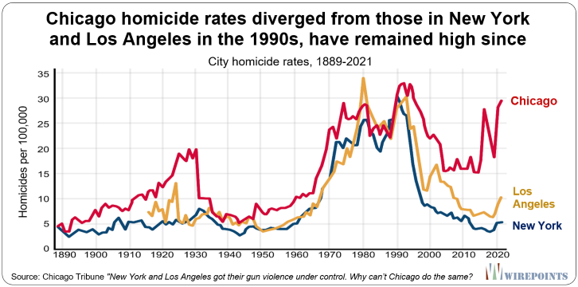

# Introduction

## History of Pittsburgh Black Population

Few places held as much promise for the huge numbers of African Americans fleeing the South in the years following the Civil War as the thriving city of Pittsburgh, Pennsylvania. Black people flocked to Pittsburgh, particularly to the Hill District, hoping to find work in the steel and railroad industries and escape the Jim Crow segregationist laws of the Reconstruction-era South. This was during the time period when Pittsburgh had a very booming steel manufacturing industry.

The Hill District was a neighborhood close to downtown but up against steep hills, making it an unattractive place for the city's upper classes to live. In the Hill District, a city-within-a-city that was acknowledged by the 1930s as the center of black culture and commerce, African Americans established close-knit communities. The Negro League Pittsburgh Crawfords, one of the best baseball teams in the country, played in the comunnity at Greenlee Field, the first black-owned and black-build baseball stadium in America. It was also home to one of the most active jazz scenes in the nation.
  

However, as the century went on, the neighborhood's decaying infrastructure cast a shadow over it. Regardless of whether the Lower Hill District's structures need restoration, the city decided to demolish them in 1956 to make room for the construction of the new Civic Arena. Over the subsequent five years, this resulted in the eviction of 8,000 inhabitants, further causing overcrowding in the Middle and Upper Hill areas. This led to the loss of much of the city's cultural vitality and significantly changed how the Hill is today.

After these events, the city of Pittsburgh, as a whole, suffered through a period of economic decline as the city would start to lose their number of jobs and residents to the suburbs and to overseas. Though they faced hardship, the African-American population in Pittsburgh would continue to grow, reaching to about 12% in 1950. However, that would not stop the rampant unfair employment practices and barriers they would have to overcome to live where they wanted to live. Black unemployment was more than twice as high as white unemployment from the early 1950s to the early 1960s, and wealth disparities were pervasive. Even though the city passed a fair employment practices legislation in 1953, approximately 25% of all discrimination complaint cases across the states were filled with the Pittsburgh area office. 

## Policing in Pittsburgh

The Pittsburgh Police Department's budget has risen from a budget of $74 million to $115 million from the years 2014 to 2021, an almost 60% in 7 years. One-fifth of the city's annual budget is represented by this figure. Because of this, many individuals in the Pittsburgh region conveyed the wish to cut the police budget by at least $40 million in order to invest the money elsewhere in the community. 

The figure visualizes the statistic of the police bureau receiving one-fifth of Pittsburgh's operating budget, which is the largest percentage in over six years. Within this image, one can see how the police budget steadily increases by every year, no sign of decrease. 

Inside the Pittsburgh City Paper, Lauryn Nania writes an article discussing the call for the decrease in police  funding and an increase in community investment in Pittsburgh, Pennsylvania. In this article, she discusses comments made at a news conference conducted by the Coalition to Reimagine Public Safety. Nanaia recounts a statement Jasiti X, founder of 1Hood Media, made when examining the structural and institutionalized violence that minority groups experience and the fact that these problems frequently lead to violent crimes. The problem cannot be handled if these communities lack the necessary resources. Jarisi X exemplifies his point by saying, "Violence is far more than just crime. Violence is an experience that limits or diminishes people's capacity to survive. Unemployment, inadequate housing, lack of access to medical care, subpar public education systems, food insecurity, and racism are all violence." [7] 

With this, individuals are concerned with the increase in police funding when problems within community investment continue to be neglected. According to a 2020 research by the Abolitionist Law Center, there were significant disparities in how Black and white were treated by police in Pittsburgh in 2019. This information was highlighted by the Coalition to Reimagine Public Safety in Lauryn Nania's article. The Abolitionist Law Center report states, "Black people made up only 23.2% of the Pittsburgh population, and yet they made up 43.6% of individuals involved in traffic stops, 71.4% of all frisks, 69% of individuals subject to warrantless search and seizures, and 63% of all arrests conducted by the Pittsburgh Police." [7]

When it comes to children, the disparities were even more vast: Black children accounted for 83% of all warrantless search and seizures of individuals ages 11-18 and 100% of all warrantless search and seizures of children ages 10 and under.
[7] These statistics illustrates the effect of the increasing crime prevention rather than analyzing the aspects of what could displace a community. Even with these statistics, Mayor Bill Peduto has resisted calls to dramatically reduce the police budget, arguing that while it has grown, general crime has fallen. Individuals within the community believe with an uprising in interactions with police that end in death such as Antown Ross II and Bruce Kelly Jr., policing can be replaced with required and immediate alternatives. 

## Relationship between Citizens and Police

George Floyd's death and other instances of police brutality have sparked national calls for police reform and elevaed public oversight of law enforcement to the top of the agenda in legislative discussions. Because of these instances, residents are starting feel frightful when around the presence of law enforcement, rather than protected. Local eleceted authorities are moving to establish and broaden civilian supervision, including a recent proposal for referendum to improve Pittsburgh's Citizen Police Review Board (CRPB) and renewed efforts to establish a county wide board. 

However, some residents are hesitant to a citizen police review board primarily because they believe it was not be successful towards the pursuit of police reform. The varying opinions about citizen review boards by residents of Pittsburgh ranges from individuals believing that the boards can lessen prejudice in officer investigations and increase public trust in the police to boards frequently fail to conduct full investigations and impose discipline. Juliette Rihl and Mitra Nourbakhsh, the authors of "Who polices the police? In Pittsburgh and Allegheny County, a critical crossroads for civilian review", use stastics to assess the effectiveness of a citizen police review board in Pittsburgh, "Between 1998 and 2017, 3% of the more than 3,000 complaints CPRP received resulted in public hearings, one of the final stages of the board's process...Across that time period, Pittsburgh's police chiefs fully rejected many of CPRB's recommendations" [11]. This stat highlights the disconnect between the police department in Pittsburgh and their citizens. Though citizens are voicing their opinions on how policing in conducted in their city, the police department refuses to properly address these issues. They chose to classify them as a non-essential matter. 

## Gun Violence in Pittsburgh 

According to recent study by county researchers, homicides in Allegheny County are disproportionately concentrated in a small number of high-need regions and disproportionately affect young Black men. Since the beginning of the Coronavirus pandemic in 2020, Pittsburgh and Allegheny County's homicide rate has spiked since the initial decline. The researchers who conducted the specific study spoke about the results, "All people, regardless of race or socio-economic status, deserve to live in neighborhoods that are safe and free of violence,...violence is heavily concentrated in just a small number of higher-need communities and overwhelmingly cuts short the lives of young Black men". [2] The analysis made by the researchers shows the disadvantage higher-need communities have compared to other communities in Allegheny County, specifically the suburban communities, due to how violence has become normalized. 

Though there is evidence that gun violence has become assimilated into predominantly Black communities, there still exists a lack of action towards addressing the gun violence issue and lessening the homicide rate. The eastern city neighborhoods of East Hills, Homewood, Larimer, and Lincoln-Lemington, along with a few more on the upper North Side, Hill District, South Hilltop, and West End, as well as Wilkinsburg, a part of Penn Hills, villages in the Mon Valley, are where most homicides occur.

Homicides occur in a very small percentage of Allegheny County's census blocks, and 79% of those blocks are located in regions with moderate to severe levels of "community need", which the researchers gauge by looking at statistics on poverty and other factors

The map above visualizes six years of homicides that have taken place in Allegheny County, additionally non-fatal shootings in Pittsburgh. The figure focuses on the city of Pittsburgh neighborhoods and also Allegheny County municipalities outside Pittsburgh.According to the legend located at the bottom of the figure, the coloring represents if the instances of homicidies are either more sparse or more dense in a certain community. Evidently, homicide seems to occurr more frequently around the Eastern region of Pittsburgh, where the residents are primarily Black. 

## Motivation

The current metro area population in 2022 stands as 1,699,000.[4] Statistically, the racial composition of Pittsburgh in the year of 2022 is 66.37% White, 24% Black or African American, 5.83% Asian, and 0.3% Latino. 

The graph illustrates the different races in Pittsburgh per the percentage in total population. The figure shows that the majority of the population in Pittsburg identify as white compared to the other races present. 

Within the semi-diverse community of Pittsburgh, there was a clear displacement between the neighborhoods, whether one 
was speaking about the suburban communities or the urban communities. In both the suburban and urban communities in Pittsburgh, PA, the percentage of white people is more than 82%. Inside these primarily white communities, the Black population percentage stands as 9.8%.

The figure above illustrates a line plot of the city of Pittsburgh's historical population from the 1950s to the 2000s, while depicting a second plot of the annual change in Pittsburgh's population. This figure also shows the United Nation's projections of what the metro population of Pittsburgh will be in 2030. One can see how there is gradual increase around the 1950s, and then a clear decrease occurs around the 1990s. After these evident changes, the population of Pittsburgh around the 2000s stays stagnant.

If one would compare these differing communities, the statistics would show how the Black and Brown communities are economically disadvantaged and more vulnerable to displacement. In actuality, issues within displacement represent the negative aspect of enduring poverty and segregation/exclusion. According to the Pittsburgh Neighborhood Project, due to deliberate actions taken at the federal, state, and municipal levels that deprived poor Black and Brown neighborhoods of investment, along with the consequences of white flight, outmigration, and de-industrialization, our poorest communities are as destitute as they are. [3]

The figure here shows the percentage of poor white and black residents living in high or extreme poverty neighborhoods in Pittsburgh according to the 2017 American Community survey estimates. Evidently, there is a higher percentage of Black resident living in high or extreme poverty. 

## Current State of the Art

Currently, there have been several kinds of actions taken to control housing development throughout Pittsburgh. Since the early 1990s, organizations and/or corporations have started to notice the neighborhood development crisis continue to worsen in Pittsburgh, and city officials continuing to leave  this plight unnoticed. Each of these organizations thrive to see the displacement of different Pittsburgh neighbrhoods be eradicted in the upcoming years. 

For instance, the Pittsburgh Housing Development Corporation (PHDC) was founded with the intention of initating, planning, financing, devloping, and managing Pittsburgh's housing construction. After realizing that neither the private development market nor neighborhood community development corporations were adequately serving significant portions of the city and county, the Urban Redevelopment Authority of Pittsburgh (URA) established the Pittsburgh Housing Development Corporation (PHDC) in 1994. The goal of PHDC was to promote the expansion of, and never supplant, organization that can create both inexpensive and/or market-rate housing. With an organization like the PHDC, there is more attention directed to the neighborhoods that require investment and/or development. Since its founding, PHDC has been involved in the creation of almost 350 units across the city, including market-rate new construction, affordable single family for sale new construction, single family rehabilitation projects, and multifamily rental complexes.

Another example is the Neighborhood Community Development Fund, which was formerly knows as the "Northside Community Devlopment Fund". They are a more than 20-year old, neighborhood-focused community loan fund based in Pittsburgh's Northside. Their mission is to assure that the neighborhoods who need it will receive the economic opportunits and community revitalization to thrive. While also providing resources, they aid disadvantaged neighborhoods by creating affordable housing and leading the redevelopment of the neighborhoods in Allegheny County. Specifically, these ventures should include opportunies of for all the members of the community, women, people of color, and people of different ancestries. According to the Neighborhood Community Development Fund website, since their founding, they have been able to accomplish 399 loans funded, 1,336 jobs created, and 70 affordable houses financed. [9]

## Goals of the Project

There are marginalized communities almost everywhere. They are persons who are excluded from participating in popular economic, political, cultural, and social activities for a variety of reasons. The goal of this project is to shed light on the effect marginalization has had on these Black and Brown communities. Though there is not a clear solution for marginalization at the moment, there can be steps made to acknowledge the affected individuals, and thus aid in their need for community investment. In fact, there are several benefits to tackling marginalization for the United States of America's economy. 

The economic prosperity of communities and the entire nation might be significantly increased by marginalized groups, such as ex-offenders and low-income communities, but they require support from the commercial, public, and social sectors. Concerning those who were previously incarcerated, more opportunities for newly released prisoners to enter the workforce are required. Thus, it opens up avenues for these individuals to re-build their lives and start providing for themselves and also the economy.
 

While also providing opportunities for ex-convicts, individuals should also focus their attention on delivering services to those who most need them. People who are having a hard time financially need assistance, but they are frequently too overburdened by work, family, and other commitments to ask for it.

## Ethical Implications

Regarding data science, there are pre-cautions individuals should take when completing projects take require data collection. The ability to access enormous amounts of data has profound effects on society. The human population has the potential to solve more problems and do more than ever before due to technology breakthroughs. However, it is crucial to keep in mind that law, ethics, and the concepts of privacy, trust, and security are all intertwined.

Data collection, in general, mandates several ethical considerations to be taken. For example, acquiring permission to use or share data, receiving clear and informed consent, and securely keeping data. Since this project relies heavily on data, there is a concern about information accuracy. To mitigate this harm, I have been carefully processing through the data sets I have acquired to ensure the data collected was not tampered with / has incorrect data.

It is crucial to have defined procedures for data sharing in addition to having clear processes in place for data collection.

# Related work

When it comes to neighborhood development, more funding for struggling areas is the presumptive answer. However, there needs to be clear initiative set on what would be the best way to utilize the funding. The analysis of instances where a community received, but still experienced hardship is frequently disregarded.  

## Pittsburgh Neighborhood Project

The 90 communities in the city of Pittsburgh are examined street by street in the Pittsburgh Neighborhood Project. The truth of enduring racial and economic segregation is reveled by this project as each neighborhood's beauty and individuality are also investigated. The mission of this project is to inform Pittsburgh residents about the origins, effects, and ongoing racial and economic segregation in Pittsburgh's neighborhood. The project also hopes to draw attention to the areas and the people who live there who desperately need long-term, equitable, all-encompassing investment.  

Similar to the project CriticalJustice, the Pittsburgh Neighborhood Project focus on indicators of why a specific community requires a higher level of need than other communities. In contrast, the Pittsburgh Neighborhood Project focuses on how poverty affects the citizens of the community, compared to how CriticalJustice will focus on how lack of infrastructure and over-policing affect a community. Similary, both of the projects focus on the idea that everyone, regardless of their color or social standing, deserves to live in areas that are secure and free from violence.

The Pittsburgh Neighborhood Project emphasizes the idea that because race matters, place matters (i.e., our neighborhoods were segregated by design). Particularly, from the early 1900s on, municipal land use control was employed to primarily favor White property owners at the expense of Black and poor people. There have been several tactics used to continue this separation from land use zoning to racial, which has been deemed unconstitutional by the Supreme Court in the 1920s. Furthermore, exclusionary zoning regulations still exist today and continue to have a disproportionately negative impact on Black and poor households, from the unequal allocation of public services to the concentration of nuisances in Black and poor communities.

The figure here shows the map visualization of the Pittsburgh neighborhood Project. The map here shows the different communities of Pittsburgh while also depicting the relevant Pittsburgh Parks and Allegheny County Major Rivers. The legend below also highlights one of the key factors of the Pittsburgh Neighborhood Project that they have been trying to emphasize-poverty. The coloring of the map represents the percentage of the rate that falls below federal poverty line by census tract.

## Infrastructure and Policing Research  

In the project CriticalJustice, the aim is to visualize how factors such as lack of infrastructure and over-policing disproportionately affect the neighborhood development in Black communities compared to white communities. Within several aspects of infrastructure, Black communities continually face some type of disadvantage. For instance, in Jesus M. Barajas' article, "Biking where Black: Connecting transportation planning and infrastructure to disproportionate policing", he examines whether excessive policing is related to transit limitations while using the example of cycling in Chicago. He would then report his findings, "Tickets were issued 8 times more often per capita in majority Black tracts and 3 times more often in majority Latino tracts compared to majority white tracts. More tickets were issued on major streets, but up to 85% fewer were issued when those streets had bike facilities, which was less prevalent in Black and Latino neighborhoods." From these statistics, one can conclude that the impacts of racially biased policing are exacerbated in the context of transportation safety tactics by infrastructure imbalances.

Black, Latino, and low-income neighborhoods in Chicago are more likely to be labeled as "dangerous" places for cyclists, but this exists due to historical underinvestment and failure to build sufficient infrastructure. Because of the element of danger in these communities, Barajas states how, "...safety advocates have called for an overhaul of the traditional 3 E's approach to safety focused on engineering, education, and enforcement to one that mitigates the impacts of crashes through a safe systems approach." This would soon become labeled as  Vision Zero, an approach that puts a lot greater focus on using data to target and create the best roadside countermeasures possible in order to completely eradicate traffic fatalities. With an approach like this, there will be a demand for a component of traffic enforcement to stop the riskiest driving practices. However, if police are continually being sent into areas with this goal, a trend will arise of stops unrelated to immediate safety increasing. Because of the impacts of policing on communities of color that are disproportionate, advocates have started to question the significance of policing in comprehensive safety methods like Vision Zero.

Since there is a present racial bias in policing, validated through documentation, infrastructure alone cannot eliminate racial prejudice in law enforcement, and discrepancies are likely to persist even after taking infrastructure into consideration. There is evidence of discrepancies at the neighborhood level in addition to racially biased enforcement at the person level. The patterns of traffic stops frequently reveal a policing approach that aims to impose order on "disorganized" communities. According to the article, researchers discovered that in an unnamed city in the Southwest of the United States, more traffic citations were issued in areas with lower residential stability, higher poverty rates, and higher proportions of Black and Latino residents, regardless of the race, gender, or resident status of the drivers. This re-occurring discrimination start to effect Black and brown communities more mentally and emotionally, rather than physically.

Policies like Broken Windows Enforcement, which can be described as a theory that states in metropolitan areas, even seemingly little incidents of social and physical disorder can lead to a lawless environment that fosters more serious crimes, and analogous tactics that aim to dissuade crimes by zealously enforcing small infractions, such as pedestrian or cycling offenses, explicitly indicate an aggressive policing policy. Throughout history, several scholars have suggested that a zero-tolerance policing policy degraded quality of life and constrained the mobility of people of color while being linked to a decrease in violent crime. Though you can see the advantage of a strict policing strategy, the mental and emotional health of people of color consequently decreases because of the prevalent racial bias police will always have. It raises the question of the effectiveness of
strict policing when it pertains to the happiness of the community's population of people of color. 

## Neighborhood Investment and Crime

With the aim of enhancing community conditions, service access, and ultimately the wellbeing of people, there is growing interest in rejuvenating urban neighborhoods that have historically experienced disinvestment. However, place-based affordable housing is frequently opposed by locals who claim that it will increase crime and drive down poverty values. In the article, "Do investments in low-income neighborhoods produce objective change in health-related neighborhood conditions", the authors Researchers have noticed that there is a necessity to evaluate to what extent may the revival of troubled, low-income urban-districts be triggered by strategic allocation or processes associated to development implementation. In other words, there is not enough evidence to declare that community investment really affect characteristics that may have a direct impact on inhabitants' capacity to live comfortably, such as crime incidence reports and walkability that has been objectively analyzed.

In addition to this article's findings, the article, "Residential crimes and neighbourhood build environment: Assessng the effectiveness of crime prevention through environmental design (CPTED)", evaluates the relationship between residential crime and the built environment that adheres to the CPTED principles at the neighborhood level. In this article, the author, Dong-Wook Sohn, highlights the claim that criminologists make about how demographic and socioeconomic conditions are highly linked to crime in urban neighborhoods. However, when it comes to the perspective of environmental psychology, crime is thought to be a behavior that is influenced by the physical aspects of the environment.

Sohn references a book called, "The Death and Life of Great American Cities'", which is made by Jane Jacobs to introduce her claim that, "the continual use of public areas promoted by the creation of open, permeable environment with mixed land uses was the most effective way of ensuring informal surveillance." In this claim, Jacobs stresses how if there was more emphasizes on the the public areas of the environment, especially with mixed land uses, informal surveillance would be ensured. Thus, such arguments are founded on the premise that increased opportunities for informal monitoring present themselves as the number of people on the streets increases, discouraging criminal action.

## The Death and Life of Great American Cities

In her book, "The Death and Life of Great American Cities", Jane Jacobs directly criticizes the current results of city planning and rebuilding, and its effects it has on, as she describes it, the "slums" of America cities. She emphasizes in the introduction of her book that she will be discussing how cities in America work in real life, "because this is the only way to learn what principles of planning and what practices in rebuilding can promote social and economic vitality in cities, and what practices and principles will deaden these attributes". Jacobs prefaces this statement before speaking more about the topic to acknowledge the deficiencies of city planners today. If one wants to rebuild a community they feel is faltering, one must understand the conditions that certain city is understanding and how cities in general operate.

Though several individuals in America believe investing more money in the communities she refers to as "slums" would be a clear solution, Jane Jacobs debunks that claim by utilizing how city planning strategies such as, low-income projects, middle-income housing projects, expressways, etc., have made more of a negative impact on these communities rather than a positive impact. She proclaims that, "Under the surface, these accomplishments prove even poorer than their poor pretenses". Jacobs believes that actions that have been taken towards city planning cannot stand as achievements because they rarely assists the urban areas around them, despite the fact that in theory they should. Moreover, many believe the biggest accomplishments when it comes to city planning is when areas that may be labeled as "dangerous" are combined with modern city architecture. Nonetheless, the crisis within the communities continue to worsen while the removal of commerce and culture from the intimate and informal life of cities is concealed by massive cultural centers beneath the publicity blitz.

Jacobs heavily criticizes those who are in charge of city planning by stating how they, "...are guided instead by principles derived from the behavior and appearance of towns, suburbs, tuberculosis sanatoria, fairs, and imaginary dream cities-from anything but cities themselves". This statement by Jacobs references back to the idea that there is becoming a removal of culture from cities nowadays. Instead of focusing on the revival of the so-called "slums", both practitioners and educators in this field continue to attempt to replicate their view of a "balanced community", where aspects of commercialization and struggle are both present.

## Crime and Private Investment in Urban Neighborhoods

Though the task of how to best enhance neighborhoods burden policy-makers, practitioners, and academia, there still remains to be little to no change made towards the issue. Correspondingly, the most effective ways to achieve community development are still the subject of a heated dispute. In the article, "Crime and private investment in urban neighborhoods", Johanna Lacoe analyzes a study that was conducted to examine how, throughout the 2000s, while crime was dropping in both Chicago and Los Angeles cities on a city-wide level, private investment in areas varied as the incidence of neighborhood crime changed. The questions of whether criminal policy may influence the development of neighborhoods and the residents who live there is the focus of this essay.

For background, this figure above showcases the homicide rate diverged from three major cities, New York, Los Angeles, and Chicago from the years 1889 to 2021. All three cities starting to see an increase in their own homicide rates in the early 1990s, but both New York and Chicago began to see a rise as early as 1890. The homicide rate starting to be become noticeable in the city of Los Angeles in the year 1920. However, the city of Chicago had a much higher increase than the other two cities. That soon to become a trend all three cities had a noticeable increase in the homicide rate, Chicago's homicide rate would surpass the more populated cities. In fact, when there was massive decrease in the homicide rate from the years 2010 to 2020, the city of Chicago's homicide rated increased 10 times its counterparts.

There has been research conducted already that evidently shows that a neighborhood's and its residents' quality of life is negatively impacted by high and rising crime rates. However, this does not immediately mean that the relationship between crime and neighborhoods is proportionate. More specifically, the research on crime and neighborhoods raises the questions of whether or not crime and communities have a symmetrical dynamic connection. In other words, if more crime has bad consequences, does less crime have good consequences that produce observable change? If so, it would imply that measures aimed at lowering crime might be useful and even significant instruments for economic development. After conducting research on how private investment in the cities of Chicago and Los Angeles has changed as the incidence (and rate) of crime in those neighborhoods changed, Johanna Lacoe was able to come to the conclusion that private investment, as shown by procurement of construction permits, increase on the same blocks where crime decreased the year before.

# Method of approach

This chapter answers the "how" question - how did you complete your project,
including the overall design of your study, details of the algorithms and tools you
have used, etc.  Use technical diagrams, equations, algorithms, and paragraphs of text
to describe the research that you have completed. Be sure to number all figures and
tables and to explicitly refer to them in your text.

This should contain:

* lists
* with points
* and more points
  * possibly subpoints

For those projects whose implications address social or moral issues (i.e. ethical
standards, causes, effects), you will want to use this section to describe how you
actively mitigated or considered these issues.

# Experiments

This chapter describes your experimental set up and evaluation. It should also
produce and describe the results of your study. The section titles below offer
a typical structure used for this chapter.

## Experimental Design

Especially as it pertains to responisble computing, if conducting experiments or
evaluations that involve particular ethical considerations, detail those issues here.

## Evaluation

## Threats to Validity

# Conclusion

Traditionally, this chapter addresses the areas proposed below as sections, although
not necessarily in this order or organized as offered. However, the last section --
"Ethical Implcations" is required for this chapter. See the heading below for more
details.

## Summary of Results

## Future Work

## Future Ethical Implications and Recommendations

Especially as pertains to the public release or use of your software or methods, what
unresolved or special issues remain? What recommendations might you make?

## Conclusions

# References

::: {#refs}

[1] Wolfson, Charlie, and Ladimir Garcia. “Turnout Data Show Marginalized Communities Often Have Quietest Voice in Allegheny County Elections.” Pittsburgh City Paper, Pittsburgh City Paper, 28 Nov. 2022, https://www.pghcitypaper.com/pittsburgh/turnout-data-show-marginalized-communities-often-have-quietest-voice-in-allegheny-county-elections/Content?oid=22722946. 

[2] 90.5 WESA | By Kate Giammarise. “Allegheny County Homicide Rate Driven by Gun Violence, Report Finds.” 90.5 WESA, 27 July 2022, https://www.wesa.fm/politics-government/2022-07-26/allegheny-county-homicide-report.

[3] The Pittsburgh Neighborhood Project. The Pittsburgh Neighborhood Project, 19 Nov. 2022, https://pittsburghneighborhoodproject.blog/.

[4] “Pittsburgh Metro Area Population 1950-2022.” MacroTrends, https://www.macrotrends.net/cities/23100/pittsburgh/population. 

[5] “Pittsburgh, 1957: A Mecca of Black Culture and Business Destroyed (from the Playbill).” Marin Theatre Company, https://www.marintheatre.org/productions/fences/fences-pittsburgh-1957. 

[6] “The Keys to America's Economic Growth Are in Low-Income and Marginalized Communities.” Urban Institute, 22 Nov. 2017, https://www.urban.org/urban-wire/keys-americas-economic-growth-are-low-income-and-marginalized-communities. 

[7] Nania, Lauryn. “Police-Reform Activists Call for Decrease in Pittsburgh Police Funding and Increase in Community Investment.” Pittsburgh City Paper, Pittsburgh City Paper, 1 Dec. 2022, https://www.pghcitypaper.com/pittsburgh/police-reform-activists-call-for-decrease-in-pittsburgh-police-funding-and-increase-in-community-investment/Content?oid=19705923. 

[8] “Let's Talk about Race: Data Page.” PublicSource, https://projects.publicsource.org/pittsburgh-race/data.html.

[9] “Neighborhood Community Development Fund.” Neighborhood Community Development Fund, 9 Aug. 2022, https://www.ncd-fund.org/about-us/. 

[10] Cotter, First-person essay by Nick. “Disparities between Pittsburgh Neighborhoods Persist. This Project Tries to Understand Why.” PublicSource, 5 Nov. 2021, https://www.publicsource.org/disparities-between-pittsburgh-neighborhoods-persist-this-project-tries-to-understand-why/. 

[11] Juliette Rihl, Mitra Nourbakhsh. “Who Polices the Police? in Pittsburgh and Allegheny County, A Critical Crossroads for Civilian Review.” PublicSource, 13 Aug. 2020, https://www.publicsource.org/who-polices-the-police-in-pittsburgh-and-allegheny-county-a-critical-crossroads-for-civilian-review/.

[12] Barajas, Jesus M., et al. “Biking Where Black: Connecting Transportation Planning and Infrastructure to Disproportionate Policing.” Transportation Research Part D: Transport and Environment, Pergamon, 3 Sept. 2021, https://www.sciencedirect.com/science/article/pii/S1361920921003254?via%3Dihub.

[13] Holliday, Stephanie Brooks, et al. “Do Investments in Low-Income Neighborhoods Produce Objective Change in Health-Related Neighborhood Conditions?” Health &amp; Place, Pergamon, 15 June 2020, https://www.sciencedirect.com/science/article/pii/S1353829220300666?via%3Dihub.

[14] Dong-Wook Sohn,"Residential crimes and neighbourhood built environment: Assessing the effectiveness of crime prevention through environmental design (CPTED)", Cities, Volume 52, 2016, Pages 86-93, ISSN 0264-2751,
https://doi.org/10.1016/j.cities.2015.11.023.
(https://www.sciencedirect.com/science/article/pii/S0264275115300159)

:::
