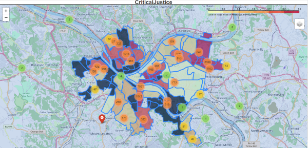
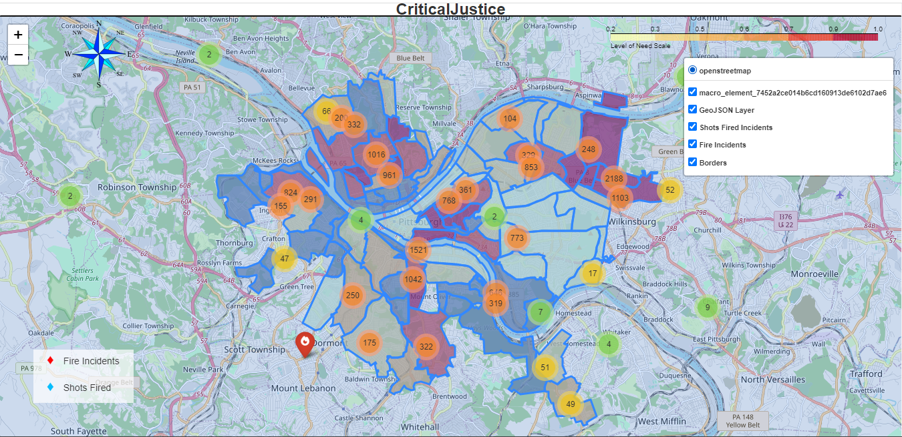

# Acknowledgments

**Mommy and Daddy**: From the moment we came here from Nigeria, you guys have been so supportive in every little activity I wanted to do. From me being able to be creative in everything and also with academics, I am so grateful for all the support and love you guys have been giving me for my 21 years on this earth. God Bless you guys and I love you both so very much. Thank you for everything!

**Tumi and Tom**: My carbon copies! I do not think I would be able to get through most of my childhood without have you guys being by my side. As much as I hate to admit this, you guys are the best twin siblings in the world. From all the inside jokes we have, to the laughing attacks we have everywhere no matter where we are, I appreciate every moment I spend with you guys. I'm grateful to you guys for adding so much joy and excitement to my life.

**The Computer Science Department**: I can say from the bottom of my heart, I am so grateful to be apart of this amazing department. From freshmen year, I have learned so much by taking computer science class and engaging with the several different professors in the departments. I am so grateful for everyone individual I have met in the Computer Science Department and all the amazing times I have shared at Allegheny! I definitely struggled with moments of "imposter syndrome" where I believed computer science was not the right path for me. However, with the guidance and admiration from the professors of the department, I have been to evolve as an individual with both my academic pursuits and my personal achievements. Thank you so much Professor Luman, Professor Jumadinova, Professor Bonham-Carter, Professor Mohan, and Professor Kapfhammer! A big special thank you to Professor Luman for being an amazing comp advisor, I seriously do not think I would have been ablt to craft my thesis without your guidance!

**Lex**: My girl! (I have another word I want to use, but I do not think that would be appropriate.) Every computer science class I have been able to take with you has genuinely been so fun no matter how difficult the work was. You are the only person that can make me laugh so easily and so much at a time. I love you so much and I am so happy I can call you one of my best friends! You are going to do amazing things!

**Kai'lani**: My OG, oh my goodness! We have been best friends and taking computer science classes together for 4 straight years and I am still happy of the day we met. You have been such an amazing friend and I am so proud of seeing how you have been able to evolve as a person. I would never trade our friendship for anything and I am so excited for what you do in the future. You are amazing, and I adore you so very much.

**Shira, Lili, Adriana, and Jasmin**: I honestly cannot thank you guys enough for being some of the greatest friends / roommates I have ever had. You guys inspire me everyday to be better and you all are always there to pick me back up whenever I am feeling down about myself. I am so grateful I have met every single one of you and I know I will keep in touch with all of you in the future! I love you guys so much

**Daniel and Gabe**: I can very confidently say you both are my best guy friends I have really ever made. You both have made so many memorable memories for me here at Allegheny and I am so thankful for that. Seeing you both grow as individuals from freshmen year and achieve so much in that time was so amazing to witness. Thank you for always sharing my interests with me when no one did. I love and appreciate you both so much and I am so happy to call you both my best friends!

**Carly and Logan**: It is absolutely insane to me that I have been best friends with the both of you for 10 (INSANE) years. You both have watched me grow from middle school to the end of my college career and I am so grateful I have been able to have the both of you on this journey with me. I know our friendship will evolve even more in our adult lives and I cannot wait to see what you both achieve in the future. I love and adore you both so so much!

**Pi Phi**: To this day, I am still so proud of myself of committing to joining an organization like Zeta Phi Beta Sorority, Incorporated. This organization has allowed to break out of my shell and push myself out of my comfort zone and I am so grateful for that. I am so thankful for the long-lasting friendships I have being able to make from joining this organizations and how they have been able to build me up to this. Especially, Shonna and Jahmaya, you both have become like sisters to me and I would not trade that for the world!

**London, Kaylan, Amani, Yara, Zoe, Abby, Nathalie, Laila**: Even though I have become close to all of you guys in such a short amount of time, all of you has made such a great impact in my life here at Allegheny. To be able to be with people that share similar experiences with me and look like me has been an absolute joy and I honestly cannot thank you guys enough for being so amazing. I love you guys!

**Anna, Rachel, Sarah, L, Asher, Kabang**: Thank you for your amazing friendship and everything you guys have contributed to my time here at Allegheny. I love all you so dearly and I hope to continue to talk to you all after graduation!

# Introduction

There are several reasons crime occurs in a certain community. These could range from the economic determinants such as educational attainment, wage income, income inequality, and public expenditure on police. The theory that police presence or public funding in protection actually causes more crime may seem contradictory, but there has been data that show that communities who have a higher percentage of police dispatches tend to have a higher crime rate.  

Additionally, lack of investment in a community can lead to a higher crime rate in a community. One must consider the long-standing connection between violence and geography in order to comprehend the causes of-and potential remedies for- violence in the United States. According to decades of study, violence is spatially concentrated in America, happening disproportionately in a small number of streets.

Also, the concentration of structural disadvantage indicators (such as poverty, poor educational attainment, and high unemployment) and the greatest percentage of persons of color may be found in these areas.

For instance, in a survey conducted by Jefferey T. Ulmer, Casey T. Harris, and Darrell Steffensmeier, the authors compared white, Black, and Hispanic populations regarding race and ethnic differences in structural disadvantage and crime. Their goal for this study is to increase understanding of the systemic causes of racial and ethnic differences in violence. They do this by extending the few and limited research that has been done on the connection between racial/ethnic disparities in deprivation and variations in violent crime among groups. [@ulmer_harris_steffensmeier_2012]

Their results from this study suggest that there is a lot of variation in the extent of the structural disadvantage and crime gaps between Whites and Blacks, Whites and Hispanics, and Blacks and Hispanics, and these gaps are positively correlated with racial and ethnic differences in homicide and other forms of violence.

To summarize, the current study shows that racial and ethnic gaps in crime are significantly influenced by differences in disadvantage, notably family structure and poverty.

## Black Population Currently in Pittsburgh, PA

In order for individuals to understand the impact of factors in the determinants of crime and the relationship with infrastructure that affect neighborhood development, one has to understand the conditions of the Black population in Pittsburgh, PA.

According to the U.S. Census, 7,000 persons of color left Pittsburgh between 2014 and 2018-as recently as May 2021. According to a news report on WPXI-TV, Pittsburgh's news source, by Michele Newell, the wholesale eviction of Black inhabitants from Pittsburgh is the primary cause of the out-migration. Newell reports that Black and Brown people in the city of Pittsburgh believe that they aren't given tools to create and preserve affordable housing. Black and Brown people in the city of Pittsburgh were able to voice their concerns about mass displacement of Black residents in Pittsburgh during the City Council's public hearing. A woman exclaims during the hearing that, "Pittsburgh fails Black women and their families terribly! Unemployment and housing!" [@newell2021]

It is clear from the above testimony and the facts provided by the news reporter that Black and Brown individuals are dissatisfied with quality of life in Pittsburgh.

According to an article titled, "Pitt report: Quality of life for black residents worse in Pittsburgh than in other cities", Emily Wolfe reports that the former Mayor Bill Peduto's Gender Equity Commission released a report that investigates racial and gender disparity in the City. According to the report conducted by a team of Pitt researchers, "while Pittsburgh ranks in the middle 50% of American cities when it comes to health, employment, income and education for its white residents, those same factors rank much lower for black residents." [@wolfe2019]

The above factors, health, employment, income, and education, are essential for neighborhood development, and predominantly Black communities suffer because they do not have access to these elements compared to their white counterparts.

A new initiative called "Black Pittsburgh Matters" is the City of Pittsburgh's approach to develop Black neighborhoods and enhance the quality of life for Black people. Their principles are Black Communities Matter, reviving traditional Black communities; Black Lives Matter, ensuring the health and safety of Black People; and Black Wealth Matters, fostering Black enterprise and employment. R. Daniel Lavelle and Rev. Ricky Burgess, councilmen from Pittsburgh, Pennsylvania, continue to draft laws that would improve the quality of life for the city's Black residents. [@thecityofpittsburgh]

During a period in which they felt abandoned by the community, initiatives like these provide those living in low-income Black areas in Pittsburgh, Pennsylvania hope. As a result, there could now be a greater emphasis on the quality of life for Black people if programs like this keep developing and being proposed. By concentrating on the factors that make Black people in Pittsburgh unhappy, the city may start to come up with solutions that will make housing in Pittsburgh more accessible and eliminate any cases of eviction.

## Motivation

The current metro area population in 2022 stands as 1,699,000. Statistically, the racial composition of Pittsburgh in the year of 2022 is 66.37% White, 24% Black or African American, 5.83% Asian, and 0.3% Latino. [@macrotrends2010]


The graph illustrates the different races in Pittsburgh per the percentage in total population. The figure shows that the majority of the population in Pittsburgh identify as white compared to the other races present.

Within the semi-diverse community of Pittsburgh, there was a clear socioeconomic difference between the neighborhoods, whether one was speaking about the suburban communities or the urban communities. In both the suburban and urban communities in Pittsburgh, PA, the percentage of white people is more than 82%. Inside these primarily white communities, the Black population percentage stands as 9.8%.


The figure above illustrates a line plot of the city of Pittsburgh's historical population from the 1950s to the 2000s, while depicting a second plot of the annual change in Pittsburgh's population. This figure also shows the United Nation's projections of what the metro population of Pittsburgh will be in 2030. One can see how there is gradual increase around the 1950s, and then a clear decrease occurs around the 1990s. After these evident changes, the population of Pittsburgh around the 2000s stays stagnant.

As someone who grew up in a predominantly Black and brown community in the suburbs of Pittsburgh, I have witnessed how individuals in my neighborhood suffered compared to the individuals who lived in the predominantly white neighborhoods near me who did not face the same issues. In actuality, issues within displacement represent the negative aspect of enduring poverty and segregation/exclusion. According to the Pittsburgh Neighborhood Project, due to deliberate actions taken at the federal, state, and municipal levels that deprived poor Black and Brown neighborhoods of investment, along with the consequences of white flight, out-migration, and de-industrialization, our poorest communities are as destitute as they are. [@cotter2019]


The figure here shows the percentage of poor white and black residents living in high or extreme poverty neighborhoods in Pittsburgh according to the 2017 American Community survey estimates. Evidently, there is a higher percentage of Black resident living in high or extreme poverty.

To sum up, because my neighborhood serves as an illustration of how largely Black neighborhoods suffer from  underinvestment, particularly in infrastructure, I am enthusiastic about bringing attention to other communities that experience this problem.

## Community Violence in Pittsburgh

There are many factors that has been speculated that lead to violence. Research that has been conducted identifies numerous root causes and danger signs for societal violence. It can range from individual risk factor, relationship risk factors, and community risk factors. More prevalently, community risk factors such as social disorganization  or limited community participation; poverty; crime; and community blight. Despite significant intervention and prevention efforts made by public officials, researchers, law enforcement personnel, and community-based individuals are organizations, community violence has persisted as a public health issue throughout the United States, and particularly within urban underprivileged communities of color.

For an individual to understand why community violence occurs so frequently, one must recognize the many elements that contribute to community violence. The Allegheny County Department of Human Services is especially interested in community violence because of how it disproportionately impacts families in communities and vulnerable population groups. In a report prepared by Erin Dalton, Michael Yonas, Latoya Warren, and Emily Sturman titled, "Violence in Allegheny County and Pittsburgh", the authors attempt to produce a profile of community violence in Allegheny County to more fully comprehend how DHS clients and consumers feel about violence. [@acanalyticswebdev]

In addition to intergroup violence, Pittsburgh has had a number of incidents of gun violence in its urban neighborhoods. Even though they frequently make the news, killings and drive-by shootings are much less common than aggravated assaults with weapons. In Pittsburgh, shootings (defined as aggravated assaults with a firearm that cause injury) are six times as prevalent as killings, while aggravated assaults with firearms are ten times more frequent than homicides. According to the report, "Pittsburgh's murder rate (4.8 per 100,000 in 2005) is lower than the national average and that of many benchmark cities like Detroit, St. Louis, Baltimore, and Richmond. [@acanalyticswebdev]

However, examination of violence trends among different demographic groups shows that, in particular, Pittsburgh's young black men are at acute risk of homicide victimization; the homicide rate for this group was 284.2 per 100,00-60 times the city-wide average and more than 50 times the national average". This information exposes the demographic that actively is affected by gun violence in Pittsburgh which is the Black male community. This violence was strongly concentrated in particular Pittsburgh areas as well as in nearby but outlying communities including Penn Hills, Wilkinsburgh, West Mifflin, and Mckeesport. The report indicated that African Americans and those living in poverty are more prevalent than usual in almost all communities with high homicide rates.

Though there is evidence that gun violence has become assimilated into predominantly Black communities, there still exists a lack of action towards addressing the gun violence issue and lessening the homicide rate.


The map above visualizes six years of homicides that have taken place in Allegheny County, additionally non-fatal shootings in Pittsburgh. The figure focuses on the city of Pittsburgh neighborhoods and also Allegheny County municipalities outside Pittsburgh. According to the legend located at the bottom of the figure, the coloring represents if the instances of homicides are either more sparse or more dense in a certain community. Evidently, homicide seems to occur more frequently around the Eastern region of Pittsburgh, where the residents are primarily Black.

## Fire Instances and Infrastructure

Pittsburgh has unfortunately seen several infrastructure fails in the past couple years. In September of 2016, a building fire came dangerously close to destroying the Liberty Bridge. It took firefighters nearly 30 minutes to put out the fire, which had a temperature of more than 1,200 degrees. [@folts2022] With an incident like this occurring, there was a need for an investigative report on fire inspections in Pittsburgh, PA.

Fortunately, Carnegie Mellon University conducted a Metro21 research project that assesses fire risk prediction models to decide which property fire inspections to prioritize. Their motivation for this research project address the issue with the approach towards fire inspections and how they could be significantly advanced in the city of Pittsburgh. The argument made here is that the use of risk-based data-driven systems for the identification, selection, and prioritization of new properties to check could greatly improve current approaches to fire inspection. [@carnegie]

In order to develop their model, researchers make use of information from past fire incidents from 2009 to 2017, data on property assessments and valuations from Allegheny County, and information on non-fire inspections and violations (such as noise and sanitation) from the Department of Permits, Licenses, and Inspections of the City of Pittsburgh. They combine this data at the address level, and by "training" the model on the first 7.5 years worth of historical fire incidence data and assessing the model on a test set that was not used for training, researchers are able to estimate the chance of a fire for a particular address over a 6-month span. [@carnegie]

As this model can anticipate property fires that take place in various communities, it may prove valuable for the city of Pittsburgh. Whether an alarm or smoke detector was activated at the address in question before the fire incident was one significant predictive characteristic that our model was able to identify. This enables the researchers to determine whether fire incidents were a regular occurrence in this specific location. Measures of the lot area, assessed value, and sale price at the address were additional significant predictive variables. The age of the building might be inferred from these data, which may indicate that there hasn't been much infrastructural development.

The researchers next conducted study on the buildings that earned high fire risk scores, as indicated by the model output as of this writing, after presenting the predictive characteristics on the model.


The most high-risk property kinds are shown in the aforementioned graphic. According to this presentation, apartments with 40 or more units are the ones with the greatest number of high-risk addresses and apartment with 5-19 units had the second greatest number of high-risk addresses. These apartments often serve as low-income housing for individuals, where there is a lack of community investment, and as a result, they typically have worse conditions than other apartment buildings.

Also, the picture illustrates how specific infrastructure in some low-income communities does not receive the same level of investment as in other places. So, compared to more contemporary structures, a degraded building has a larger danger of catching fire.

## "Hot Spot" Policing

On top of the lack of resources that could be a catalyst for  neighborhood development, the aspect of "Hot Spot" policing could potentially damage the community it targets because of the overly aggressive and indiscriminating police. There are certain unfavorable outcomes, including increasing hostility against and fear of the police and, more significantly, a failure to adequately address the roots of crime.

"Hot Spot" policing is a controversial strategy for reducing crime. In this method, resources and activities in hot spots are targeted. "Hot spots" are defined as places where crime and chaos are persistently high. Usually, these hot spots tend to have a high population of Black residents. The plan with "hot spot" policing is predicted on the nation that in communities, crime and disorder are often concentrated in a few small areas rather than being distributed uniformly and crime issues can be resolved more effectively by focusing resources on areas with a persistently high crime rate. [@collegeofpolicing2022]

A mechanism that has been used for "Hot Spot" policing has been the gunshot detection system ShotSpotter. ShotSpotter consistently detects and precisely locates gunshots using a set of acoustic sensors that are linked to a centralized, cloud-based application. According to the ShotSpotter data collected, the equipment had a 97% accuracy rate and a 0.5 false positive rate. [@shotspotter2023]

Even with the reported positive results, several individuals still question the gunshot detection company and its technology. For instance, the city of Chicago's Inspector General issued a critical report on the ShotSpotter gunshot detection company which indicated there are deep problems with ShotSpotter and its technology and how it impacts communities of color and their relationship with law enforcement. Inside the critical report, it questions the technology's "operational value" and discovered that it makes police officers use stop and frisk procedures more frequently in specific neighborhoods. The Northwestern School of Law's MacArthur Justice Center also made a similar critical report and legal filing that addresses how Shot Spotter is "deployed overwhelmingly in communities of color, which already disproportionately bear the brunt of a heavy police presence". There are various issues with the police's claim that they choose neighborhoods for deployment depending on where shootings occur. For example, the MacArthur Justice Center highlights that because sensors are placed in some neighborhoods but not others, the police will be able to identify more incidents—real or fake—in those areas. This could skew data on gunfire and produce a statistical basis for excessive policing in neighborhoods of color. [@stanley2021]

## Relationship between Citizens and Police

Pittsburgh's recent city operating budget has created an uproar among their citizens due to the large amount of money allocated to the Pittsburgh Police Department. Andrew Bankson and Brian Gonnella in their article titled, "Pittsburgh's city budget works for the police but not for the people", discuss the specifics of the budget and display which  organizations suffered when it pertains to funding. Pittsburgh's city operating budget for 2021 increased spending more than $30 million from the previous year. That totals a staggering $608 million, including a 5.45 percent rise in the budget for police personnel, which rose to over $68 million. [@banksongonnella2021]

Because of this diversion of money, public-sector workers must bear the burden and government positions must "stay unfilled". This creates even more fracture to communities because for EMS personnel, firefighters, laborers, truck drivers, and several other city employees who have put their lives in danger to keep the city operating during the crises our community has experienced, the budget asks for a general cut in pay. These cuts to city employees severely affects almost all city employees, with the exception of the pay and benefits of the uninformed police officers who intimidate the Black population of the city. The city budget is still managing to slash salaries for the Office of Public Works staff by am astounding 23.64 percent, while also reducing the number of truck drivers from 44 to 38 and laborers from 118 to 106. [@banksongonnella2021] This is in a city known for its deteriorating infrastructure, potholes, and lead-tainted pipes.

Unfortunately, these are the not the only programs who have seen cuts when it pertains to staffing and funding. Environmental Services is seeing a 23.64 percent reduction in funding as well as personnel layoffs. With a 27.17 percent reduction in staff, the Bureau of Facilities will have to lay off electricians, plumbers, bricklayers, and ironworkers. The Department of Mobility and Infrastructure, which manages one of Pittsburgh's biggest issue, is down 20.42 percent, and the Department of Parks and Recreation is down 18.58 percent. [@banksongonnella2021] Even the Citizen Police Review Board, whose power was recently approved by 78 percent of voters through referenda, suffered a 2.25 percent decrease in personnel wages and compensation.

## Critique of Current City Planning

In her book, ***The Death and Life of Great American Cities***, Jane Jacobs directly criticizes the current results of city planning and rebuilding, and its effects it has on, as she describes it, the "slums" of America cities. She emphasizes in the introduction of her book that she will be discussing how cities in America work in real life, "because this is the only way to learn what principles of planning and what practices in rebuilding can promote social and economic vitality in cities, and what practices and principles will deaden these attributes". [@jacobs1993] If one wants to rebuild a community they feel is faltering, one must understand the conditions of that certain city and how cities in general operate.

Though several individuals in America believe investing more money in the communities she refers to as "slums" would be a clear solution, Jane Jacobs debunks that claim by explaining how city planning strategies such as, low-income projects, middle-income housing projects, expressways, etc., have made more of a negative impact on these communities rather than a positive impact. She proclaims that, "Under the surface, these accomplishments prove even poorer than their poor pretenses". [@jacobs1993] Jacobs believes that the actions that have been taken towards city planning cannot stand as achievements because they rarely assists the urban areas around them, despite the fact that in theory they should. Moreover, many believe the biggest accomplishments when it comes to city planning is when areas that may be labeled as "dangerous" are combined with modern city architecture. Nonetheless, the crisis within the communities continue to worsen while the removal of commerce and culture from the intimate and informal life of cities is concealed by massive cultural centers beneath the publicity blitz.

Jacobs heavily criticizes those who are in charge of city planning by stating how they, "...are guided instead by principles derived from the behavior and appearance of towns, suburbs, tuberculosis sanatoria, fairs, and imaginary dream cities-from anything but cities themselves". [@jacobs1993] This statement by Jacobs references back to the idea that there is becoming a removal of culture from cities nowadays. Instead of focusing on the revival of the so-called "slums", both practitioners and educators in this field continue to attempt to replicate their view of a "balanced community", where aspects of commercialization and struggle are both present.

In her book, Jacobs discusses how planning for a city or a community may not always result in improvements to the inhabitants' standard of living. The first consideration for city planners when deciding whether to develop a community is if the proposed project will improve the lives of the residents or do more harm to their neighborhood.

## Current State of the Art

Data visualization can be described as a potent ability for the interactive and effective presenting of key data insights. In a a survey conducted by the Institute of Electrical and Electronics Engineers, this organization examined the effective uses of data visualization in a variety of disciplines and domains, including environmental data visualization, Internet of Things (IoT) dashboards, health sector visualization apps, and corporate dashboards.

A conclusion made from this study is that there is still a knowledge gap present concerning a data visualization survey that is interactive, effective, and efficient and explains the fundamentals of modern state-of-the-art best interactive visualization approaches, web-based tools, and platforms, best performance theories, and data structures and algorithms

Even for non-professional users, interactive visualizations may help make graphs and charts meaningful so that decisions can be made quickly. Given the benefits of people's inherent preference for interactive, powerful visualization, it is simple to generate insights and hidden values that aid in making better judgments. Data visualizations have been widely used across various industries thanks to these advantages. [@shakeel2022]

## Goals of the Project

Within this project, data has been collected that relate to the determinants of crime, ranging from economic to social determinants. The main goal of the project CriticalJustice is to visualize research that is already available for the public to view. The method of visualization primarily will be mapping instances of determinants of crime such as Shots Fired data, Fire Incident data, and the Average Dispatches per Shots Fired.

Though there is a main goal of the project, there is also an argument that this project is trying to prove. The argument is from the evidence of the data collected, there is implicit bias when police are being dispatched. There has been  This argument requires a large amount of evidence that specifically shows the effect of implicit police dispatch bias existing in a community and how that affect the resident's lives.

For instance, "CriticalJustice" utilizes the research conducted on the gunshot detection system ShotSpotter to add more to the argument that it is trying to prove. ShotSpotter is a type of technology that has caused residents in areas where it is widely used feel as though their privacy has been violated, despite claims of how accurate it has been at forecasting where the likely fire is located. Benjamin Goodman in his article, "ShotSpotter - The New Tool to Degrade What Is Left of the Fourth Amendment", explains how he feels the new technology infringes on the Fourth Amendment in the United States Constitution that, "protects people from unreasonable searches and seizures by the government".

The "CriticalJustice" project is also attempting to demonstrate that, when it comes to elements like the proportion of families living below the poverty lines and the frequency of 911 dispatches for gunshots, neighborhood with the highest police presence are also the ones with the greatest need. A neighborhood's level of need can also be determined by the frequency of fire incidents there. The statistics on fire incidences can show how infrastructure development varies from community to community.

## Ethical Implications

Regarding data science, there are pre-cautions individuals should take when completing projects take require data collection. The ability to access enormous amounts of data has profound effects on society. The human population has the potential to solve more problems and do more than ever before due to technology breakthroughs. However, it is crucial to keep in mind that law, ethics, and the concepts of privacy, trust, and security are all intertwined.

Data collection, in general, mandates several ethical considerations to be taken. For example, acquiring permission to use or share data, receiving clear and informed consent, and securely keeping data. Since this project relies heavily on data, there is a concern about information accuracy.

It is crucial to have defined procedures for data sharing in addition to having clear processes in place for data collection. However, also it is also essential to check the researcher's bias when collecting data from research, for example, scholarly articles. Also, there is a substantial amount of statistical bias in datasets that argue for social change as well as community development.

Regarding how the evidence connects to the argument, there can be ethical ramifications in the context of the "CriticalJustice" project. There may be a number of situations when a town with a high percentage of white residents simultaneously has a high demand. In this situation, steps should be taken to comprehend this number and how to deal with it so that the Black communities continue to receive attention.

# Related work

When it pertains to data visualization, the primary goal exists as helping to convey stories by organizing data into an understandable format and emphasizing patterns and anomalies. A strong visualization highlights important information while reducing noise in the data and telling a story. More specifically, within critical cartography, maps represent and maintain power relations, usually in the dominant group's favor.

Also, there are several examples of some sort of police surveillance that impacted the infrastructure of a certain community that exists in not just the Pittsburgh region, but other cities that are more populated than Pittsburgh. However, these cities share similar demographics to the city of Pittsburgh and face the same issues when it pertains to community investment.

In this section, I will offer critiques of the articles that discuss the value of community investment and the effects of excessive police presence in various neighborhoods. In order to illustrate the many functionalities used and how they are similar to "CriticalJustice", I will also be looking at critical cartography initiatives which address inequality  and marginalized communities.

## Critical Cartography

Critical cartography can be defined as a set of mapping techniques and analytical approaches based on critical theory, particularly the concept that maps reflect and uphold power relations, often favoring the dominant groups in society. With the help of critical cartography, people have been able to demonstrate a variety of ideologies using data and different mapping techniques. Counter-mapping which can be defined as map-making as a method of protest against established power structures also relates to the ideology of critical cartography.

Critical cartography may involve the creation and transformation of knowledge. The process of mapping involves sharing knowledge and building new knowledge by combining various points of view, connecting various personal maps, or developing group maps through rotation, negotiation, or consensus. [@firth2015]

## Mapping Inequality: Redlining in New Deal America

At the University of Richmond, Virginia Tech, University of Maryland, and Johns Hopkins University, three teams were able to collaborate to create "Mapping Inequality". In order to help the public better understand the effects of federal housing policy and local implementation in their own communities, "Mapping Inequality" brings a study of Home Owners' Loan Corporation into the digital sphere. This big data approach can simultaneously give a national view of the program to a neighborhood level-assessment of the 1930s real estate rescue. In this project, HOLC staff members assigned to residential neighborhood that reflected their "mortgage security", which would then be visualized on color-coded maps. The grades were based on data and evaluation compiled by local real estate professional-lenders, developers, and real estate appraisers-in each city. [@digitalscholarshiplab2016]

When banks and other mortgage lenders were assessing who should receive loans and which locations in the city were safe investments, they considered neighborhoods obtaining the highest rating of "A"-colored green on the maps-to be minimum risks. Red-colored communities with the lowest grade of "D" were labeled as "dangerous".

This project utilizes shapefiles and GeoJSON to develop complex visualizations of large geographically related data, similar to CriticalJustice. Geospatial visualization emphasize the actual linkage of the data elements. In order to provide insight, these visualizations concentrate on the connection between the physical location of the data. Geospatial visualization can depict the history of humanity. [@tableau2003]


This figure depicts the visualization of the "Mapping Inequality" project. There is a legend located at the bottom corner that informs users how the color-coded markers represent the how a particular portion of a city is graded and colored.

## Native Land

The "Native Land" project represents a critical cartography project that aids in mapping Indigenous lands, agreements, and languages all around the world. By utilizing mapping, the goal of this project is to map Indigenous lands in a way that alters, tests, and enhances how people perceive the past of the present. Within this interactive map, all Indigenous territories, languages, and treaties are featured to show the wide influence Indigenous culture at a global scale.

This project utilizes a mix of technologies that make it reasonably simple to maintain, access, and distribute the site. These technologies include: Mapbox and WordPress and its plugins. This differs from the technologies utilized in CriticalJustice to create an interactive map. The technical procedure of updating the map requires creating entries in WordPress for each distinct country, language, or treaty. This is then sent to Mapbox, where there is a daily update for our public geoJSONs and API. [@nativeland2021]


This graphic displays "Native Land Digital's" interactive map. Compared to CriticalJustice, this map provides a greater variety of data because it depicts the many Indigenous lands of every nation on the planet. Also, within this graphic, there are options for the user to not only see the different Indigenous territories, but also the different languages and treaties made in each country.

## Pittsburgh Neighborhood Project

The 90 communities in the city of Pittsburgh are examined street by street in the Pittsburgh Neighborhood Project. The truth of enduring racial and economic segregation is reveled by this project as each neighborhood's beauty and individuality are also investigated. The mission of this project is to inform Pittsburgh residents about the origins, effects, and ongoing racial and economic segregation in Pittsburgh's neighborhood. The project also hopes to draw attention to the areas and the people who live there who desperately need long-term, equitable, all-encompassing investment. [@cotter2019]

Similar to the project "CriticalJustice", the Pittsburgh Neighborhood Project focus on indicators of why a specific community requires a higher level of need than other communities. In contrast, the Pittsburgh Neighborhood Project focuses on how poverty affects the citizens of the community, compared to how "CriticalJustice" will focus on how lack of infrastructure and policing procedures affect a community. Similarly, both of the projects focus on the idea that everyone, regardless of their color or social standing, deserves to live in areas that are secure and free from violence.


The figure here shows the map visualization of the Pittsburgh neighborhood Project. The map here shows the different communities of Pittsburgh while also depicting the relevant Pittsburgh Parks and Allegheny County Major Rivers. The legend below also highlights one of the key factors of the Pittsburgh Neighborhood Project that they have been trying to emphasize-poverty. The coloring of the map represents the percentage of the rate that falls below federal poverty line by census tract.

## Allegheny County Community Need Map

In order to pinpoint regions that are more in need and have more socioeconomic hurdles than others, the Allegheny County Department of Human Services (DHS) develops a Community Need Index (CNI). For visualization purposes, an interactive map titled the "Allegheny County Community Need Map" allows for the 2018 CNI to be seen by people and data to be extracted. The "Allegheny County Community Need Map" utilizes features similar to those of "CriticalJustice" interactive map to highlight community need in the city of Pittsburgh. The two maps do, however, differ from one another despite their similarities.


This figure depicts the "Allegheny County Community Need Map". Similar to the "CriticalJustice" interactive map, the city of Pittsburgh is being displayed and there are clear borders dividing each Pittsburgh neighborhood.

In the "CriticalJustice" interactive map, the data points that are the main focus for the argument are the amount of fire instances and also the amount of gun shots fires that occur in the neighborhood. These data points connect to the need for infrastructure development and community investment in certain neighborhoods.

The "Allegheny County Community Need Map" does provide many demographic layers, such as the percentage of internet access and the number of emergency shelters for the homeless, but there are no clear indicators as to what could be driving some regions to have a high degree of need. Instead, the interactive map highlights community need index variable of each Pittsburgh neighborhood, such as the average rate of gun shots reported per 500 people and housing value in each community, rather than linking these variables to an argument.

## Infrastructure and Policing Research  

In the project "CriticalJustice", the aim is to visualize how factors such as lack of infrastructure and over-policing disproportionately affect the neighborhood development. Within several aspects of infrastructure, Black communities continually face some type of disadvantage.

For instance, in Jesus M. Barajas' article, "Biking where Black: Connecting transportation planning and infrastructure to disproportionate policing", he examines whether excessive policing is related to transit limitations while using the example of cycling in Chicago. He would then report his findings, "Tickets were issued 8 times more often per capita in majority Black tracts and 3 times more often in majority Latino tracts compared to majority white tracts. More tickets were issued on major streets, but up to 85% fewer were issued when those streets had bike facilities, which was less prevalent in Black and Latino neighborhoods." [@BARAJAS2021103027]. From these statistics, one can conclude that the impacts of racially biased policing are exacerbated in the context of transportation safety tactics by infrastructure imbalances.

Barajas' brings a different aspect when it pertains to infrastructure that individuals usually do not think about. Inside this article, a connecting thread exists between the harm caused by racially biased police and the compounding injustices of poor bike infrastructure and disproportionately high levels of policing in Chicago's Black neighborhoods.

According to the article's findings, Black, Latino, and low-income neighborhoods in Chicago are more likely to be labeled as "dangerous" places for cyclists, but this exists due to historical underinvestment and failure to build sufficient infrastructure. Because of the element of danger in these communities, Barajas states how, "...safety advocates have called for an overhaul of the traditional 3 E's approach to safety focused on engineering, education, and enforcement to one that mitigates the impacts of crashes through a safe systems approach." [@BARAJAS2021103027] This would soon become labeled as Vision Zero, an approach that puts a lot greater focus on using data to target and create the best roadside countermeasures possible in order to completely eradicate traffic fatalities.

Vision Zero has similar technology to ShotSpotter when it relates to predictive policing, which is the practice of using computational models to predict where crime will occur before it happens.

Since there is a present racial bias in policing, validated through documentation, infrastructure alone cannot eliminate racial prejudice in law enforcement, and discrepancies are likely to persist even after taking infrastructure into consideration. There is evidence of discrepancies at the neighborhood level in addition to racially biased enforcement at the person level. The patterns of traffic stops frequently reveal a policing approach that aims to impose order on "disorganized" communities. According to the article, researchers discovered that in an unnamed city in the Southwest of the United States, more traffic citations were issued in areas with lower residential stability, higher poverty rates, and higher proportions of Black and Latino residents, regardless of the race, gender, or resident status of the drivers. This re-occurring discrimination start to effect Black and brown communities more mentally and emotionally, rather than physically. [@BARAJAS2021103027]

Throughout history, several scholars have suggested that a zero-tolerance policing policy degraded quality of life and constrained the mobility of people of color while being linked to a decrease in violent crime. Though you can see the advantage of a strict policing strategy, the mental and emotional health of people of color consequently decreases because of the prevalent racial bias police will always have. It raises the question of the effectiveness of
strict policing when it pertains to the happiness of the community's population of people of color.

## Neighborhood Investment and Crime

With the aim of enhancing community conditions, service access, and ultimately the wellbeing of people, there is growing interest in rejuvenating urban neighborhoods that have historically experienced disinvestment.

However, place-based affordable housing is frequently opposed by locals who claim that it will increase crime and drive down poverty values. In the article, "Do investments in low-income neighborhoods produce objective change in health-related neighborhood conditions", the authors have noticed that there is a necessity to evaluate to what extent may the revival of troubled, low-income urban-districts be triggered by strategic allocation or processes associated to development implementation. In other words, there is not enough evidence to declare that community investment really affect characteristics that may have a direct impact on inhabitants' capacity to live comfortably, such as crime incidence reports and walkability that has been objectively analyzed. [@BROOKSHOLLIDAY2020102361]

In addition to this article's findings, the article, "Residential crimes and neighborhood build environment: Assessing the effectiveness of crime prevention through environmental design (CPTED)", evaluates the relationship between residential crime and the built environment that adheres to the crime prevention through environmental design principles at the neighborhood level. In this article, the author, Dong-Wook Sohn, highlights the claim that criminologists make about how demographic and socioeconomic conditions are highly linked to crime in urban neighborhoods. However, when it comes to the perspective of environmental psychology, crime is thought to be a behavior that is influenced by the physical aspects of the environment. [@SOHN201686]

These two articles discuss how location and crime interact to shape perceptions of the local population. In Sohn's article, he focuses on how the four principles of territoriality, natural surveillance, activity support, and access control have traditionally been seen as fundamental concepts for changing the built environment to prevent crime. Each principle address approaches towards modifying neighborhoods that could potentially reduce crime and preserve the quality of the residents.

## Crime and Private Investment in Urban Neighborhoods

Though the task of how to best enhance neighborhoods burden policy-makers, practitioners, and academia, there still remains to be little to no change made towards the issue. Correspondingly, the most effective ways to achieve community development are still the subject of a heated dispute. In the article, "Crime and private investment in urban neighborhoods", Johanna Lacoe analyzes a study that was conducted to examine how, throughout the 2000s, while crime was dropping in both Chicago and Los Angeles cities on a city-wide level, private investment in areas varied as the incidence of neighborhood crime changed. The questions of whether criminal policy may influence the development of neighborhoods and the residents who live there is the focus of this essay. [@LACOE2018154]


For background, this figure above showcases the homicide rate diverged from three major cities, New York, Los Angeles, and Chicago from the years 1889 to 2021. All three cities starting to see an increase in their own homicide rates in the early 1990s, but both New York and Chicago began to see a rise as early as 1890. The homicide rate starting to be become noticeable in the city of Los Angeles in the year 1920. However, the city of Chicago had a much higher increase than the other two cities. That soon to become a trend all three cities had a noticeable increase in the homicide rate, Chicago's homicide rate would surpass the more populated cities. In fact, when there was massive decrease in the homicide rate from the years 2010 to 2020, the city of Chicago's homicide rated increased 10 times its counterparts.

There has been research conducted already that evidently shows that a neighborhood's and its residents' quality of life is negatively impacted by high and rising crime rates. However, this does not immediately mean that the relationship between crime and neighborhoods is proportionate.

More specifically, the research on crime and neighborhoods raises the questions of whether or not crime and communities have a symmetrical dynamic connection. In other words, if more crime has bad consequences, does less crime have good consequences that produce observable change? If so, it would imply that measures aimed at lowering crime might be useful and even significant instruments for economic development. After conducting research on how private investment in the cities of Chicago and Los Angeles has changed as the incidence (and rate) of crime in those neighborhoods changed, Johanna Lacoe was able to come to the conclusion that private investment, as shown by procurement of construction permits, increase on the same blocks where crime decreased the year before. [@LACOE2018154]

To sum up, there are ongoing initiatives that use critical cartography to depict data pertaining to particular power dynamics in a community or a change effort across a number of American locations. Also, there are critiques about how neighborhood investment can be linked to police presence in a certain neighborhood. Each project employs a special approach that helps consumers to correctly visualize the narrative being conveyed by the image.

# Method of approach

After reviewing all the topics I could research for the senior thesis project, I decided that I would primarily focus on the topic of data analysis. Originally, I wanted to center my thesis on the idea of crime in the United States and the different categories of crime. I had downloaded a dataset that contained every county in the United States's crime rate while also depicting the amount of instances of different kinds of crime. Though this was a very informative dataset,I felt I was going towards a more broad approach rather than concretely identifying an idea.

After consulting with advisors, I realized I need to be more specific in my research idea. Then, after much deliberation, I decided to concentrate my thesis on the concept of the under-investment of communities particularly neighborhoods in Pittsburgh, PA. Another aspect of my previous thesis idea that I felt was not sufficient was that the best way to visualize this data was just a simple bar and plot graphs. Because of the research I conducted, I felt that type of visualization was redundant and I wished for my project to have uniqueness. Therefore, I explored several types of data visualization until I was able to discover critical cartography.

By using mapping as a visualization, I will be able to clearly show how the severity of neighborhoods varies depending on the factors related to the systemic problems I am researching.

## Data Collection and Analysis

Once the idea for my thesis was definite, the next step was to collect data that related to the argument that I am attempting to portray. After much research, I was able to download several datasets whose information correlated with my research idea. I was able to download all of the datasets as CSV files. Firstly, I would not be able to collect these data if it was not for several of the community agencies that collect data related to the Pittsburgh community. For instance, I was able to download a dataset that I named `Neighborhood.csv`. This dataset was downloaded from the Allegheny County Analytics webpage. In this dataset, there is details about every neighborhood in Pittsburgh, Pennsylvania. These details range from the total population and also different demographics population, but I am mostly concerned with the Black population of each community, to the average dispatches for shots fired per five hundred which connects with the idea of over-policing in communities.

I also was able to download a dataset from the Western Pennsylvania Regional Data Center. This data was called the Allegheny County 911 Dispatches - EMS and Fire. According to the website, this dataset contains dispatched EMS and Fire events from a computer aided dispatch system and also includes information about the nature of the emergency. [@catalog2023] I chose the dataset `FireIncident.csv` because I wanted to research if there was bias concerning how police were dispatched in different Pittsburgh neighborhoods. Also, this dataset also contains information about fire instances in different neighborhoods. These range from simple cooking fires to building fires. By highlighting the disproportionate number of building fires that occur in predominately Black neighborhoods, I think these statistics will demonstrate how important infrastructure investment is for some communities.

In relation to the subject of gun violence, I was able to download the dataset `Shots.csv` that contains information from ShotSpotter data in Pittsburgh, Pennsylvania. Each instance in this dataset contains the longitude and latitude coordinates, allowing users to determine the precise place where the shot was fired. Additionally, it specifies the incident type of the specific shot fired; these incident types include single gunshot, multiple gunshots, and probable fire, which denotes a very high probability that a shot was fired. This dataset will enable to create more about the argument of excessive policing in predominately Black neighborhoods.

## SQL Analysis

After collecting the datasets, I started brainstorming ways to make correlations between the community data. I made the decision that I wanted to show how each town is unique depending on a number of elements, whether they are social or economic. After conducting research, I realized utilizing a common programming language for managing relational databases and carrying out different operations on the data they contain. The use of the SQLite programming language follows this criteria.

With the programming language SQLite, I was able to divide each of the downloaded datasets into tables and separate the included data into columns. I primarily utilized the CSV files that concentrated on police dispatches with shots fired data, neighborhood data, and fire incident data. This information can be located in the `FireIncident.csv`, `Shots.csv`, and `Neighborhood.csv`. With the SQLite platform, I was able to create queries that related to how infrastructure investment varied between different communities.

For instance, if I wanted to see community data about the municipality of Wilkinsburg, the query would look like this:

```SQL
SELECT Municipality, Black_Pop_Rate, Average_Dispatches_for_Shots_Fired
_per_Five_Hundred, 
Level_of_Need 
FROM Neighborhood 
WHERE Municipality == 'Wilkinsburg';
```

Table: Wilkinsburg Query

|   |   |   |   |   |
|---|---|---|---|---|
|Wilkinsburg|48.45735027|4.355716878|Moderate Need
Wilkinsburg|67.20741599|16.91772885|Extreme Need
Wilkinsburg|72.71959459|12.9222973|Extreme Need
Wilkinsburg|73.41389728|12.48741188|Extreme Need
Wilkinsburg|83.71407517|8.843036109|High Need
Wilkinsburg|71.8008376|5.956258725|Moderate Need
Wilkinsburg|62.22532264|8.440878968|Moderate Need

This approach to data analysis helped me both in formulating the claim I was attempting to support and in connecting the dots among the data that was included in the three datasets mentioned.

## Level of Need Indicator

The Allegheny County Community Need Index was created by the Allegheny County Department of Human Services (DHS) to the identify the locations that require more help and have more socioeconomic obstacles to overcome than other areas. According to the Allegheny County Analytics, the Community Need Index will be ranking neighborhoods by looking at the percentage of families who live below the poverty line, the percentage of unemployed males, the resident education levels, the percentage of single mothers, and the number of 911 dispatches for gun shots fired.

The takeaways of the Community Need Index for Allegheny County is that census tracts in Allegheny County have mostly maintained their levels of need from the prior research five years ago. In this most recent study, 89% of the tracts with high or exceptional needs from 2009 to 2013 (a five-year projection) still had such needs. With the information from the Community Need Index, Allegheny County has been able to generate reports throughout the years of urban and suburban communities detailing which communities were the most in need each year and what were the regional trends.

From this site, I was able to download the specific neighborhood dataset that showcased attributes about each Pittsburgh neighborhood. According to the Community Need Index report, the takeaways are that levels of need amount Allegheny County census tracts have stayed mostly consistent with the previous analysis 5 years ago. Also, 89% of tracts that were high or extreme need within 2009 to 2013 (5-year estimate) were still high or extreme need in the latest report. [@acanalyticswebdev2]

The community index report has been utilized to inform a variety of DHS strategic planning and resource allocation choices, including those on the placement of new after-school programs or Family Centers. For the sake of my study, this index will be used to rank Pittsburgh neighborhoods according to which ones require greater infrastructure investment based on the previously listed characteristics.


The figure illustrates the spectrum of community need in Pittsburgh, Pennsylvania. The levels range from a very modest demand to an enormous need, as one can observe. The figure also displays the ranking criteria, such as the percentage of men without a job and the number of shooting per 500 residents.

According to the neighborhood dataset and the community need index, Pittsburgh's high-need areas include parts of the West End, the Upper Northside as whole, the Hill District, and East End communities including Garfield, Homewood, Larimer, East Hills, and Lincoln-Lemington. High and extreme need clusters can be found outside of Pittsburgh in the Monongahela River valley, parts of Wilkinsburg and Penn Hills, stretches of the Ohio River Valley like McKees Rocks and Stowe Township, and parts of Harrison Township in the county's far northeast. [@cotter21]

## Technical Diagram


This UML diagram shows how each of the datasets interact with each other and the certain columns that were essential in creating the Python script `vector.py`.  In the top upmost table, I stated the columns I would be utilizing in the `Neighborhood.csv` dataset. I utilized the `Pittsburgh_Neighborhood` column to display each of the Pittsburgh neighborhoods' names, so individuals would know where each community was located. The `Level_of_Need` and `Level_of_Need_Scale` columns coincide together to visualize the metric of the level of need in neighborhood by transforming the scale to a decimal format.

Concerning the `Shots.csv` file, by using both the `Longitude` and `Latitude` columns, data points that had neighborhood's exact location were able to be plotted on the interactive map. Additionally, the `IncidentType` column was put to use to display the kind of incident was occurring at the exact location.

Similar to the `Shots.csv` file, in the `FireIncident.csv` file, the columns `latitude` and `longitude` were employed to create data points that show different kinds of fire incidents that have occurred in the certain community. The `incident_type` column gives a description of the certain fire incident that occurred in that particular neighborhood. This can range from a simple cooking fire to a building fire.

## Code Segment

I have now finished gathering the information necessary to create the interactive map of Pittsburgh, Pennsylvania. I had access to satellite maps to overlay the data on, but each Pittsburgh neighborhood needed to be displayed precisely. I came to the conclusion that using a shape file is the most effective technique to accurately depict the boundaries of the neighborhoods.


This figure shows how each Pittsburgh neighborhood is delineated, allowing one to pinpoint exactly where a certain aspect of community need is located and how frequently each incidence occurs.

After being to able to find a shapefile that properly defined the Pittsburgh neighborhood, I then began constructing the Python script that would create the interactive map.

```python
import pandas as pd
from datatest import validate
import branca
import geopandas as gpd
import folium
from folium import Choropleth, Marker
from folium.plugins import FloatImage
from folium.features import GeoJsonTooltip
from folium.plugins import MarkerCluster
```

With each individual `import` statement, I will be utilizing a Python package, which is a directory with Python files that also contains an `__init__ .py` file, which sets a package apart from a directory that is meant to hold several Python scripts. Each package served a different purpose in the development of the interactive map:

### pandas

When working with "relational or "labeled data, the pandas Python library offers quick, adaptable, and expressive data structures that are simple to use. I utilized the Python package `pandas` to read into CSV files, which are the datasets I was able to download. Also, with `pandas`, I was able handle any missing data, these can be represented as Nan, NA, or NaT, that was present throughout any of the downloaded datasets. [@pypi2008]

### dataset/validate

The python package `dataset` makes database data reading and writing as easy as reading and writing JSON files. The dataset module is compatible with the major database SQLite, that I utilized to create tables for the multiple CSV files. Also, from the dataset module, I imported the `validate` library to validate the specific dataset I wanted to read into did not contain any NaN values.

### branca

Folium has a spin-off called `branca`. It has the ability to produce `HTML` and `JavaScript`. Its foundation is Jinja2. I was able to utilize this package to produce `HTML` code on the interactive map. For instance, I was able to produce a title at the top of the page displaying the name of the interactive map "CriticalJustice". I also utilized the `branca` package and `HTML` to create a legend at the bottom left-hand corner of the map.

### geopandas

The Python package `geopandas` enables a user to work with geospatial data with Python. It is an extension of the package `pandas` to enable geometric types to do spatial operations.  `Geopandas` combines the power of `pandas` with another Python package `shapely` by giving `shapely` a high-level interface to several geometries and `pandas` geographic operations. I was able to utilize `geopandas` to read a shapefile and convert it to a GeoJson, so I couple properly create a `choropleth` map visualizations. [@geopandas]

### folium

The Python package `folium` allows user to view Python-manipulated data on an interactive leaflet map. With the `folium` package, I created a Leaflet map by combine the data manipulation capabilities of the Python ecosystem and the mapping capabilities of the leaflet.js library. I was also able to utilize `folium` plugins and features that helped to enhance the interactive map even more. [@folium]

### Choropleth

The map known as a choropleth is made up of colored polygons utilizing the `folium` package. It is used to depict how a quantity varies in space. In connection to a numerical variable, a `choropleth` map shows split geographic areas or regions that are colored. I added this feature to the interactive map to visualize the Black population rate in Pittsburgh, PA.

### Marker

With the `Marker` feature in `folium`, I was able to plot points from the download CSV files. For instance, the `Shots.csv` data file included the longitude and latitude coordinates of each shots fired in Pittsburgh, PA. With these two columns, I was able plot the points of th shots fired. I was also able to do this feature with the `FireIncident.csv` dataset as well.

### GeoJsonToolTip

The `GeoJsonTooltip` class of the `folium.features` package enables a user to create tooltip that utilizes data from a `GeoJSON` file. I was able to utilize this specific feature to create tooltips on the GeoJson file I downloaded, so individuals have a better understanding on the markers I made.

### MarkerCluster

The`MarkerCluster` plugin in `folium` is utilized to condense data that slows down the performance of the interactive map. I utilized this feature for the `Shots.csv` and `FireIncident.csv` datasets, so that the large points were contained in clusters.

## Code Analysis

```python
pitt_map = folium.Map(zoom_start=12)
```

This code syntax represents the creation of the Folium map and assigning it as `pitt_map`. This also creates a default Folium with no features added until the user prompts it with additional code.

For the next code segment, I use the  `folium.GeoJson` plugin to change the downloaded shape-file into a `GeoJson` file . I made this choice to make the in-lines stand out sufficiently to demonstrate how Pittsburgh's communities are divided.

Each of the downloaded datasets may be read into by using the `pandas` and `geopandas` tools. The shapefile that is now in `GeoJSON` format may be used for the initial shape of teh interactive map of Pittsburgh, Pennsylvania, thanks to the `geopandas` package and `read_file` function. The `Shots.csv`, `FireIncident.csv` and `Neighborhood.csv` files were similarly given alternative values using the `pandas` package and `read_csv` function so that the data within could be used for modification.

The `FireIncident.csv` dataset, however, contained `NaN` values, which Python cannot recognize as data. In order to remove any `NaN` values from the `latitude` and `longitude` columns, I utilized the `datatest` package and import the `validate` library to validate the dataset.

```python
folium.Choropleth(
    geo_data='pittsburgh.geojson',
    data=neighbor,
    columns=['Pittsburgh_Neighborhood', 'Level_of_Need_Scale'],
    key_on='feature.properties.name',
    fill_color='OrRd',
    fill_opacity=0.7,
    line_opacity=0.2,
    legend_name="Level of Need Scale in Pittsburgh, Pennsylvania" 
).add_to(pitt_map)
```

The `Level_of_Need_Scale` is being represented as a choropleth map within this code section, which visualizes it as a color-coded map. I set the variable `geo_data` to include the converted `GeoJSON` file. The dataset being used is called `Neighborhood.csv`. `Pittsburgh_Neighborhood` and `Level_of_Need_Scale` are the columns that will be displayed through the map, with the degree of need metric being measured by the `fill_color` scale.

```python
for i, r in base_df.iterrows():
    location =[r['Latitude'], r['Longitude']]
    folium.Marker(location, 
                tooltip=tooltip, 
                popup=r["IncidentType"], 
                icon=folium.Icon(color="blue", icon="person-rifle", prefix='fa')).add_to(marker_cluster)

for i, r in fire_data.iterrows():
    location1 = [r['latitude'], r['longitude']]
    folium.Marker(location1, 
                tooltip1=tooltip1, 
                popup=r["type_description"], 
                icon=folium.Icon
                (color="red", icon="fire", prefix='fa'))
                .add_to(marker_cluster_1), 
```

These two `for` loops demonstrate how data points from the `Shots.csv` file and `FireIncident.csv` are plotted. Both employ `Latitude` and `Longitude` coordinates to depict the locations of the two distinct occurrences. I was able to add creative icons to the data points and incorporate a `tooltip` that identifies the incident type thanks to several `folium` capabilities. To prevent the performance of the interactive map from being slowed down and to maintain the aesthetic appeal, these points will likewise be enclosed in a `MarkerCluster`.

To conclude, the implementation shown in this chapter represent that process I went through to create the technical aspect of the project "CriticalJustice", which was the visual component of an interactive map.

# Experiments

I will cover both the basics of mapping and the problems that emerge when using mapping and data sets in this chapter. Creating arguments and producing analyses to support  arguments both benefit greatly from data collecting. Yet, there is a chance for problems to occur in the data gathering process if the proper procedure is not followed, especially if it involves community data collection.

Normally, for the argument to be more persuasive, visualization may be employed to help people grasp the reasoning and see connections and patterns within the facts. The data has more significance when it is visualized. Data has been visualized with the help of mapping, particularly data pertaining to social concerns. A map must however, meet certain requirements in order to be accepted as legitimate.
I'll be assessing a variety of maps, including the interactive map in "CriticalJustice", to evaluate which standards they adhere to and which ones they do not.

## Purpose of Project  

With the project "CriticalJustice", I hope to shed light on how the lack of infrastructure and community investment effects a neighborhood and its citizens' quality of life. Because it continues to be a problem in the majority of areas today, I believe this matter deserves attention. Furthermore, I believe that a lot of these under-invested communities-both financially and in terms of services-also see an excessive amount of police in their local areas. This belief also comes from the personal experience I have from growing up in a low-income neighborhood. I've done a lot of study on this subject, and when I apply it to myself, I realize how crucial a tool like this is since it represents actual  lived experience. When addressing how causes of crime like excessive police or a lack of infrastructure investment influence a community, this project helps those who live in low-income areas or "dangerous" places feel more represented and understood.

## Issues with Community Data Collection

Although community data collecting may be used to a community's advantage, there are difficulties and irregularities in the procedure. It is crucial to first identify obstacles to consistent data collecting before developing strategies to enhance data gathering process.

### Census Under-Count

More specifically, there has been a social problem with Census data under-counting that is both historical and current. In the project "CriticalJustice", I utilize Census data about Pittsburgh, Pennsylvania that was contained in a dataset. The dataset included information about the total population of each community in Pittsburgh while also showing the demographics of each of the neighborhoods. This dataset will be utilized to further my argument about how Black communities are disproportionally affected by lack of infrastructure investment. With the use of aggregate information on births, deaths, immigration, emigration, and previous censuses, demographic analysis gives estimates of the overall U.S. population and its constituent parts by race, age, and sex. A measure of census coverage is produced by comparing the estimated value to the corresponding census numbers. [@westfein1990]

However, when it pertains to census community data collection, there are certain population who suffers from the census under-count. There are some populations, nevertheless, that are under-counted in the census when it comes to gathering community statistics. Because of the large number of homeless people living in urban neighborhoods, these communities are typically the ones to experience these instances. In a study sent to the Secretary of the Department of Housing and Urban Development in 1984, the first shot was fired in the "numbers debate" surrounding homelessness. [@wright1992counting]. The Housing and Urban Development assessment estimated that there were between 250,000 to 350,000 homeless people in the country, an order of magnitude fewer than the 2-3 million figure that was then popular in advocacy circles. This estimate was based on educated judgment and shelter capacity in many significant cities. Many people instantly discounted the HUD estimate as a weak attempt by a conservative government to downplay the severity of the homelessness issue.

### Bias with Data Collection

The effectiveness of our conclusions is impacted by the data gathering techniques we use. Those who collect data can range from those collecting data for the Census to those collecting data for their own research, mostly likely a dissertation. Researchers have a higher risk of methodological errors and the resulting weaknesses in their results and policy recommendations since they operate in high-risk, low information environments. Those who are able to respond to the data collected are individuals that are affected by the Selection bias happens when a researcher purposefully excludes a certain class of subjects from their data collection. When using samples that are not typical of the population, selection biases develop. When working with tiny data sets or when the sampling technique is not completely random, this may naturally occur.

## Design Principles of Mapping

There are many design principles that are taken in to consideration when compiling maps. Legibility, visual contrast, figure-ground, hierarchical order, and balance are five of the major design concepts. These factors work together to provide a framework for identifying and comprehending the relative relevance of the information on the page and in the map. Together, they aid cartographers in producing maps that effectively convey geographic information. [@buckley2011]

### Visual Contrast

Visual contrast refers to how page items and map features contrast with one another and with their backgrounds. A well-designed map with strong visual contrast may have a crisp, tidy, sharp appearance. Something will stick out more, generally the darker or brighter feature, the higher the contrast between features. On the other hand, a map with little visual contrast might be utilized to convey a more subdued message.

### Legibility

The capacity to be read nad comprehended is known as legibility. For the outcomes to be effortlessly seen and easily understood, legibility depends on effective decision making for selecting symbols that are recognizable and choosing the proper sizes. For instance, if you are depicting two kinds of data points on your map, both symbols representing the data points must be clearly visible and In order for your mind to interpret what your eyes are sensing, features must be distinct from one another and the backdrop as well as large enough to be seen and comprehended.

### Figure-ground

The spontaneous separation of a foreground figure from a shapeless background is known as figure-ground organization. This design idea is used by cartographers to make it easier for readers to focus on a particular section of the map or page. There are several ways to support figure-ground organization, including giving the map more depth and applying effects.

### Hierarchical Organization

Making meaningful distinctions between traits and depicting similarities, contrasts, and linkages is one of the main goals of mapping. To make the map easier to read, the interior visual organization is crucial. A hierarchy may be thought of as the visual division of the map into levels of data. Readers can concentrate on what is essential and see trends thanks to the map's and the page's visual stacking of information.

### Balance

The layout of the map and other website components contributes to balance. An impression of stability and harmony is created by a well-balanced map page. The two main components of balance are visual weight and visual direction. With the help of the element of balance, the elements of the map will be positioned in a certain way, taking into account their respective size, form, and subject matter.

These five design tenets work well together to significantly influence your map. Map readers will be attracted ot deterred depending on how you employ them. You can ensure that your maps are ones that people will want to look at by carefully considering how to build them utilizing these concepts.

## Experimental Design

Table: Map Validation Scoreboard

|Criteria   | PASS Criteria?|
|---------- |------------ |------------- |
|Title      |             |
|Scale Indicator |         |
|Orientation |               |
|Borders |                 |
|Legend |                    |
|Map Credits |                |
|Locator Map (Inset) |      |
|Effective Graphical Design |       |
|Visual Hierarchy |        |
|Purpose |                 |

A scoreboard for conducting adequate validation tests on each of the maps involved in this procedure is shown in the table above. By utilizing this tactic, I will effect be able to grade each map based on the map criteria shown to determine if the specific map represents a good map.

## Evaluation

I will be undertaking evaluations of three mapping examples, including my own project's interactive map, in this chapter's portion. This assessment system is going to be built using map criteria that have been gathered from many sources.

### Map Criteria

Alongside design principles, there are a number of questions needed to be asked pertaining to map criteria before crafting an interactive map. The data visualization must fulfill certain requirements in order to be understood. According to the website **opendatasoft**, who uses the map would be an example of a question. The person drawing up the map is prompted with this question to specify their goal. This will demonstrate how consistent and audience-specific the mapping is. [@chouikri2023]

In a course called, ***Computer Cartography***, at Western Washington University, Bach and Freelan introduced criteria on ***WHAT ALL GOOD MAPS SHOULD HAVE***, or, the "Golden Rules of Cartography". The writers of this essay outline the components that a cartographer needs in order to produce a high-quality map:

- **Title**: According to the authors, the map's title should be in a prominent typeface that is clear to read and include language that describes the map's location and function.

- **Scale Indicator**: A scale of the map is usually represented by a graph bar scale, according to the author's criteria. The link between a unit of measure on a map and a unit of measure in the actual world must be discernible to the reader.

- **Orientation**: As per the authors, a map should show which direction is north (and sometimes also south, east, and west). Often, a compass rose or north arrow is used for this. Grid marking or graticules can also be used to indicate orientation (e.g. lines of latitude and longitude)

- **Border(s)**: A map border, which should be near to the margins of the mapped region, indicates precisely where the mapped area ends. The border of the map should be the same distance from all sides (balanced). The entire page or map layout should also have a border (enclosing and grouping the title, legend, text boxes, etc.).

- **Legend**: If the map utilizes symbols or colors, the legend is necessary (including shapes of gray and patterns). Maps (including specific map features) do not require legends if the symbology is widely use or straightforward enough for the reader to comprehend. Yet, it must be obvious what each type, weight, and pattern of marking or line denotes.

- **Map Credits**: The name of the cartographer who developed the map, the date of the map's production or publishing, as well as the date of the map data, would all be included in the map's credits. Even if it is optional, the map's projection may be required for small-scale maps.

- **Locator Map (Inset)**:  If the region of the map is vast scale or difficult to recognize, an inset Locator map is required. It is also possible to utilize inset detail map(s) to illustrate a specific section of the map in more detail (larger scale).

- **Effective Graphical Design**: Effective sentence structure and layout design are equally crucial to written material. The planning and decision-making processes that go into the visual representation of geographic data are referred to as design.

- **Visual Hierarchy**: It is best to employ a hierarchy of symbols for typography, line weights, and shading. Less significant or background information should be smaller and lighter, whereas more prominent aspects are often bigger and/or darker.

- **Purpose**: Every aspect of the map, including the layout, is influenced by the map's function. the audience (those who will use the map) and the client (for whom the map is being made) should both be kept in mind by the cartographer as they formulate the purpose of their map.

### Evaluation of "CriticalJustice"


This figure shows the interactive map that I created for the "CriticalJustice" project. This map depicts the neighborhoods of Pittsburgh, Pennsylvania utilized a CSV file that included information about each Pittsburgh community.

The first question I would ask to evaluate this map would be is there a title that describes the purpose of the map. From this figure, there is not a title at the top-middle of the interactive map that states "CriticalJustice" in clear and readable font for the users to see. So, utilizing HTML, I was able to add a title to the top of the interactive map.



Second, there should be a scale indicator that links a unit of measure on the map to another unit of measure in the real world. On this map, there is a scale based on the level of need in a certain community in Pittsburgh, Pennsylvania. This scale is represented by a graphic scale that showcases how a lighter red to show a very low level of need and a darker red to show to a very extreme level of need.

Third, a map ought to be able to show which direction is north, south, east, and west. A compass rose or a north arrow can be used for this. So, the next question I would ask for this map is is there any evidence of orientation In the interactive map "CriticalJustice", there is not any indication of orientation. So, similar to the implementation of the title of the map, I imported a compass rose at the top left corner, so there will be an indication of orientation on the interactive map "CriticalJustice"


Fourth, a map border will be able to properly identify where the mapping area begins and stops. Also, the entire page or map layout should also have a border. There are borders and outlines surrounding the shapefile on the interactive map "CriticalJustice", indicating that this is the area of the map that should be concentrated.

Fifth, if the interactive map makes use of any symbols or colors, including shading or patterns, a legend would be necessary. In the interactive map "CriticalJustice", there are two different icons that represent the `Shots Fired` data and also the `Fire Incident` data of each Pittsburgh community. A legend has been implemented on the map and is located at the bottom left corner that indicates which color represents which data point. For example, a red icon represents the fire incidents data points while the blue icon represents the shots fired data points.


Sixth, there should be map credits displayed on the interactive that shows the source of the data, name of the cartographer, the data of the map creation / publication and the data of the map data. There is no information on the "CriticalJustice" map that suggests any of the mentioned criteria.

Seventh, an inset Locator map would be necessary if the map;s region is difficult to distinguish or has a vast scale. An inset "Detail" map of Pittsburgh is included on the interactive map "CriticalJustice" and displays the city in incredible depth on the same page of the map of the United States.

Eighth, an effective graphical design refers to the planning and decision-making processes that go into the visual representation of geographic data. Achieving balance within the map is one method to make the design work. More specifically, a map with an effective graphical design will be produced if the map and all of its components are tidy, obvious, and symmetrically balanced. In "CriticalJustice", each of the map elements such as the legend, the scale indicator, the layer control, and the map itself, are separated evenly on the page so there is balance. The only cluster visible would be with the data points, and that is because of the large amount of data that was collected for the interactive map.

Next, the typography, line weights, and shading should follow a hierarchy of symbolism. Generally, more significant characteristics are larger and or darker, while less significant or background information should be smaller and/or lighter. The interactive map "CriticalJustice" follows a hierarchy of symbolism for the shading of the Pittsburgh community. The shading represents the level of need adn the darker the shading, the more need a neighborhood requires.

Finally, all maps have a purpose, which affects every component and layout of the map. Like it was mentioned before,"CriticalJustice"'s purpose is to seek to shed light on how a neighborhood's and it residents' quality of life is impacted by a lack of infrastructure investment. This issue needs to be addressed because it is still a problem in most places today in the United States.

### Evaluation of "Mapping Inequality" Map


This figure depicts the interactive map created for the project "Mapping Inequality". This map showcases how neighborhood were graded by the Home Owners' Loan Corporation graded based on which community should receive loans from banks and which areas in the city were safe investments. The first way I would evaluate this map would be to see if there is a noticeable title located on this map. In this figure, there is a title at the top left corner of the map that states, "*Mapping Inequality: Redlining in America"* that is readable for users.

Second, there should be a scale indicator that showcases a link between a unit of measure in the map and in the real world. According to the legend, the size of each circle represents the area that in that city that the Home Owners' Loan Corporation graded, each hue indicating the percentage of the city that has been graded and colored. The scale reads from green, which is labeled as a "A" grade and means "Best", to pink, which labeled as a "D", which means "Hazardous."

Third, the next question that needs to be asked concerning cartography should be if there is a way to indicate orientation on an interactive map. In the project "Mapping Inequality", there is not a a compass rose or arrow pointing north visible on the interactive map.

Fourth, a map should be able to distinctively outline the borders of the specific location that is being map. Since "Mapping Inequality" focuses on the United States as a whole, there is not prominent borders and outlines around specific areas. So, there is not visible borders present.

Fifth, a legend is useful for individual to be able to indicate what the symbols and coloring mean according to the interactive map. The legend, which doubles as a scale indication, may be found in the lower left corner of the interactive map "Mapping Inequality".

Sixth, the source of the data, the name of the cartographer, the data of the map creation / publishing, and the data of the map data should all be listed in the interactive's map credits. The interactive map "Mapping Inequality" does not have any display of map credits on the map page.

Seventh, if the region of map is vast scale or difficult to recognize, an inset Locator map is required. The interactive map "Mapping Inequality" focuses on every region in the United States, however when the map is zoomed in, there is a more zoomed in map that depicts the coloring of the legend.


This figure depicts an inset Locator map that describes a more specified version of the interactive map.

Eighth, The planning and decision-making procedures that go into the visual representation of geographic data are referred to as an effective graphical design. One way to make the map useful is to achieve equilibrium within it. In the interactive map, "Mapping Inequality", each element is hidden until the user engages it to display the information, which contributes to the map's neatness. Similar to the "CriticalJustice" interactive map, the only cluster is within the data points.

Next, line weights, shading, and typography have to all adhere to a hierarchy of symbolism. Typically, larger and/or darker traits denote greater significance, whereas smaller and/or lighter qualities denote less significance or background information. In the "Mapping Inequality" interactive map, each circle's diameter reflects how the Home Owner's Loan Corporation assessed the region in that city. Each circle's size represents how prominent that specific region was pertaining to investment.  

Finally, for a map to be pronounced efficient, there needs to be a purpose to its creation. "Mapping Inequality" graphically demonstrates the interaction between racism, organizational culture, economics, and the physical environment by providing a digital library of the state's participation in housing construction.

### Evaluation of "Native Land" Map


The figure above shows the interactive map developed for the project "Native Land". This map depicts the Indigenous territories, languages, and treaties that are present in every region in the entire world. The first way that I would evaluate this map would be to see if there is a title that is present for the readers to see. In the top left corner of the map, there is a title that states, "Native Land Digital", that is readable for users.

Second, there should be scale indicator that represents a link between a unit of measure in the map and in the real world. There is no scale indicator visible in the interactive map, though, because this kind of interactive map serves a more educational function.

Third, there should be some type of clue as to orientation on a map for it to meet the right criteria. In the "Native Land" map, there is a north arrow that is pointing to the north. With this north arrow, there is clear evidence of orientation located in the map.

Fourth, a person will be able to clearly identify the regions that are the major emphasis in an interactive map by using a map border. Although, there are distinct regions visible, they are often grouped together to demonstrate the huge quantity in each region rather than having a clear map boundary around them. The world's continents are divided by the sole boundary that exists.

Fifth, with a legend, the user has a better understanding of the coloring and symbology in the interactive map. Currently on the "Native Land" interactive map, there is not an evident legend located in this specific map. However, there is a search bar that represents the legend. This allows the user to search a specific territory, language, and treaty. The coloration in the mapping corresponds to this feature.

Sixth, the source of the data, the identity of the cartographer, the information about the production and publishing of the map, and the information about the map data should all be presented on the interactive map. Specifically on the map, the interactive map "Native Land" does not have any indication of map credits present.

Seventh, an inset Locator map is necessary if the map's territory is large or challenging to identify. The "Native Land" interactive map depicts Indigenous culture and history in every region in the world. Despite the fact that the data is concentrated in a single area, an inset Locator map that identifies a specific location is not readily apparent.

Eighth, effective graphical design refers to the planning and decision-making processes that go into the visual display of geographic data. To create balance within the map is one method of making it useful. The map "Native Land" strikes a balance between the elements of its orientation, the interactive map itself, and the search tool.

Next, a hierarchy of symbolism must be observed in the use of line weights, shading, and typography. Larger and/or darker characteristics often indicate higher relevance, whereas smaller and/or lighter characteristics typically indicate less significance or background information. However, the shading in the "Native Land" map only represents the different territories, languages, and treaties present rather than relevance.

Finally, a map must have a goal in mind if it is to be considered effective. Dedicated to provide a free online resource for those interested in learning more about the Indigenous history of the land they live on and visit, "Native Land" is an Indigenous-led initiative.

### Evaluation of "Allegheny County Community Need Map"


Allegheny County, widely known as Pittsburgh, is seen on the map in the image above. The amount of community need in each Pittsburgh neighborhood is depicted on this map, along with the contributing variables that go into determining that level of need.

First, In this figure above, there is a title located at the top left-hand corner that states "Allegheny County Community Need" map that is visible for viewers to see.

Second, a scale indication that shows the relationship between a unit of measurement on the map and in reality is necessary. On the "Allegheny County Community Need" map, there is a scale indicator present that is similar to the one shown in the "CriticalJustice" interactive map. In the layer control titled "Change in Need & Race Layers", the variables "Change in Need from 2013 CNI to 2018 CNI" and "Level of Need by Census Tract" are being based off a shading scale to determine which communities have had change in need and also how high is the need in the certain neighborhood.

Third, for a map to be considered appropriate, there must be some sort of orientation hint on the map. On the "Allegheny County Community Need" map, there is no indication of a orientation provided. The map does not include a compass rose for the user to distinguish all 4 different directions.

Fourth, A map border may be used to clearly highlight the areas that are the main focus on an interactive map. There are intricate lines being shown in the "Allegheny County Community Need" map to showcase the unique neighborhoods in Pittsburgh.

Fifth, the user's understanding of the interactive map's symbolism and color is improved by the presence of a legend. On the "Allegheny County Community Need" map, there are several types of legends present.


In this figure, by utilizing the layer control titled "Facility & Demographic Layers", users will be able to add significant factors that relate to the demographics of Pittsburgh and also different kinds of facilities. Each factor is represented by a unique symbol.

Sixth, the interactive map should display the source of the data, the name of the cartographer, information about the creation and publication of the map, and information about the map data. The "Allegheny County Community Need" map lists this information in an informative section titled "About This Map and How To Use It". This is located under the search bar provided on the map.

Seventh, if the territory of the map is extensive or difficult to locate, an inset Locator map is required. On the "Allegheny County Community Need" interactive map, there is not an apparent inset Locator map. There is no need for an inset Locator map because the information displayed on the interactive map highlights the key features of the map.

Eighth, the planning and decision-making procedures that go into the visual presentation of geographic data are referred to as good graphical design. One way to make the design work is to achieve balance throughout the map. The "Allegheny County Community Need" interactive map is able to create balance within the map by properly displaying its elements, map, legend, layer controls, evenly on the page.

Next, it is best to employ a hierarchy of symbols for the typography, line weights, and shading. Less significant or background information should be smaller and lighter, whereas more prominent aspects are often bigger and/or darker. The shade on the interactive "Allegheny County Community Need" map denotes relevance in relation to several characteristics, such as the amount of need and also the change in need from one time period to another.

Finally, there must be a reason for a map's creation in order for it to be considered efficient. The "Allegheny County Community Need" interactive utilizes community data to highlight that systemic, institutional, and interpersonal racism is the cause of the relationship between need and race. By doing this, the map is able to inform users that higher need neighborhoods are still affected by the historical consequences of disinvestment, poverty, and lack of opportunity.

### Validation Results

The requirements that each interactive map meets are reported in this section using the validation scoreboard that was developed using the criteria for the maps that were investigated.

### "CriticalJustice"

Before implementing any improvements, I first carried out the scoring validation by determining which map criteria the interactive "CriticalJustice" map originally meets.

Table: "CriticalJustice" Map Validation Scoreboard

|Criteria   | PASS Criteria?|
|---------- |------------ |------------- |
|Title      |      NO      |
|Scale Indicator |     YES    |
|Orientation |        NO       |
|Borders |          YES       |
|Legend |          NO          |
|Map Credits |      NO          |
|Locator Map (Inset) |   NO   |
|Effective Graphical Design |   YES    |
|Visual Hierarchy |    YES    |
|Purpose |        YES         |

After I created the interactive map for "CriticalJustice", I was able to develop an updated version of it after making a number of improvements.

Table: Updated "CriticalJustice" Map Validation Scoreboard

|Criteria   | PASS Criteria?|
|---------- |------------ |------------- |
|Title      |      YES      |
|Scale Indicator |     YES    |
|Orientation |        YES       |
|Borders |          YES       |
|Legend |          YES          |
|Map Credits |      NO          |
|Locator Map (Inset) |   YES   |
|Effective Graphical Design |   YES    |
|Visual Hierarchy |    YES    |
|Purpose |        YES         |

From this scoreboard, individuals can see the interactive map "CriticalJustice" passes "nine out of the 10" parts of the map requirements. This map does not have any map credits displayed to indicate the source of the data, the name of the cartographer, the data of the map creation / publishing, and the data of the map data.

### "Mapping Inequality"

Table: "Mapping Inequality" Map Validation Scoreboard

|Criteria   | PASS Criteria?|
|---------- |------------ |------------- |
|Title      |      YES      |
|Scale Indicator |     YES    |
|Orientation |        NO       |
|Borders |          YES       |
|Legend |          YES          |
|Map Credits |      NO          |
|Locator Map (Inset) |   YES   |
|Effective Graphical Design |   YES    |
|Visual Hierarchy |    YES    |
|Purpose |        YES         |

This validation scoreboard indicates that the "Mapping Inequality" interactive map passes "eight out of the 10" elements of the map criteria. This map does have any signal of orientation present to show direction. This map also does not have any map credits displayed as well.

### "Native Land"

Table: "Native Land" Map Validation Scoreboard

|Criteria   | PASS Criteria?|
|---------- |------------ |------------- |
|Title      |      YES      |
|Scale Indicator |     NO    |
|Orientation |        YES       |
|Borders |          NO       |
|Legend |          YES          |
|Map Credits |      NO          |
|Locator Map (Inset) |   NO   |
|Effective Graphical Design |   YES    |
|Visual Hierarchy |    YES    |
|Purpose |        YES         |

From this map validation scoreboard, users can see that the "Native Land" interactive map passes "six out of the 10". Because this is more of an informative map, there is no scale indicator present. There are no borders specifically shown as well. There are no map credits listed, just as the previous two maps. There is no locator map present because there is no need to show a specific region in the map.

### "Allegheny County Community Need Map"

Table: "Allegheny County Community Need Map" Map Validation Scoreboard

|Criteria   | PASS Criteria?|
|---------- |------------ |------------- |
|Title      |      YES      |
|Scale Indicator |     YES    |
|Orientation |        NO       |
|Borders |          YES       |
|Legend |          YES          |
|Map Credits |      YES          |
|Locator Map (Inset) |   NO   |
|Effective Graphical Design |   YES    |
|Visual Hierarchy |    YES    |
|Purpose |        YES         |

According to this scoreboard for map validation, the "Allegheny County Community Need" interactive map passes "eight out of the 10" criteria listed above. The map lacks orientation to indicate direction for users. A inset Locator map is also not visible for users to view.

## Threats to Validity

In terms of possible validity risks, there can be an issue with the relationships the interactive map depicts not properly guiding the story. The initial approach of the project "CriticalJustice" was to draw attention to the problems that Black communities, in particular, have with inadequate infrastructure and excessive police. This remains the project's primary strategy, but it's possible that this tactic won't hold up if it turns out that a neighborhood with a preponderance of white residents has greater needs than one with a preponderance of Black residents.

While this may pose a threat to the project's ability to carry out its intended role, it also presents an opportunity for anyone to investigate the reasons behind why this particular result occurs. Other factors may contribute to why a community may need investment such as education, health services, and family resource centres.

Another major threat validity could be the very likely possibility that the "CriticalJustice" project does not determine the underlying cause of community under-investment. Because that is the major goal of the entire project, this could continue to be a problem.

# Conclusion

## Summary of Results

Finally, I was able to develop an interactive map that displays data points related to inadequate infrastructure investment and excessive policing while also discussing community need after performing extensive study on the implementation and the data linked.



By developing a visual of the data collected, I was also able to visualize the connections I made between the data that was collected. Specifically, I was able to make connections between elements of the `Neighborhood.csv` file with the instances present in the `Shots.csv` file and the `FireIncident.csv` file.

### Data Conclusions

Data on the demographics of each Pittsburgh municipality and neighborhood may be found in the `Neighborhood.csv` file. There is additional information available on income and other aspects of that region's economic health. For instance, there is information concerning the family poverty rate and also the median gross rent and the median home value in a community. This dataset was really useful in the development of the thesis since the statistics allowed me to conclude that some of these factors may be related to the causes of both crime and community disinvestment.


This figure utilizes Sqlite3 to display all the variables that are included in the `Neighborhood.csv` file.

In the `FireIncident.csv` file, the information in the dataset is based on the fire incidents that occur in the city of Pittsburgh. This information ranges from the type of fire incident based on fire codes, ex. 111 implicates a building fire has occurred, the exact address of the incident, the neighborhood of the incident, and the exact longitude and latitude coordinates of the incident. I was able to tie this dataset to the part of my thesis that dealt with infrastructure development. In places with a higher degree of need from the previous dataset, I found a frequency of 111 fire codes after running queries over the datasets. As a result, I was better equipped to analyze the assertion that areas with high levels of need suffer from a lack of community investment and excessive police.


All the variables from the "FireIncident.csv" file are shown in this picture using Sqlite3.

In the `Shots.csv` file, this dataset contained information the exact date, time, and longitude and latitude coordinates of a specific gunshot fire utilizing the ShotSpotter gunfire detection technology. The incident type, this can range from multiple gunshots to a single gunshot or probable gunfire is also included in the dataset. This dataset allowed me to visualize show how severe gun violence is in certain communities in Pittsburgh. After visualizing this data utilizing the interactive map, there was noticeably more gun activity in the eastern region of Pittsburgh. This region contains communities like Wilkinsburg, Garfield, Homewood North and South, all communities with high levels of need and high Black population. After collecting this information, there was now an added element of gun violence to the thesis claim of there is a lack of community investment in Black communities.


The "Shots.csv" file's variables are all represented in this image utilizing Sqlite3.

After gathering these datasets, I used SQLite to run queries on the data and draw linkages that would be useful for my arguments. Within the queries, I was noticing a notable difference between the community data of predominantly Black and white communities. For instance, I ran queries to highlight certain characteristics of two Pittsburgh neighborhoods—one with a high Black population and the other with a high white population. The communities will be Homewood (North and South) and Upper St. Clair Township.

```SQL
SELECT Pittsburgh_Neighborhood, White_Pop_Rate, 
Black_Pop_Rate, Average_Dispatches_for_Shots_
Fired_per_Five_Hundred, Home_Median_value, 
Level_of_Need, FROM Neighborhood WHERE
Pittsburgh_Neighborhood = "Homewood"
```

Table: Homewood Query

|   |   |   |   |   |
|---|---|---|---|---|
|Homewood South|2.52173913|94.08695652|30.60869565|66800|Extreme Need
Homewood South|5.989847716|80.81218274|39.08629442|56600|Extreme Need
Homewood North|0.98400984|93.11193112|25.95325953|38500|Extreme Need
Homewood North|4.825737265|92.2922252|18.56568365|46700|Extreme Need

```SQL
SELECT Municipality, White_Pop_Rate, 
Black_Pop_Rate, Average_Dispatches_for_Shots_
Fired_per_Five_Hundred, Home_Median_value, 
Level_of_Need, FROM Neighborhood WHERE
Municipality = "Upper St. Clair Twp"
```

Table: Upper St. Clair Query

|   |   |   |   |   |
|---|---|---|---|---|
|Upper St. Clair Twp|83.83644347|0.960482986|0|256600|Very low Need
Upper St. Clair Twp|91.56753899|0.237906423|0|298800|Very low Need
Upper St. Clair Twp|89.62571196|0|0|290900|Very low Need
Upper St. Clair Twp|90.90909091|0.158102767|0|332100|Very low Need
Upper St. Clair Twp|86.12007747|0.043038519|0|263900|Very low Need

There is a result from the query that was used for the particular community that was selected in the condition in both of these photos. The variables that were considered for the query were the white and Black population rates, the average dispatches for shots fired per five hundred, the median home value in the neighborhood, and the level of need of that current neighborhood. Aspects of community development and excessive policing are made up of these several components. These two communities have clear differences when it pertains to how often there are police dispatches and how high their degree of need is. When it comes to having modern infrastructure and frequent appearances by the police, it appears that largely Black areas struggle more than white communities.  

In conclusion, the information gathered from the three comma-separated values files coincided with one another to produce the primary argument. The data from the aforementioned files was then used to create a visual component that supported this parameter.

## Future Work

Regarding the aesthetics of the interactive map and the constraints of the study undertaken, there are still a number of improvements that need to be made to the project "CriticalJustice".

### Argument Improvements

The initiative does, in my opinion, a good job of illustrating the role that crime prevention plays in the growth of a community. However, there are other aspects that could have been implemented to make the argument even stronger. The components that might potentially lead to crime include many others in addition to the determinants of crime I discussed in my thesis. For instance, one of the biggest barriers to success that a specific person encounters is their level of schooling. Because there isn't as much investment in the local educational system in some regions, there are less opportunities for residents to pursue higher education.

Additionally, to add new components to the argument, I would need to research for more data to back up my arguments. Thankfully, in preparation for the quantity of data I would need to make an argument, I downloaded various datasets that connected to the notions of crime, policing, and infrastructure. For example, I specifically downloaded a dataset that listed all the traffic stops made in Pittsburgh, Pennsylvania.

The city of Pittsburgh served as the primary focus of this study in order to examine the claim that crime prevention affects neighborhood development. Because I have spent more than half my life in Pittsburgh and have personally witnessed neighborhood disinvestment, it was a major factor in my decision. Nevertheless, now that I am aware that I can support this claim with data from only one city, I'm curious to see how it would hold up when applied to other American cities. For instance, I believe that Philadelphia would be an excellent topic to use to support my claim. Pittsburgh and Philadelphia have certain commonalities, yet they diverge when it comes to overzealous enforcement. In comparison to Pittsburgh, Philadelphia has a higher police presence due to the degree of gun violence that exists there. Moreover, community development enforcement initiatives are also being fought for in Philadelphia. For example, The Philadelphia Housing Development Corporation is a full-service community development agency serving Philadelphia's communities and residents. Through housing alternatives, repurposed abandoned land, and community resources, the program assists the citizens of Philadelphia. [@philadelphia_2023]

Furthermore, I think the methodology of the adopted approach may be utilized in a number of other well-known US cities. While my belief that my argument is understandable to individuals without prior knowledge of the subject of community development, I do think that more work can be done to further expand the case. Without making the case more difficult, I think there is a way to add more factors that influence criminality to it.

### Map Improvements  

After analyzing the "CriticalJustice" interactive map, there was criteria that the map did not pass for it be considered a well-constructed map. More specifically, it was criteria that was focal to the map's identity. For example, there was no indication of map credits on the interactive map. Map credits would include basic details of the map and the creator of map such as the cartographer's name and the date and time the map was created. Even though the interactive map met the requirements for good graphics design, I would like to improve the map's aesthetic appeal. In order to create a high-quality map, I would start by researching maps that meet all the requirements. I could then apply it to the interactive map for "CriticalJustice" since I would have a clear understanding of what a vibrant and informative map looks like.

Even though I was able to design and display a visually appealing and detailed map, I think much more work has to be done before the map can be deemed excellent. This would include me adding more features that enhance the map's visual attractiveness. Some of these options could include redesigning certain map components. For instance, the title and map legend could both need some updating to make them appear more attractive. These features do not appear to fit on the map since they were developed using only basic HTML; instead, they appear more general and very much created in. In addition, I want to make sure that users can correctly interpret the interactive map based on the data points and shading that correlate to the indicator of the amount of need a community requires on the map.

Adding more information about infrastructure development and excessive policing, in my opinion, was another way to make the map more descriptive. The information in the `Neighborhood.csv` file that showed the median house value in each Pittsburgh neighborhood was another element I might have included that was tied to infrastructure development. This would make it possible to strengthen the claim that neighborhoods with more building fires have housing that is of lower value. I would have included information on the typical dispatches per shot fired to depict overzealous policing was present. Individuals will be able to observe how frequently police are stationed in a specific neighborhood by adding the dispatches component, which will demonstrate when there is excessive policing taking place

To conclude, I think the "CriticalJustice" interactive map's finished output is effective given the requirements for maps that it meets. I believe the interactive map effectively illustrated the idea I was attempting to convey to those that visit this map, even though there may be more improvements to be made in the future.

## Future Ethical Implications and Recommendations

While developing a project that concentrates on social justice concerns, there are a number of ethical implications to take into account. This applies particularly to initiatives that use data to support the thesis they are seeking to prove.

## Intersectionality of Race and Class

In my primary argument, I discuss how certain communities suffer from community dis-investment and excessive policing. Additionally, I added the element of race and emphasized how predominantly Black communities suffer from this more than predominantly white communities. Despite the fact that this idea can be supported by statistics, making an argument of this nature is nonetheless risky.

There are evidence from the "CriticalJustice" interactive map that there are incidents where a community has a high or extreme level of need also has high a Black population. This occurs severely in parts of East Pittsburgh. However, a possible ethical implications could be a situation where predominantly white communities suffer from lack of resources and have a high level of need. Though there are more indications of Black communities having a higher level of need according to the interactive, that data point of white communities may skew some conclusions made for individuals. However, it is important for me to continue to emphasize the argument I making concerning how Black residents' quality of life is deteriorating concerning the lack of infrastructure and over-policing occurring in their neighborhoods.

In conclusion, attempting to apply a race- and class-intersectionality framework may have some ethical repercussions for the "CriticalJustice" initiative in the future. The easiest method to deal with this possible issue is to prioritizing the issue of race in my research while providing strong evidence to support my assertions. My claim that mostly Black neighborhoods experience community disinvestment and over-policing more than their white counterparts does, for the time being, have reliable statistics to support it. To properly persuade people that race is a factor in a circumstance like this, an argument like this would require further supporting data.

## Methodology Concerns

I stated earlier in this chapter that I hoped to maybe apply the same methodology to other American cities as part of the work I would be doing for the "CriticalJustice" project in the future. The question of whether the same methodology will work the same way in other places has ethical ramifications, though.

The research's findings, for Phoenix, for instance, can be different from those for Pittsburgh. Communities with a high Black population density may be found in Pittsburgh and Phoenix. Nevertheless there are neighborhoods in Phoenix that are primarily Black and also have a high Hispanic population rate. It is feasible for the Black and Hispanic populations in these mixed neighborhoods to experience underinvestment in their neighborhoods as well as overzealous police. When faced with a circumstance like this, the approach used by the "CriticalJustice" project as a whole would find it impossible to attempt to make the same assertion that it had previously made.

Moreover, there may be cases where a neighborhood has a high Black population rate, yet these areas are not seen as suffering but rather highly affluent. In these situations, the presumption that mostly Black neighborhoods suffer from underinvestment in the community would not hold true when talking about a Black community that is affluent and prosperous. This can create an unfair assumption about a Black population who have been fortunate to not have to face these struggles because of their riches.

In conclusion, there could be ways in which the methodology of the "CriticalJustice" project that could not stand as true. Both of these examples are valid to disprove the claim that predominantly Black communities suffer from community underinvestment. Even while these incidences do happen, it does not diminish the fact that a large number of predominantly Black neighborhoods continue to suffer from the negative effects of excessive policing on their ability to grow.

## Conclusions

I am really appreciative of the chance I was given to develop a senior thesis project that showcases one of the topics I am passionate about. I was able to construct an interactive map that analyzes the effect of crime prevention on community development as part of the project "CriticalJustice".

This research was initially intended to focus mostly on the concept of criminal incidents and how they vary from state to state in the United States of America. Additionally, I wanted to add the element that though Nevertheless, I became aware of how wide that study is and how challenging it would be to develop a tale using the information on crime incidents across the US. That's why I made the decision to look for a city that would serve as my main focus. After some thought, I made the decision to focus my study on the city of Pittsburgh.

With that, I made the decision to alter the subject of my defense and concentrate more on the elements of crime prevention and community investment. Hence, the emphasis shifts from considering crime as a concept and criminal incidents as a phenomenon to figuring out the causes of these certain incidents. I believe shifting to this topic helped motivate me to ensure that I was able to prove the argument of predominantly Black communities suffering.

Furthermore, I am expecting that "CriticalJustice" will be able to clearly illustrate the difficulties that a number of mostly Black neighborhoods encounter in relation to excessive police and neighborhood development. I'm hoping that this research will be able to shed some light on the detrimental effects of crime prevention in various areas because there are still many communities that deal with concerns of this nature.

# References

::: {#refs}
:::
